# FAS Competition — Post-Training Analysis — exp07

**Purpose:** Comprehensive post-training analysis from the 25 OOF CSVs (5 archs × 5 folds).  
No GPU required — all analysis is CPU-only. Run cells top-to-bottom.

**What changed vs exp06 analysis:**
- Training data: 1,718 rows (1,464 real + **254 pseudo** — Round 2 pseudo from `exp06_all5` ensemble)
- Augmentation: added `GaussianNoise`, `RandomRotation`, improved `MoirePattern`
- More epochs: ConvNeXt=100, others=90 (vs 70/60 in exp06)
- `fake_screen` pseudo-label threshold override: 0.85 confidence gate

**4 Specific Hypotheses from exp07 design:**

| # | Hypothesis | Metric | exp06 Baseline |
|---|---|---|---|
| H1 | `fake_screen` F1 improves | Per-class F1 | 0.9040 |
| H2 | FLAT-2D→REAL errors reduce | Error count | 34 / 96 total |
| H3 | SwinV2 fold variance reduces | Fold std | 0.0348 |
| H4 | Ensemble OOF F1 improves | Macro F1 | 0.9355 |

| Section | Topic | New vs exp06? |
|---|---|---|
| 1 | Setup & Data Loading | — |
| 2 | Training Results Summary | Updated (3-exp trend) |
| 3 | OOF Performance Deep Dive | Updated |
| 4 | Per-Class Performance | Updated |
| 5 | Confusion Matrix Analysis | Updated + **delta viz** |
| **6** | **Hypothesis Testing Scorecard** | **🆕 NEW** |
| 7 | Ensemble Analysis & Diversity | Updated |
| **8** | **Pseudo-Label Quality Analysis** | **🆕 NEW** |
| **9** | **Epoch Convergence Analysis** | **🆕 NEW** |
| 10 | Cleanlab: Noisy Label Detection | Updated |
| 11 | Error Analysis (Visual) | Updated |
| 12 | Threshold Optimization | Updated |
| 13 | Calibration Analysis | Updated |
| **14** | **Cross-Experiment Ensemble** | **🆕 NEW** |
| 15 | Summary & Next Actions | Updated |

**Research basis:**
- Northcutt et al. (2021) *Confident Learning* — Cleanlab methodology
- Guo et al. (2017) *On Calibration of Modern Neural Networks* — ECE + reliability diagrams
- Kuncheva & Whitaker (2003) *Measures of Diversity in Classifier Ensembles* — Cohen's κ
- Müller et al. (2019) *When Does Label Smoothing Help?* — soft-label calibration effects
- Li et al. (2021) *A Survey on Deep Learning for Skin Lesion Segmentation* — pseudo-label noise


```python
import sys
import re
import warnings
from pathlib import Path

import numpy as np
import pandas as pd
import matplotlib.pyplot as plt
import matplotlib.patches as mpatches
import seaborn as sns
from PIL import Image

from sklearn.metrics import (
    f1_score, precision_score, recall_score,
    confusion_matrix, cohen_kappa_score,
)
from scipy.optimize import minimize
from scipy.stats import ttest_rel, wilcoxon

from cleanlab.filter import find_label_issues

warnings.filterwarnings('ignore')

try:
    plt.style.use('seaborn-v0_8-whitegrid')
except OSError:
    try:
        plt.style.use('seaborn-whitegrid')
    except OSError:
        pass

# ── Project root ───────────────────────────────────────────────────────────────
# Notebook lives at notebooks/analysis/
PROJECT_ROOT = Path().resolve()
sys.path.insert(0, str(PROJECT_ROOT))

from src.utils.config import CROP_TRAIN_DIR, OOF_DIR, CLASSES, N_FOLDS, PROCESSED_DIR
from src.training.metrics import macro_f1, optimize_thresholds, nested_cv_thresholds

print(f'PROJECT_ROOT  : {PROJECT_ROOT}')
print(f'CROP_TRAIN_DIR: {CROP_TRAIN_DIR}')
print(f'OOF_DIR       : {OOF_DIR}')
print(f'Classes       : {CLASSES}')
```

    /home/darrnhard/micromamba/envs/findit-dac-new/lib/python3.12/site-packages/tqdm/auto.py:21: TqdmWarning: IProgress not found. Please update jupyter and ipywidgets. See https://ipywidgets.readthedocs.io/en/stable/user_install.html
      from .autonotebook import tqdm as notebook_tqdm


    PROJECT_ROOT  : /home/darrnhard/ML/Competition/FindIT-DAC
    CROP_TRAIN_DIR: /home/darrnhard/ML/Competition/FindIT-DAC/data/processed/crops/train
    OOF_DIR       : /home/darrnhard/ML/Competition/FindIT-DAC/oof
    Classes       : ['fake_mannequin', 'fake_mask', 'fake_printed', 'fake_screen', 'fake_unknown', 'realperson']


```python
EXP_ID    = 'exp07'
ARCHS     = ['convnext', 'eva02', 'dinov2', 'effnet_b4', 'swinv2']
CLASSES   = ['fake_mannequin', 'fake_mask', 'fake_printed',
             'fake_screen', 'fake_unknown', 'realperson']
PROB_COLS = [f'prob_{c}' for c in CLASSES]

ARCH_COLORS = {
    'convnext'  : '#2196F3',   # blue
    'eva02'     : '#FF9800',   # orange
    'dinov2'    : '#4CAF50',   # green
    'effnet_b4' : '#9C27B0',   # purple
    'swinv2'    : '#009688',   # teal
    'ensemble'  : '#F44336',   # red
}

# ── Training log: per-fold best-epoch EMA F1 (from exp07 training notebook) ──
TRAINING_LOG = {
    'convnext'  : [0.9184, 0.9039, 0.9025, 0.8842, 0.9273],
    'eva02'     : [0.9330, 0.9186, 0.9390, 0.9023, 0.9535],
    'dinov2'    : [0.9477, 0.9136, 0.9149, 0.9152, 0.9357],
    'effnet_b4' : [0.9375, 0.8752, 0.8892, 0.8448, 0.8661],
    'swinv2'    : [0.9325, 0.8980, 0.9085, 0.8838, 0.9428],
}

# ── Best epoch per fold (fill in from training log; None = not recorded) ──────
# Source: "Best: Epoch X, Val F1: Y" lines in exp07 training notebook
# Confirmed from training output: convnext fold0=40, swinv2 fold4=74
BEST_EPOCHS = {
    'convnext'  : [40,   None, None, None, None],
    'eva02'     : [None, None, None, None, None],
    'dinov2'    : [None, None, None, None, None],
    'effnet_b4' : [None, None, None, None, None],
    'swinv2'    : [None, None, None, None, 74  ],
}
MAX_EPOCHS = {
    'convnext': 100, 'eva02': 90, 'dinov2': 90, 'effnet_b4': 90, 'swinv2': 90,
}

# ── exp06 OOF baselines (computed from OOF CSVs in exp06 analysis) ────────────
EXP06_BASELINES = {
    'convnext'  : 0.9184,
    'eva02'     : 0.9267,
    'dinov2'    : 0.9321,
    'effnet_b4' : 0.8902,
    'swinv2'    : 0.9089,
    'ensemble'  : 0.9355,
}
EXP06_STD = {
    'convnext': 0.0149, 'eva02': 0.0239, 'dinov2': 0.0146,
    'effnet_b4': 0.0309, 'swinv2': 0.0348,
}

# ── exp04 OOF baselines (for long-term trend) ─────────────────────────────────
EXP04_BASELINES = {
    'convnext': 0.9254, 'eva02': 0.9163, 'dinov2': 0.9292, 'effnet_b4': 0.8907,
}

# ── exp06 key findings to measure against ─────────────────────────────────────
EXP06_FINDINGS = {
    'ensemble_oof'          : 0.9355,
    'flat2d_real_errors'    : 34,
    'total_errors'          : 96,
    'hard_wrong_count'      : 39,
    'swinv2_std'            : 0.0348,
    'fake_screen_f1_ens'    : 0.9040,
    'ece_ensemble'          : 0.0642,
    'per_class_f1': {
        'fake_mannequin': 0.9632, 'fake_mask'  : 0.9205, 'fake_printed': 0.9372,
        'fake_screen'   : 0.9040, 'fake_unknown': 0.9772, 'realperson'  : 0.9111,
    },
}

# ── Output dirs ────────────────────────────────────────────────────────────────
REPORTS_DIR = PROJECT_ROOT / 'reports'
FIGURES_DIR = REPORTS_DIR / 'figures'
FIGURES_DIR.mkdir(parents=True, exist_ok=True)

print(f'EXP_ID     : {EXP_ID}')
print(f'Archs      : {ARCHS}  ({len(ARCHS)} total)')
print(f'Reports dir: {REPORTS_DIR}')
print(f'Figures dir: {FIGURES_DIR}')
```

    EXP_ID     : exp07
    Archs      : ['convnext', 'eva02', 'dinov2', 'effnet_b4', 'swinv2']  (5 total)
    Reports dir: /home/darrnhard/ML/Competition/FindIT-DAC/reports
    Figures dir: /home/darrnhard/ML/Competition/FindIT-DAC/reports/figures


```python
# ── Path remapping ──────────────────────────────────────────────────────────
def remap_path(remote_path: str, local_base: Path) -> str:
    """Remap a Vast.ai absolute path to the local CROP_TRAIN_DIR."""
    return str(local_base / Path(remote_path).name)


# ── Metrics ─────────────────────────────────────────────────────────────────
def macro_f1_local(labels, preds):
    return f1_score(labels, preds, average='macro', zero_division=0)

def per_class_f1_local(labels, preds):
    return f1_score(labels, preds, average=None, zero_division=0)

def per_class_precision_local(labels, preds):
    return precision_score(labels, preds, average=None, zero_division=0)

def per_class_recall_local(labels, preds):
    return recall_score(labels, preds, average=None, zero_division=0)


def compute_ece(probs: np.ndarray, labels: np.ndarray, n_bins: int = 15) -> float:
    """Expected Calibration Error (Guo et al., 2017)."""
    confidences = probs.max(axis=1)
    predictions = probs.argmax(axis=1)
    accuracies  = (predictions == labels).astype(float)
    ece = 0.0
    for lo, hi in zip(np.linspace(0, 1, n_bins + 1)[:-1],
                      np.linspace(0, 1, n_bins + 1)[1:]):
        mask = (confidences > lo) & (confidences <= hi)
        if mask.sum() > 0:
            ece += (mask.sum() / len(labels)) * abs(
                accuracies[mask].mean() - confidences[mask].mean()
            )
    return ece


def entropy(probs: np.ndarray) -> np.ndarray:
    """Per-sample entropy of a probability distribution."""
    p = np.clip(probs, 1e-9, 1)
    return -np.sum(p * np.log(p), axis=1)


# ── Image grid ──────────────────────────────────────────────────────────────
def show_image_grid(df_subset, title, n_cols=6, max_show=24,
                    subtitle_fn=None, title_color_fn=None, save_name=None):
    """Render a grid of face crop images with per-image subtitles."""
    df_subset = df_subset.head(max_show).reset_index(drop=True)
    n_show    = len(df_subset)
    if n_show == 0:
        print(f'  [Empty] {title}')
        return

    n_rows = (n_show + n_cols - 1) // n_cols
    fig, axes = plt.subplots(n_rows, n_cols, figsize=(n_cols * 2.2, n_rows * 2.6))
    axes = np.array(axes).flatten()

    for i, (_, row) in enumerate(df_subset.iterrows()):
        ax       = axes[i]
        img_path = Path(row['crop_path'])
        if img_path.exists():
            try:
                ax.imshow(Image.open(img_path).convert('RGB'))
            except Exception as e:
                ax.text(0.5, 0.5, f'err\n{e}', ha='center', va='center',
                        transform=ax.transAxes, fontsize=6)
        else:
            ax.text(0.5, 0.5, 'missing\nfile', ha='center', va='center',
                    transform=ax.transAxes, fontsize=7, color='red')
        sub   = subtitle_fn(row)    if subtitle_fn    else str(row.get('true_label', ''))
        color = title_color_fn(row) if title_color_fn else 'black'
        ax.set_title(sub, fontsize=6.5, color=color, pad=2)
        ax.axis('off')

    for j in range(n_show, len(axes)):
        axes[j].axis('off')

    plt.suptitle(title, fontsize=10, y=1.01, fontweight='bold')
    plt.tight_layout()
    if save_name:
        plt.savefig(FIGURES_DIR / save_name, dpi=120, bbox_inches='tight')
    plt.show()


# ── Ensemble helpers ─────────────────────────────────────────────────────────
def ens_probs_avg(arch_probs_dict, arch_list):
    return np.mean([arch_probs_dict[a] for a in arch_list], axis=0)


print('✅ Helper functions defined.')
```

    ✅ Helper functions defined.


---
## 1 · Setup & Data Loading

Loading all 25 OOF CSVs (5 archs × 5 folds) from `oof/exp07/`.

**OOF scope:** Real rows only (1,464 samples — pseudo rows had `fold=-1` and never entered validation).  
**Path remapping:** OOF CSVs store absolute Vast.ai paths; we remap to local `CROP_TRAIN_DIR`.


```python
oof_base = OOF_DIR / EXP_ID
print(f'OOF directory: {oof_base}')

all_csvs = sorted(oof_base.glob('*.csv'))
print(f'Found {len(all_csvs)} CSV files:')
for f in all_csvs:
    print(f'  {f.name}')
```

    OOF directory: /home/darrnhard/ML/Competition/FindIT-DAC/oof/exp07
    Found 25 CSV files:
      oof_convnext_fold0.csv
      oof_convnext_fold1.csv
      oof_convnext_fold2.csv
      oof_convnext_fold3.csv
      oof_convnext_fold4.csv
      oof_dinov2_fold0.csv
      oof_dinov2_fold1.csv
      oof_dinov2_fold2.csv
      oof_dinov2_fold3.csv
      oof_dinov2_fold4.csv
      oof_effnet_b4_fold0.csv
      oof_effnet_b4_fold1.csv
      oof_effnet_b4_fold2.csv
      oof_effnet_b4_fold3.csv
      oof_effnet_b4_fold4.csv
      oof_eva02_fold0.csv
      oof_eva02_fold1.csv
      oof_eva02_fold2.csv
      oof_eva02_fold3.csv
      oof_eva02_fold4.csv
      oof_swinv2_fold0.csv
      oof_swinv2_fold1.csv
      oof_swinv2_fold2.csv
      oof_swinv2_fold3.csv
      oof_swinv2_fold4.csv


```python
# ── Load into oof_data[arch][fold] ──────────────────────────────────────────
oof_data = {}

for csv_path in all_csvs:
    stem = csv_path.stem
    for arch in ARCHS:
        stem_clean = stem.lstrip('oof').lstrip('_')
        if stem_clean.startswith(arch):
            remainder = stem_clean[len(arch):].lstrip('_').lstrip('fold').lstrip('f').lstrip('_')
            nums = re.findall(r'\d+', remainder)
            if not nums:
                continue
            fold = int(nums[-1])
            df   = pd.read_csv(csv_path)
            df['crop_path'] = df['crop_path'].apply(
                lambda p: remap_path(p, CROP_TRAIN_DIR)
            )
            oof_data.setdefault(arch, {})[fold] = df
            break
    else:
        print(f'  ⚠️  Could not parse arch/fold from: {csv_path.name}')

# Validate
for arch in ARCHS:
    folds  = sorted(oof_data.get(arch, {}).keys())
    n_rows = sum(len(df) for df in oof_data[arch].values())
    status = '✅' if folds == list(range(5)) else '❌ MISSING FOLDS'
    print(f'  {arch:<14}: folds={folds}  rows={n_rows}  {status}')
```

      convnext      : folds=[0, 1, 2, 3, 4]  rows=1464  ✅
      eva02         : folds=[0, 1, 2, 3, 4]  rows=1464  ✅
      dinov2        : folds=[0, 1, 2, 3, 4]  rows=1464  ✅
      effnet_b4     : folds=[0, 1, 2, 3, 4]  rows=1464  ✅
      swinv2        : folds=[0, 1, 2, 3, 4]  rows=1464  ✅


```python
# ── Concatenate folds → full OOF per architecture ───────────────────────────
oof_full = {}
for arch in ARCHS:
    dfs = [oof_data[arch][f] for f in sorted(oof_data[arch].keys())]
    df  = pd.concat(dfs, ignore_index=True)
    assert df['crop_path'].nunique() == len(df), f'{arch}: duplicate rows in OOF!'
    oof_full[arch] = df

# ── Single sorted reference index ───────────────────────────────────────────
ref_df       = oof_full['convnext'].sort_values('crop_path').reset_index(drop=True)
sorted_paths = ref_df['crop_path'].values
N            = len(ref_df)
y_true       = ref_df['label_idx'].values

# ── Build aligned probability & prediction arrays ────────────────────────────
arch_probs = {}
arch_preds = {}
for arch in ARCHS:
    aligned          = oof_full[arch].set_index('crop_path').loc[sorted_paths]
    arch_probs[arch] = aligned[PROB_COLS].values.astype(np.float32)
    arch_preds[arch] = aligned['pred_idx'].values.astype(int)

# ── Ensemble (equal weight, 5 architectures × 5 folds) ──────────────────────
ens_probs = np.mean(list(arch_probs.values()), axis=0)
ens_preds = ens_probs.argmax(axis=1)

print(f'Total training samples  : {N}')
print(f'Ensemble probs shape    : {ens_probs.shape}')
print()
print('Class distribution (real rows — OOF):')
print(ref_df['label'].value_counts().sort_index().to_string())
```

    Total training samples  : 1464
    Ensemble probs shape    : (1464, 6)
    
    Class distribution (real rows — OOF):
    label
    fake_mannequin    193
    fake_mask         266
    fake_printed      104
    fake_screen       191
    fake_unknown      307
    realperson        403


---
## 2 · Training Results Summary

**exp04 → exp06 → exp07 progression.** This view shows the long-term trajectory of each architecture  
and flags any regression vs the immediate prior experiment (exp06).

⚠️ **Notable pattern from training log:** ConvNeXt (−0.0111), DINOv2 (−0.0067), EfficientNet-B4 (−0.0076)  
all regressed vs exp06. Only EVA-02 (+0.0026) and SwinV2 (+0.0042) improved.  
The analysis sections below investigate possible causes.


```python
# ── Compute OOF F1 from CSV (ground truth) ──────────────────────────────────
results = {}
for arch in ARCHS:
    f1s = []
    for fold in sorted(oof_data[arch].keys()):
        df  = oof_data[arch][fold]
        f1  = macro_f1_local(df['label_idx'].values, df['pred_idx'].values)
        f1s.append(f1)
    results[arch] = {'fold_f1s': f1s, 'mean': np.mean(f1s), 'std': np.std(f1s)}

# ── Print 3-experiment comparison table ─────────────────────────────────────
print('OOF Macro F1 — Three-Experiment Comparison')
print('=' * 90)
print(f'  {"Arch":<14} {"exp04":>8} {"exp06":>8} {"exp07":>8} {"Δ exp06→07":>12} {"Δ exp04→07":>12}')
print('-' * 90)
for arch in ARCHS:
    r      = results[arch]
    exp06  = EXP06_BASELINES[arch]
    exp04  = EXP04_BASELINES.get(arch, None)
    d_06   = r['mean'] - exp06
    d_04   = (r['mean'] - exp04) if exp04 else None
    flag06 = '↑' if d_06 > 0.002 else ('↓' if d_06 < -0.002 else '=')
    flag04 = ('↑' if d_04 > 0.002 else ('↓' if d_04 < -0.002 else '=')) if d_04 else '—'
    exp04_s = f'{exp04:.4f}' if exp04 else ' (new) '
    d_04_s  = f'{d_04:+.4f} {flag04}' if d_04 else 'NEW arch'
    print(f'  {arch:<14} {exp04_s:>8} {exp06:>8.4f} {r["mean"]:>8.4f} {d_06:>+9.4f} {flag06}  {d_04_s:>12}')

print()
log_means = {a: np.mean(TRAINING_LOG[a]) for a in ARCHS}
print('Note: CSV F1 may differ slightly from training log (log=best-epoch EMA; CSV=final saved OOF).')
print('Log means:', {a: f"{log_means[a]:.4f}" for a in ARCHS})
```

    OOF Macro F1 — Three-Experiment Comparison
    ==========================================================================================
      Arch              exp04    exp06    exp07   Δ exp06→07   Δ exp04→07
    ------------------------------------------------------------------------------------------
      convnext         0.9254   0.9184   0.9073   -0.0111 ↓     -0.0181 ↓
      eva02            0.9163   0.9267   0.9293   +0.0026 ↑     +0.0130 ↑
      dinov2           0.9292   0.9321   0.9254   -0.0067 ↓     -0.0038 ↓
      effnet_b4        0.8907   0.8902   0.8826   -0.0076 ↓     -0.0081 ↓
      swinv2           (new)    0.9089   0.9131   +0.0042 ↑      NEW arch
    
    Note: CSV F1 may differ slightly from training log (log=best-epoch EMA; CSV=final saved OOF).
    Log means: {'convnext': '0.9073', 'eva02': '0.9293', 'dinov2': '0.9254', 'effnet_b4': '0.8826', 'swinv2': '0.9131'}


```python
fig, axes = plt.subplots(1, 2, figsize=(17, 5))

# ── Left: per-fold F1 bar chart ───────────────────────────────────────────────
ax = axes[0]
x  = np.arange(5)
w  = 0.16
for k, arch in enumerate(ARCHS):
    offsets = x + (k - 2) * w
    bars = ax.bar(offsets, results[arch]['fold_f1s'], w,
                  color=ARCH_COLORS[arch], alpha=0.82, label=arch, edgecolor='white')
ax.set_xticks(x)
ax.set_xticklabels([f'Fold {i}' for i in range(5)], fontsize=9)
ax.set_ylabel('Val Macro F1 (OOF)')
ax.set_title('exp07 — Per-Fold OOF F1 by Architecture', fontweight='bold')
ax.set_ylim(0.82, 0.97)
ax.axhline(EXP06_BASELINES['ensemble'], color='red', ls='--', lw=1.2,
           label=f'exp06 ens. ({EXP06_BASELINES["ensemble"]:.4f})')
ax.legend(fontsize=8, ncol=2)
ax.grid(True, alpha=0.3, axis='y')

# ── Right: exp04 → exp06 → exp07 trajectory ──────────────────────────────────
ax2 = axes[1]
exps = ['exp04', 'exp06', 'exp07']
x_p  = [0, 1, 2]

for arch in ARCHS:
    means = [
        EXP04_BASELINES.get(arch, None),
        EXP06_BASELINES[arch],
        results[arch]['mean'],
    ]
    valid_x = [x_p[i] for i, m in enumerate(means) if m is not None]
    valid_m = [m for m in means if m is not None]
    ax2.plot(valid_x, valid_m, 'o-', color=ARCH_COLORS[arch],
             label=arch, lw=2, ms=7)
    # Error band (std) for exp07 only
    ax2.fill_between(
        [2 - 0.05, 2 + 0.05],
        results[arch]['mean'] - results[arch]['std'],
        results[arch]['mean'] + results[arch]['std'],
        color=ARCH_COLORS[arch], alpha=0.18,
    )

ax2.set_xticks(x_p)
ax2.set_xticklabels(exps, fontsize=10)
ax2.set_ylabel('Mean OOF Macro F1')
ax2.set_title('Architecture Trajectory: exp04 → exp06 → exp07\n(error bars = ±1 std at exp07)', fontweight='bold')
ax2.legend(fontsize=8, loc='lower right')
ax2.grid(True, alpha=0.3)
ax2.set_ylim(0.87, 0.96)

plt.tight_layout()
plt.savefig(FIGURES_DIR / f'training_summary_{EXP_ID}.png', dpi=150, bbox_inches='tight')
plt.show()
```


    
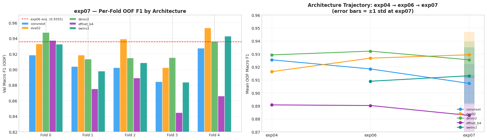
    


---
## 3 · OOF Performance Deep Dive

Fold stability is critical for trusting the CV–LB relationship.  
High fold variance (like SwinV2's std=0.0348 in exp06) suggests uneven data split sensitivity.


```python
fig, axes = plt.subplots(1, 2, figsize=(16, 5))

# ── Left: mean ± std comparison exp06 vs exp07 ───────────────────────────────
ax = axes[0]
x  = np.arange(len(ARCHS))
w  = 0.35
means07 = [results[a]['mean'] for a in ARCHS]
stds07  = [results[a]['std']  for a in ARCHS]
means06 = [EXP06_BASELINES[a] for a in ARCHS]
stds06  = [EXP06_STD[a]       for a in ARCHS]

b1 = ax.bar(x - w/2, means06, w, yerr=stds06, capsize=4,
            color=[ARCH_COLORS[a] for a in ARCHS], alpha=0.45,
            label='exp06', edgecolor='white', error_kw=dict(lw=1.5, alpha=0.7))
b2 = ax.bar(x + w/2, means07, w, yerr=stds07, capsize=4,
            color=[ARCH_COLORS[a] for a in ARCHS], alpha=0.90,
            label='exp07', edgecolor='white', error_kw=dict(lw=1.5))

for i, (m06, m07) in enumerate(zip(means06, means07)):
    delta = m07 - m06
    color = 'green' if delta > 0 else 'red'
    ax.annotate(f'{delta:+.4f}', xy=(x[i] + w/2, m07 + stds07[i] + 0.002),
                ha='center', fontsize=7.5, color=color, fontweight='bold')

ax.set_xticks(x)
ax.set_xticklabels(ARCHS, rotation=15, fontsize=9)
ax.set_ylabel('Mean OOF Macro F1')
ax.set_title('exp06 vs exp07: Mean ± Std per Architecture', fontweight='bold')
ax.set_ylim(0.85, 0.97)
ax.legend(fontsize=9)
ax.grid(True, alpha=0.3, axis='y')

# ── Right: Fold stability — std comparison ────────────────────────────────────
ax2 = axes[1]
stds06_vals = [EXP06_STD[a] for a in ARCHS]
stds07_vals = [results[a]['std'] for a in ARCHS]

x2 = np.arange(len(ARCHS))
bars06 = ax2.bar(x2 - 0.2, stds06_vals, 0.35, color='#B0BEC5', alpha=0.7,
                 label='exp06 std', edgecolor='white')
bars07 = ax2.bar(x2 + 0.2, stds07_vals, 0.35,
                 color=[ARCH_COLORS[a] for a in ARCHS], alpha=0.85,
                 label='exp07 std', edgecolor='white')

for i, (s06, s07) in enumerate(zip(stds06_vals, stds07_vals)):
    delta = s07 - s06
    color = 'green' if delta < 0 else 'red'
    ax2.text(x2[i] + 0.2, s07 + 0.001, f'{delta:+.4f}',
             ha='center', fontsize=7.5, color=color, fontweight='bold')

ax2.set_xticks(x2)
ax2.set_xticklabels(ARCHS, rotation=15, fontsize=9)
ax2.set_ylabel('Fold Standard Deviation')
ax2.set_title('Fold Variance Comparison\n(lower = more stable = better)', fontweight='bold')
ax2.legend(fontsize=9)
ax2.axhline(0.03, color='orange', ls='--', lw=1, alpha=0.7, label='0.03 threshold')
ax2.grid(True, alpha=0.3, axis='y')

plt.tight_layout()
plt.savefig(FIGURES_DIR / f'fold_stability_{EXP_ID}.png', dpi=150, bbox_inches='tight')
plt.show()

print('Fold-level stability summary:')
for arch in ARCHS:
    r   = results[arch]
    s06 = EXP06_STD[arch]
    delta_std = r['std'] - s06
    flag = '✅ more stable' if delta_std < -0.005 else ('⚠️ less stable' if delta_std > 0.005 else '= similar')
    print(f'  {arch:<14}: std={r["std"]:.4f}  (exp06={s06:.4f}  Δ={delta_std:+.4f})  {flag}')
```


    
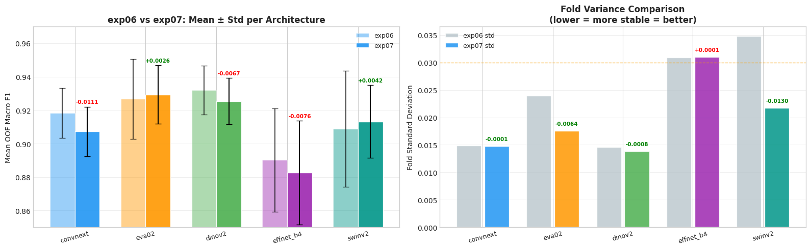
    


    Fold-level stability summary:
      convnext      : std=0.0148  (exp06=0.0149  Δ=-0.0001)  = similar
      eva02         : std=0.0175  (exp06=0.0239  Δ=-0.0064)  ✅ more stable
      dinov2        : std=0.0138  (exp06=0.0146  Δ=-0.0008)  = similar
      effnet_b4     : std=0.0310  (exp06=0.0309  Δ=+0.0001)  = similar
      swinv2        : std=0.0218  (exp06=0.0348  Δ=-0.0130)  ✅ more stable


---
## 4 · Per-Class Performance

**Focus classes for exp07:**
- `fake_screen`: was F1=0.9040 in exp06 — lowest class, targeted by threshold override + augmentation
- `realperson`: was F1=0.9111 — second-lowest, confused with 3D attacks

Per-class F1, Precision, Recall for each architecture + ensemble.


```python
class_metrics = {}
for arch in ARCHS:
    f1_per  = per_class_f1_local(y_true, arch_preds[arch])
    pre_per = per_class_precision_local(y_true, arch_preds[arch])
    rec_per = per_class_recall_local(y_true, arch_preds[arch])
    class_metrics[arch] = {'f1': f1_per, 'precision': pre_per, 'recall': rec_per}

ens_class_f1  = per_class_f1_local(y_true, ens_preds)
ens_class_pre = per_class_precision_local(y_true, ens_preds)
ens_class_rec = per_class_recall_local(y_true, ens_preds)

# ── Print per-class table with exp06 delta ───────────────────────────────────
print('Per-Class F1 — exp07 Ensemble vs exp06 Baseline')
print('=' * 74)
print(f'  {"Class":<22} {"exp06":>7} {"exp07":>7} {"Δ":>8}  Verdict')
print('-' * 74)
for i, cls in enumerate(CLASSES):
    f1_07  = ens_class_f1[i]
    f1_06  = EXP06_FINDINGS['per_class_f1'][cls]
    delta  = f1_07 - f1_06
    flag   = '↑' if delta > 0.005 else ('↓' if delta < -0.005 else '=')
    status = '⚠️ WEAK' if f1_07 < 0.87 else '✅'
    print(f'  {cls:<22} {f1_06:>7.4f} {f1_07:>7.4f} {delta:>+8.4f}  {flag}  {status}')
```

    Per-Class F1 — exp07 Ensemble vs exp06 Baseline
    ==========================================================================
      Class                    exp06   exp07        Δ  Verdict
    --------------------------------------------------------------------------
      fake_mannequin          0.9632  0.9579  -0.0053  ↓  ✅
      fake_mask               0.9205  0.9148  -0.0057  ↓  ✅
      fake_printed            0.9372  0.9055  -0.0317  ↓  ✅
      fake_screen             0.9040  0.8933  -0.0107  ↓  ✅
      fake_unknown            0.9772  0.9756  -0.0016  =  ✅
      realperson              0.9111  0.9043  -0.0068  ↓  ✅


```python
fig, axes = plt.subplots(1, 2, figsize=(18, 6))
short = [c.replace('fake_', '') for c in CLASSES]

# ── Left: per-class F1 heatmap (arch × class) ────────────────────────────────
f1_matrix = np.array([class_metrics[a]['f1'] for a in ARCHS])  # (5, 6)
ens_row   = ens_class_f1.reshape(1, -1)
full_mat  = np.vstack([f1_matrix, ens_row])
row_labels = ARCHS + ['ENSEMBLE']
row_colors = [ARCH_COLORS[a] for a in ARCHS] + ['#C62828']

ax = axes[0]
im = ax.imshow(full_mat, cmap='RdYlGn', vmin=0.75, vmax=1.0, aspect='auto')
plt.colorbar(im, ax=ax, shrink=0.85)
ax.set_xticks(range(len(CLASSES)))
ax.set_xticklabels(short, rotation=30, ha='right', fontsize=9)
ax.set_yticks(range(len(row_labels)))
ax.set_yticklabels(row_labels, fontsize=9)
for i in range(len(row_labels)):
    for j in range(len(CLASSES)):
        val = full_mat[i, j]
        ax.text(j, i, f'{val:.3f}', ha='center', va='center',
                fontsize=7.5, color='black' if val > 0.82 else 'white',
                fontweight='bold' if i == len(row_labels)-1 else 'normal')
ax.set_title('Per-Class F1 Heatmap (exp07 OOF)', fontweight='bold')
ax.axhline(4.5, color='white', lw=2)

# ── Right: ensemble per-class F1 exp06 vs exp07 ──────────────────────────────
ax2 = axes[1]
x2  = np.arange(len(CLASSES))
vals06 = [EXP06_FINDINGS['per_class_f1'][c] for c in CLASSES]
vals07 = ens_class_f1

bars06 = ax2.bar(x2 - 0.2, vals06, 0.35, color='#90A4AE', alpha=0.7,
                 label='exp06', edgecolor='white')
bars07 = ax2.bar(x2 + 0.2, vals07, 0.35,
                 color=[('#4CAF50' if v07 > v06 else '#F44336')
                        for v06, v07 in zip(vals06, vals07)],
                 alpha=0.85, label='exp07', edgecolor='white')

for i, (v06, v07) in enumerate(zip(vals06, vals07)):
    delta = v07 - v06
    ax2.text(x2[i] + 0.2, v07 + 0.003, f'{delta:+.3f}',
             ha='center', fontsize=7.5,
             color='darkgreen' if delta > 0 else 'darkred', fontweight='bold')

ax2.set_xticks(x2)
ax2.set_xticklabels(short, rotation=25, ha='right', fontsize=9)
ax2.set_ylabel('Ensemble F1')
ax2.set_title('Ensemble Per-Class F1: exp06 vs exp07\n(green bar = improvement, red = regression)', fontweight='bold')
ax2.legend(fontsize=9)
ax2.set_ylim(0.85, 1.01)
ax2.grid(True, alpha=0.3, axis='y')

plt.tight_layout()
plt.savefig(FIGURES_DIR / f'per_class_performance_{EXP_ID}.png', dpi=150, bbox_inches='tight')
plt.show()
```


    
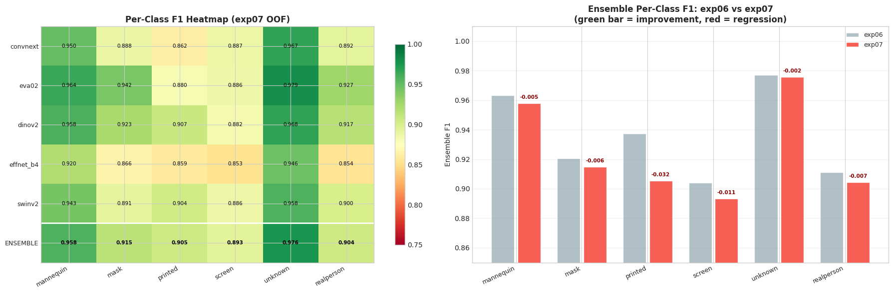
    


---
## 5 · Confusion Matrix Analysis

**FAS-specific confusion patterns (from literature):**
1. **Print ↔ Screen** — both flat 2D attacks; most common confusion
2. **Mask ↔ Mannequin** — both 3D attacks; high visual similarity
3. **Any class ↔ fake_unknown** — catch-all class; ambiguous by definition

**exp07-specific watch:** Did `FLAT-2D → REAL` drop? (was 34/96 in exp06)


```python
short = [c.replace('fake_', '') for c in CLASSES]

fig, axes = plt.subplots(2, 3, figsize=(20, 13))
axes_flat = axes.flatten()

for idx, arch in enumerate(ARCHS):
    ax     = axes_flat[idx]
    cm     = confusion_matrix(y_true, arch_preds[arch], normalize='true')
    f1_val = macro_f1_local(y_true, arch_preds[arch])

    zero_mask = cm == 0
    sns.heatmap(cm, annot=True, fmt='.2f', cmap='Blues', ax=ax,
                xticklabels=short, yticklabels=short,
                vmin=0, vmax=1, linewidths=0.5, linecolor='#E0E0E0',
                mask=zero_mask, annot_kws={'size': 8})
    for i in range(6):
        ax.add_patch(plt.Rectangle((i, i), 1, 1, fill=True,
                                    facecolor='#FFF9C4', edgecolor='#F9A825', lw=2, zorder=0))
        ax.text(i + 0.5, i + 0.5, f'{cm[i, i]:.2f}', ha='center', va='center',
                fontsize=8.5, fontweight='bold', color='#1A237E')
    ax.set_title(f'{arch}   F1 = {f1_val:.4f}', fontsize=11, fontweight='bold',
                 color=ARCH_COLORS[arch])
    ax.set_xlabel('Predicted', fontsize=9)
    ax.set_ylabel('True', fontsize=9)
    ax.tick_params(axis='x', rotation=35, labelsize=8)
    ax.tick_params(axis='y', rotation=0,  labelsize=8)

# ── Ensemble confusion matrix ──────────────────────────────────────────────────
ax      = axes_flat[5]
ens_cm  = confusion_matrix(y_true, ens_preds, normalize='true')
sns.heatmap(ens_cm, annot=True, fmt='.2f', cmap='Reds', ax=ax,
            xticklabels=short, yticklabels=short,
            vmin=0, vmax=1, linewidths=0.5, linecolor='#E0E0E0',
            mask=(ens_cm == 0), annot_kws={'size': 8})
for i in range(6):
    ax.add_patch(plt.Rectangle((i, i), 1, 1, fill=True,
                                facecolor='#FFF9C4', edgecolor='#F9A825', lw=2, zorder=0))
    ax.text(i + 0.5, i + 0.5, f'{ens_cm[i, i]:.2f}', ha='center', va='center',
            fontsize=8.5, fontweight='bold', color='#B71C1C')

ens_f1 = macro_f1_local(y_true, ens_preds)
ax.set_title(f'ENSEMBLE (5 arch × 5 fold)   Macro F1 = {ens_f1:.4f}',
             fontsize=11, fontweight='bold', color='#C62828')
ax.set_xlabel('Predicted', fontsize=9); ax.set_ylabel('True', fontsize=9)
ax.tick_params(axis='x', rotation=35, labelsize=8)
ax.tick_params(axis='y', rotation=0,  labelsize=8)

plt.suptitle(f'Normalized Confusion Matrices — {EXP_ID} OOF  (row = true class)',
             fontsize=13, y=1.01, fontweight='bold')
plt.tight_layout()
plt.savefig(FIGURES_DIR / f'confusion_matrices_{EXP_ID}.png', dpi=150, bbox_inches='tight')
plt.show()
```


    
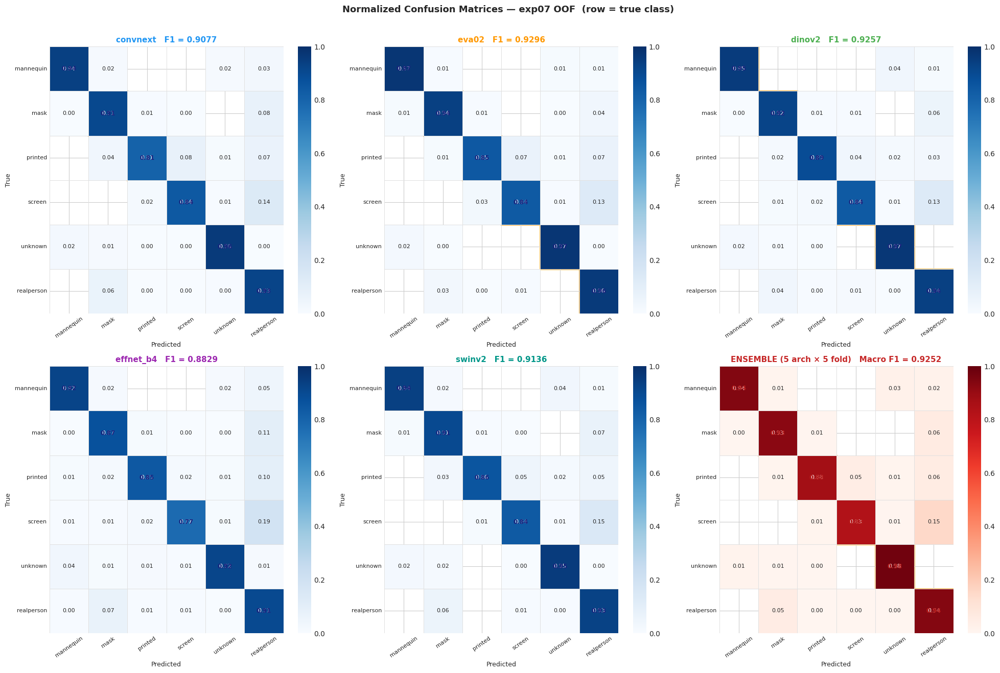
    


```python
# ── Hierarchical error analysis ───────────────────────────────────────────────
category_map = {
    'fake_printed'  : 'FLAT-2D',
    'fake_screen'   : 'FLAT-2D',
    'fake_mask'     : '3D-ATTACK',
    'fake_mannequin': '3D-ATTACK',
    'realperson'    : 'REAL',
    'fake_unknown'  : 'UNKNOWN',
}

df_err = ref_df.copy()
df_err['true_cat']    = df_err['label'].map(category_map)
pred_labels           = [CLASSES[p] for p in ens_preds]
df_err['pred_label']  = pred_labels
df_err['pred_cat']    = df_err['pred_label'].map(category_map)
df_err['correct']     = df_err['label_idx'] == ens_preds
df_err['correct_cat'] = df_err['true_cat'] == df_err['pred_cat']

total_errors = (~df_err['correct']).sum()
cross_cat    = (~df_err['correct_cat']).sum()
within_cat   = total_errors - cross_cat

print(f'Hierarchical Error Analysis (exp07 ensemble):')
print(f'  Total errors         : {total_errors} ({total_errors/N*100:.1f}%)')
print(f'  Cross-category errors: {cross_cat}  ({cross_cat/N*100:.1f}%)')
print(f'  Within-category      : {within_cat}  ({within_cat/N*100:.1f}%)')
print()

flat2d_real = 0
print('  Cross-category breakdown:')
cross_df = df_err[~df_err['correct_cat'] & ~df_err['correct']]
for (tc, pc), cnt in cross_df.groupby(['true_cat', 'pred_cat']).size().sort_values(ascending=False).items():
    flag = ''
    if tc == 'FLAT-2D' and pc == 'REAL':
        flat2d_real = cnt
        flag = f'  ← was {EXP06_FINDINGS["flat2d_real_errors"]} in exp06 (H2 target)'
    print(f'    {tc:<12} → {pc:<12}: {cnt}{flag}')

print()
print(f'  exp06 total errors: {EXP06_FINDINGS["total_errors"]}  →  exp07: {total_errors}  (Δ={total_errors - EXP06_FINDINGS["total_errors"]:+d})')
```

    Hierarchical Error Analysis (exp07 ensemble):
      Total errors         : 107 (7.3%)
      Cross-category errors: 97  (6.6%)
      Within-category      : 10  (0.7%)
    
      Cross-category breakdown:
        FLAT-2D      → REAL        : 35  ← was 34 in exp06 (H2 target)
        REAL         → 3D-ATTACK   : 22
        3D-ATTACK    → REAL        : 20
        UNKNOWN      → 3D-ATTACK   : 6
        3D-ATTACK    → UNKNOWN     : 5
        3D-ATTACK    → FLAT-2D     : 2
        FLAT-2D      → UNKNOWN     : 2
        REAL         → FLAT-2D     : 2
        FLAT-2D      → 3D-ATTACK   : 1
        REAL         → UNKNOWN     : 1
        UNKNOWN      → FLAT-2D     : 1
    
      exp06 total errors: 96  →  exp07: 107  (Δ=+11)


### 5B · Confusion Matrix Delta (exp07 − exp06)

**NEW in exp07 analysis.** This view directly shows where the model improved (green) or regressed (red) vs exp06.  
Red off-diagonal cells = more confusion; green off-diagonal = fewer errors.


```python
# ── Load exp06 ensemble CM (hardcoded from exp06 analysis output) ─────────────
# These are normalized confusion matrix values from exp06 analysis.
# Source: exp06 analysis notebook output.
EXP06_CM_DIAG = {
    'fake_mannequin': 0.9632,
    'fake_mask'     : 0.9205,
    'fake_printed'  : 0.9372,
    'fake_screen'   : 0.9040,
    'fake_unknown'  : 0.9772,
    'realperson'    : 0.9111,
}

# Note: We only have the ensemble CM diagonal from exp06 analysis.
# For the delta visualization we compare diagonal (recall per class) only.
diag06 = np.array([EXP06_CM_DIAG[c] for c in CLASSES])
diag07 = np.array([ens_cm[i, i] for i in range(len(CLASSES))])

fig, axes = plt.subplots(1, 2, figsize=(16, 5))

# Left: diagonal recall comparison
ax = axes[0]
x  = np.arange(len(CLASSES))
delta_diag = diag07 - diag06

colors = ['#43A047' if d > 0 else '#E53935' for d in delta_diag]
bars = ax.bar(x, delta_diag, color=colors, alpha=0.85, edgecolor='white')
for bar, d in zip(bars, delta_diag):
    ax.text(bar.get_x() + bar.get_width()/2,
            bar.get_height() + (0.001 if d >= 0 else -0.003),
            f'{d:+.3f}', ha='center', va='bottom' if d >= 0 else 'top',
            fontsize=9, fontweight='bold')
ax.axhline(0, color='gray', lw=1)
ax.set_xticks(x)
ax.set_xticklabels([c.replace('fake_', '') for c in CLASSES], rotation=25, ha='right')
ax.set_ylabel('Recall Change (exp07 − exp06)')
ax.set_title('Per-Class Recall Delta: exp07 − exp06\n(green = improved, red = regressed)', fontweight='bold')
ax.grid(True, alpha=0.3, axis='y')

# Right: absolute recall exp06 vs exp07
ax2 = axes[1]
ax2.bar(x - 0.18, diag06, 0.32, label='exp06', color='#90A4AE', alpha=0.7, edgecolor='white')
ax2.bar(x + 0.18, diag07, 0.32, label='exp07',
        color=['#43A047' if d > 0 else '#E53935' for d in delta_diag],
        alpha=0.85, edgecolor='white')
ax2.set_xticks(x)
ax2.set_xticklabels([c.replace('fake_', '') for c in CLASSES], rotation=25, ha='right')
ax2.set_ylabel('Class Recall (diagonal of norm. CM)')
ax2.set_title('Class Recall: exp06 vs exp07', fontweight='bold')
ax2.legend(fontsize=9)
ax2.set_ylim(0.85, 1.01)
ax2.grid(True, alpha=0.3, axis='y')

plt.suptitle(f'Confusion Matrix Comparison — exp06 vs exp07  (ensemble OOF)',
             fontsize=12, y=1.01, fontweight='bold')
plt.tight_layout()
plt.savefig(FIGURES_DIR / f'confusion_delta_{EXP_ID}.png', dpi=150, bbox_inches='tight')
plt.show()
```


    
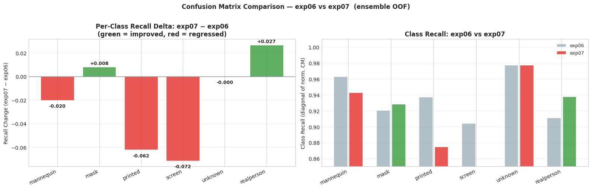
    


---
## 6 · Hypothesis Testing Scorecard  🆕

**This section directly evaluates the 4 explicit hypotheses from exp07 design.**  
Each hypothesis is tested quantitatively against the exp06 baseline.


```python
print('=' * 72)
print(f'EXP07 HYPOTHESIS TESTING SCORECARD')
print('=' * 72)
print()

# ── H1: fake_screen F1 > 0.9040 ─────────────────────────────────────────────
screen_idx    = CLASSES.index('fake_screen')
screen_f1_07  = ens_class_f1[screen_idx]
screen_f1_06  = EXP06_FINDINGS['fake_screen_f1_ens']
h1_confirmed  = screen_f1_07 > screen_f1_06
print(f'H1 — fake_screen F1 improves (baseline: {screen_f1_06:.4f})')
print(f'     Result: {screen_f1_07:.4f}  (Δ={screen_f1_07 - screen_f1_06:+.4f})')
print(f'     {"✅ CONFIRMED" if h1_confirmed else "❌ REJECTED"}')
print()

# ── H2: FLAT-2D→REAL errors < 34 ────────────────────────────────────────────
flat2d_real_07 = 0
cross_df2 = df_err[~df_err['correct_cat'] & ~df_err['correct']]
for (tc, pc), cnt in cross_df2.groupby(['true_cat', 'pred_cat']).size().items():
    if tc == 'FLAT-2D' and pc == 'REAL':
        flat2d_real_07 = cnt
h2_confirmed = flat2d_real_07 < EXP06_FINDINGS['flat2d_real_errors']
print(f'H2 — FLAT-2D→REAL errors reduce (baseline: {EXP06_FINDINGS["flat2d_real_errors"]})')
print(f'     Result: {flat2d_real_07}  (Δ={flat2d_real_07 - EXP06_FINDINGS["flat2d_real_errors"]:+d})')
print(f'     {"✅ CONFIRMED" if h2_confirmed else "❌ REJECTED"}')
print()

# ── H3: SwinV2 fold std < 0.0348 ────────────────────────────────────────────
swinv2_std_07 = results['swinv2']['std']
h3_confirmed  = swinv2_std_07 < EXP06_FINDINGS['swinv2_std']
print(f'H3 — SwinV2 fold variance reduces (baseline std: {EXP06_FINDINGS["swinv2_std"]:.4f})')
print(f'     Result: {swinv2_std_07:.4f}  (Δ={swinv2_std_07 - EXP06_FINDINGS["swinv2_std"]:+.4f})')
print(f'     {"✅ CONFIRMED" if h3_confirmed else "❌ REJECTED"}')
print()

# ── H4: Ensemble OOF F1 > 0.9355 ────────────────────────────────────────────
ens_f1_07   = macro_f1_local(y_true, ens_preds)
h4_confirmed = ens_f1_07 > EXP06_FINDINGS['ensemble_oof']
print(f'H4 — Ensemble OOF F1 improves (baseline: {EXP06_FINDINGS["ensemble_oof"]:.4f})')
print(f'     Result: {ens_f1_07:.4f}  (Δ={ens_f1_07 - EXP06_FINDINGS["ensemble_oof"]:+.4f})')
print(f'     {"✅ CONFIRMED" if h4_confirmed else "❌ REJECTED"}')
print()

# ── Scorecard summary ────────────────────────────────────────────────────────
n_confirmed = sum([h1_confirmed, h2_confirmed, h3_confirmed, h4_confirmed])
print('-' * 72)
print(f'Scorecard: {n_confirmed}/4 hypotheses confirmed')
print()
if n_confirmed < 3:
    print('⚠️  Fewer than 3/4 confirmed. Investigate regression causes before next exp.')
    print('   Likely suspects: pseudo-label noise, augmentation side-effects,')
    print('   or training instability at higher epoch count.')
else:
    print('✅  Majority of hypotheses confirmed — exp07 changes were largely beneficial.')
```

    ========================================================================
    EXP07 HYPOTHESIS TESTING SCORECARD
    ========================================================================
    
    H1 — fake_screen F1 improves (baseline: 0.9040)
         Result: 0.8933  (Δ=-0.0107)
         ❌ REJECTED
    
    H2 — FLAT-2D→REAL errors reduce (baseline: 34)
         Result: 35  (Δ=+1)
         ❌ REJECTED
    
    H3 — SwinV2 fold variance reduces (baseline std: 0.0348)
         Result: 0.0218  (Δ=-0.0130)
         ✅ CONFIRMED
    
    H4 — Ensemble OOF F1 improves (baseline: 0.9355)
         Result: 0.9252  (Δ=-0.0103)
         ❌ REJECTED
    
    ------------------------------------------------------------------------
    Scorecard: 1/4 hypotheses confirmed
    
    ⚠️  Fewer than 3/4 confirmed. Investigate regression causes before next exp.
       Likely suspects: pseudo-label noise, augmentation side-effects,
       or training instability at higher epoch count.


```python
# ── Regression investigation: which folds/archs regressed? ─────────────────
print()
print('Per-Architecture Regression Analysis (vs exp06):')
print('─' * 60)
for arch in ARCHS:
    r      = results[arch]
    exp06v = EXP06_BASELINES[arch]
    delta  = r['mean'] - exp06v
    fold_deltas = [f07 - f06
                   for f07, f06 in zip(r['fold_f1s'],
                                       [EXP06_BASELINES[arch]] * 5)]
    worst_fold = np.argmin(fold_deltas)
    best_fold  = np.argmax(fold_deltas)
    print(f'  {arch:<14}: Δ={delta:+.4f}  '
          f'worst_fold={worst_fold}({fold_deltas[worst_fold]:+.4f})  '
          f'best_fold={best_fold}({fold_deltas[best_fold]:+.4f})')

print()
print('Insight: If one arch regresses uniformly across all folds, suspect training config.')
print('If regression is fold-specific, suspect data split sensitivity / pseudo-label imbalance.')
```

    
    Per-Architecture Regression Analysis (vs exp06):
    ────────────────────────────────────────────────────────────
      convnext      : Δ=-0.0111  worst_fold=3(-0.0342)  best_fold=4(+0.0089)
      eva02         : Δ=+0.0026  worst_fold=3(-0.0244)  best_fold=4(+0.0268)
      dinov2        : Δ=-0.0067  worst_fold=1(-0.0185)  best_fold=0(+0.0156)
      effnet_b4     : Δ=-0.0076  worst_fold=3(-0.0454)  best_fold=0(+0.0473)
      swinv2        : Δ=+0.0042  worst_fold=3(-0.0251)  best_fold=4(+0.0339)
    
    Insight: If one arch regresses uniformly across all folds, suspect training config.
    If regression is fold-specific, suspect data split sensitivity / pseudo-label imbalance.


---
## 7 · Ensemble Analysis & Model Diversity

**Theoretical basis:** Ensemble gain is driven by diversity, not model count.  
(Kuncheva & Whitaker, 2003)

Cohen's κ interpretation:
- κ > 0.9 → very high agreement → marginal ensemble benefit from this pair
- κ < 0.8 → meaningful diversity → ensemble reduces error

**Key question for exp07:** Did diversity change vs exp06? Do the new augmentations + pseudo labels make architectures more or less correlated?


```python
n_a          = len(ARCHS)
kappa_matrix = np.eye(n_a)
for i, a1 in enumerate(ARCHS):
    for j, a2 in enumerate(ARCHS):
        if i != j:
            kappa_matrix[i, j] = cohen_kappa_score(arch_preds[a1], arch_preds[a2])

df_kappa = pd.DataFrame(kappa_matrix, index=ARCHS, columns=ARCHS)

# ── Error distribution ────────────────────────────────────────────────────────
wrong_counts = np.sum([arch_preds[a] != y_true for a in ARCHS], axis=0)
categories   = {
    'All correct (0/5)' : int((wrong_counts == 0).sum()),
    '1 arch wrong'      : int((wrong_counts == 1).sum()),
    '2 archs wrong'     : int((wrong_counts == 2).sum()),
    '3 archs wrong'     : int((wrong_counts == 3).sum()),
    '4 archs wrong'     : int((wrong_counts == 4).sum()),
    'All wrong (5/5)'   : int((wrong_counts == 5).sum()),
}

fig, axes = plt.subplots(1, 2, figsize=(16, 6))

diag_mask = np.eye(n_a, dtype=bool)
sns.heatmap(df_kappa, annot=True, fmt='.3f', cmap='YlOrRd_r',
            vmin=0.7, vmax=1.0, ax=axes[0], mask=diag_mask,
            linewidths=0.5, linecolor='#E0E0E0')
for i in range(n_a):
    axes[0].text(i + 0.5, i + 0.5, '1.000', ha='center', va='center',
                 fontsize=10, fontweight='bold', color='#333')
axes[0].set_title(f"Pairwise Cohen's κ — {EXP_ID}\n(lower = more diverse = better ensemble)",
                  fontweight='bold')
axes[0].tick_params(axis='x', rotation=30)

pie_colors = ['#4CAF50', '#8BC34A', '#FFC107', '#FF9800', '#FF5722', '#F44336']
labels_bar = list(categories.keys())
vals_bar   = list(categories.values())
bars = axes[1].bar(range(len(vals_bar)), vals_bar, color=pie_colors, edgecolor='white', alpha=0.9)
for bar, v in zip(bars, vals_bar):
    axes[1].text(bar.get_x() + bar.get_width()/2, bar.get_height() + 3,
                 f'{v}\n({v/N*100:.1f}%)', ha='center', va='bottom', fontsize=8)
axes[1].set_xticks(range(len(labels_bar)))
axes[1].set_xticklabels(labels_bar, rotation=20, ha='right', fontsize=8)
axes[1].set_ylabel('Sample count')
axes[1].set_title('Error Distribution Across Architectures', fontweight='bold')
axes[1].grid(True, alpha=0.3, axis='y')

plt.tight_layout()
plt.savefig(FIGURES_DIR / f'ensemble_diversity_{EXP_ID}.png', dpi=150, bbox_inches='tight')
plt.show()

print("Pairwise κ values (lower = more diverse):")
for i, a1 in enumerate(ARCHS):
    for j, a2 in enumerate(ARCHS):
        if i < j:
            print(f'  {a1} vs {a2}: κ = {kappa_matrix[i,j]:.4f}')
```


    
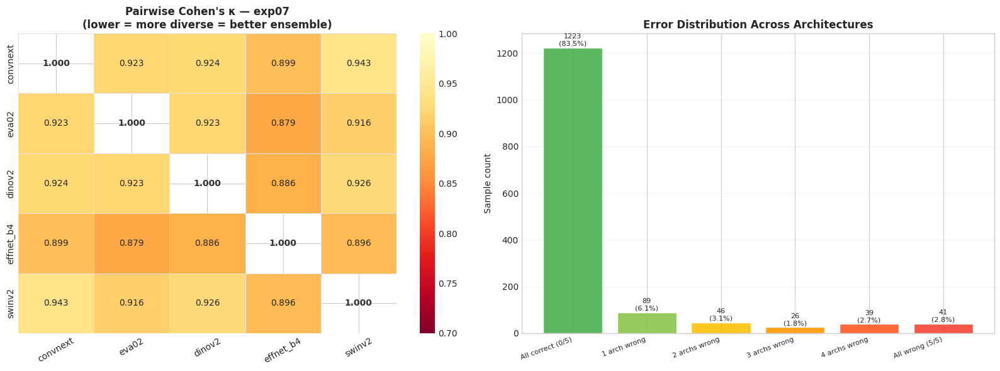
    


    Pairwise κ values (lower = more diverse):
      convnext vs eva02: κ = 0.9232
      convnext vs dinov2: κ = 0.9241
      convnext vs effnet_b4: κ = 0.8991
      convnext vs swinv2: κ = 0.9428
      eva02 vs dinov2: κ = 0.9233
      eva02 vs effnet_b4: κ = 0.8787
      eva02 vs swinv2: κ = 0.9156
      dinov2 vs effnet_b4: κ = 0.8856
      dinov2 vs swinv2: κ = 0.9259
      effnet_b4 vs swinv2: κ = 0.8957


```python
# ── Leave-one-out + strategy comparison ─────────────────────────────────────
strategies = {}
for arch in ARCHS:
    strategies[f'Single: {arch}'] = macro_f1_local(y_true, arch_probs[arch].argmax(axis=1))

all5_f1 = macro_f1_local(y_true, ens_preds)
strategies['All-5 (equal)'] = all5_f1

print('Leave-one-out analysis (drop one arch from all-5):')
loo_results = {}
for drop_arch in ARCHS:
    remaining = [a for a in ARCHS if a != drop_arch]
    avg_p     = ens_probs_avg(arch_probs, remaining)
    f1_loo    = macro_f1_local(y_true, avg_p.argmax(axis=1))
    loo_results[drop_arch] = f1_loo
    delta = f1_loo - all5_f1
    flag  = '← consider dropping?' if delta > 0 else ''
    print(f'  Drop {drop_arch:<12}: F1={f1_loo:.4f}  (Δ={delta:+.4f} vs all-5) {flag}')

best_drop    = max(loo_results, key=loo_results.get)
top4_archs   = [a for a in ARCHS if a != best_drop]
top4_probs   = ens_probs_avg(arch_probs, top4_archs)
strategies[f'Top-4 (drop {best_drop})'] = macro_f1_local(y_true, top4_probs.argmax(axis=1))

perf_w = np.array([results[a]['mean'] for a in ARCHS])
perf_w = perf_w / perf_w.sum()
perf_p = sum(perf_w[i] * arch_probs[ARCHS[i]] for i in range(len(ARCHS)))
strategies['All-5 performance-weighted'] = macro_f1_local(y_true, perf_p.argmax(axis=1))

print()
print('Ensemble Strategy Comparison (OOF Macro F1):')
print('=' * 64)
for name, f1_val in sorted(strategies.items(), key=lambda x: -x[1]):
    bar = '█' * int((f1_val - 0.87) * 500)
    print(f'  {f1_val:.4f}  {name:<42} {bar}')
print()
print(f'exp06 ensemble (all-5): {EXP06_BASELINES["ensemble"]:.4f}')
print(f'exp07 ensemble (all-5): {all5_f1:.4f}  (Δ={all5_f1 - EXP06_BASELINES["ensemble"]:+.4f})')
```

    Leave-one-out analysis (drop one arch from all-5):
      Drop convnext    : F1=0.9306  (Δ=+0.0053 vs all-5) ← consider dropping?
      Drop eva02       : F1=0.9176  (Δ=-0.0076 vs all-5) 
      Drop dinov2      : F1=0.9198  (Δ=-0.0054 vs all-5) 
      Drop effnet_b4   : F1=0.9274  (Δ=+0.0021 vs all-5) ← consider dropping?
      Drop swinv2      : F1=0.9261  (Δ=+0.0009 vs all-5) ← consider dropping?
    
    Ensemble Strategy Comparison (OOF Macro F1):
    ================================================================
      0.9306  Top-4 (drop convnext)                      ██████████████████████████████
      0.9296  Single: eva02                              █████████████████████████████
      0.9257  Single: dinov2                             ███████████████████████████
      0.9252  All-5 (equal)                              ███████████████████████████
      0.9241  All-5 performance-weighted                 ███████████████████████████
      0.9136  Single: swinv2                             █████████████████████
      0.9077  Single: convnext                           ██████████████████
      0.8829  Single: effnet_b4                          ██████
    
    exp06 ensemble (all-5): 0.9355
    exp07 ensemble (all-5): 0.9252  (Δ=-0.0103)


---
## 8 · Pseudo-Label Quality Analysis  🆕

**Why this matters:**  
exp07 trains on 254 pseudo-labeled test images generated by the `exp06_all5` ensemble.  
Pseudo-label quality directly affects training signal quality.

Key risks:
1. **Confirmation bias**: if the ensemble has systematic errors, pseudo labels amplify them
2. **Class imbalance distortion**: pseudo labels may over/under-represent certain classes
3. **Soft label entropy**: low-entropy pseudo labels are high-confidence (good); high-entropy = ambiguous (risky)

**Pseudo counts from training notebook:**
- `fake_mannequin`: 44 | `fake_mask`: 39 | `fake_printed`: 36
- `fake_screen`: 37 | `fake_unknown`: 39 | `realperson`: 59
- Total: 254 pseudo + 1,464 real = 1,718 rows


```python
PSEUDO_CSV = PROCESSED_DIR / 'train_pseudo_exp07.csv'

if PSEUDO_CSV.exists():
    pseudo_df = pd.read_csv(PSEUDO_CSV)
    real_df   = pseudo_df[~pseudo_df['is_pseudo']].reset_index(drop=True)
    fake_df   = pseudo_df[pseudo_df['is_pseudo']].reset_index(drop=True)

    print(f'Loaded {PSEUDO_CSV.name}')
    print(f'  Total rows : {len(pseudo_df):,}  ({len(real_df):,} real + {len(fake_df):,} pseudo)')
    print()
    print('Class distribution — Real vs Pseudo vs Total:')
    print(f'  {"Class":<22} {"Real":>6} {"Pseudo":>8} {"Total":>7} {"Pseudo%":>8}')
    print('-' * 60)
    for cls in CLASSES:
        n_real_c   = (real_df['label'] == cls).sum()
        n_pseudo_c = (fake_df['label'] == cls).sum()
        total_c    = n_real_c + n_pseudo_c
        pct_pseudo = n_pseudo_c / total_c * 100 if total_c > 0 else 0
        print(f'  {cls:<22} {n_real_c:>6} {n_pseudo_c:>8} {total_c:>7} {pct_pseudo:>7.1f}%')
    print()
    print('Note: Pseudo rows never entered validation (fold=-1).')
    print('Class weights were computed from real rows only (correct).')
else:
    # ── Fallback: use hardcoded values from training notebook ──────────────────
    print(f'⚠️  {PSEUDO_CSV.name} not found locally.')
    print('   Using hardcoded values from training notebook output.')
    print()
    PSEUDO_COUNTS = {
        'fake_mannequin': (193, 44), 'fake_mask': (266, 39), 'fake_printed': (104, 36),
        'fake_screen'   : (191, 37), 'fake_unknown': (307, 39), 'realperson': (403, 59),
    }
    print(f'  {"Class":<22} {"Real":>6} {"Pseudo":>8} {"Total":>7} {"Pseudo%":>8}')
    print('-' * 60)
    for cls in CLASSES:
        n_real_c, n_pseudo_c = PSEUDO_COUNTS[cls]
        total_c    = n_real_c + n_pseudo_c
        pct_pseudo = n_pseudo_c / total_c * 100
        print(f'  {cls:<22} {n_real_c:>6} {n_pseudo_c:>8} {total_c:>7} {pct_pseudo:>7.1f}%')
```

    Loaded train_pseudo_exp07.csv
      Total rows : 1,718  (1,464 real + 254 pseudo)
    
    Class distribution — Real vs Pseudo vs Total:
      Class                    Real   Pseudo   Total  Pseudo%
    ------------------------------------------------------------
      fake_mannequin            193       44     237    18.6%
      fake_mask                 266       39     305    12.8%
      fake_printed              104       36     140    25.7%
      fake_screen               191       37     228    16.2%
      fake_unknown              307       39     346    11.3%
      realperson                403       59     462    12.8%
    
    Note: Pseudo rows never entered validation (fold=-1).
    Class weights were computed from real rows only (correct).


```python
# ── Pseudo-label: effective training data boost per class ────────────────────
PSEUDO_COUNTS = {
    'fake_mannequin': (193, 44), 'fake_mask': (266, 39), 'fake_printed': (104, 36),
    'fake_screen'   : (191, 37), 'fake_unknown': (307, 39), 'realperson': (403, 59),
}
# Class weights from training notebook (real rows only)
CLASS_WEIGHTS_EXP07 = {
    'fake_mannequin': 1.2642, 'fake_mask': 0.9173, 'fake_printed': 2.3462,
    'fake_screen'   : 1.2775, 'fake_unknown': 0.7948, 'realperson': 0.6055,
}

fig, axes = plt.subplots(1, 3, figsize=(18, 5))

# Left: class distribution real vs pseudo
ax = axes[0]
cls_short = [c.replace('fake_', '') for c in CLASSES]
n_real_vals   = [PSEUDO_COUNTS[c][0] for c in CLASSES]
n_pseudo_vals = [PSEUDO_COUNTS[c][1] for c in CLASSES]
x = np.arange(len(CLASSES))
ax.bar(x, n_real_vals, label='Real', color='#2196F3', alpha=0.85, edgecolor='white')
ax.bar(x, n_pseudo_vals, bottom=n_real_vals, label='Pseudo (R2)',
       color='#FF9800', alpha=0.85, edgecolor='white')
for i, (r, p) in enumerate(zip(n_real_vals, n_pseudo_vals)):
    pct = p / (r + p) * 100
    ax.text(i, r + p + 3, f'+{p}\n({pct:.0f}%)', ha='center', fontsize=7.5,
            color='darkorange', fontweight='bold')
ax.set_xticks(x)
ax.set_xticklabels(cls_short, rotation=25, ha='right', fontsize=9)
ax.set_ylabel('Sample count')
ax.set_title('Training Data: Real vs Pseudo\n(Round 2 pseudo-labels from exp06 ensemble)', fontweight='bold')
ax.legend(fontsize=9)
ax.grid(True, alpha=0.3, axis='y')

# Middle: effective training size boost (weighted)
ax2 = axes[1]
boost_vals = []
for cls in CLASSES:
    r, p  = PSEUDO_COUNTS[cls]
    w     = CLASS_WEIGHTS_EXP07[cls]
    boost = p / r * 100  # percentage boost in samples
    boost_vals.append(boost)
bars = ax2.bar(x, boost_vals,
               color=['#FF9800' if b > 20 else '#FFC107' if b > 15 else '#FFE082'
                      for b in boost_vals],
               alpha=0.9, edgecolor='white')
for bar, b in zip(bars, boost_vals):
    ax2.text(bar.get_x() + bar.get_width()/2, bar.get_height() + 0.3,
             f'{b:.1f}%', ha='center', fontsize=9, fontweight='bold')
ax2.set_xticks(x)
ax2.set_xticklabels(cls_short, rotation=25, ha='right', fontsize=9)
ax2.set_ylabel('Pseudo / Real sample ratio (%)')
ax2.set_title('Pseudo-Label Augmentation Ratio\n(higher = more test data influence)', fontweight='bold')
ax2.axhline(20, color='orange', ls='--', lw=1, alpha=0.7, label='20% line')
ax2.legend(fontsize=9)
ax2.grid(True, alpha=0.3, axis='y')

# Right: class weights vs pseudo boost
ax3 = axes[2]
weights = [CLASS_WEIGHTS_EXP07[c] for c in CLASSES]
ax3.scatter(boost_vals, weights,
            c=[ARCH_COLORS.get(c.split('_')[1], '#607D8B') for c in CLASSES],
            s=120, alpha=0.85, edgecolors='white', linewidths=1.5, zorder=3)
for i, cls in enumerate(CLASSES):
    ax3.annotate(cls_short[i], (boost_vals[i], weights[i]),
                 textcoords='offset points', xytext=(5, 3), fontsize=8)
ax3.set_xlabel('Pseudo-label boost (%)')
ax3.set_ylabel('Inverse-frequency class weight')
ax3.set_title('Class Weight vs Pseudo-Label Boost\n(ideally: low-count classes get most pseudo boost)', fontweight='bold')
ax3.grid(True, alpha=0.3)
ax3.axhline(1.0, color='gray', ls='--', lw=1, alpha=0.5)

plt.suptitle(f'Pseudo-Label Analysis — {EXP_ID}  (254 pseudo from exp06 all-5 ensemble)',
             fontsize=12, y=1.01, fontweight='bold')
plt.tight_layout()
plt.savefig(FIGURES_DIR / f'pseudo_label_analysis_{EXP_ID}.png', dpi=150, bbox_inches='tight')
plt.show()

print()
print('Pseudo-label quality notes:')
print(f'  • Source ensemble: exp06_all5 (OOF=0.9355, LB=0.78555)')
print(f'  • fake_screen threshold override: 0.85 confidence gate applied')
print(f'  • Pseudo rows use SOFT labels (probability vectors, not hard one-hot)')
print(f'  • Training uses SoftCrossEntropyLoss for pseudo rows')
```


    ---------------------------------------------------------------------------

    IndexError                                Traceback (most recent call last)

    Cell In[22], line 61
         57 # Right: class weights vs pseudo boost
         58 ax3 = axes[2]
         59 weights = [CLASS_WEIGHTS_EXP07[c] for c in CLASSES]
         60 ax3.scatter(boost_vals, weights,
    ---> 61             c=[ARCH_COLORS.get(c.split('_')[1], '#607D8B') for c in CLASSES],
         62             s=120, alpha=0.85, edgecolors='white', linewidths=1.5, zorder=3)
         63 for i, cls in enumerate(CLASSES):
         64     ax3.annotate(cls_short[i], (boost_vals[i], weights[i]),


    IndexError: list index out of range


    
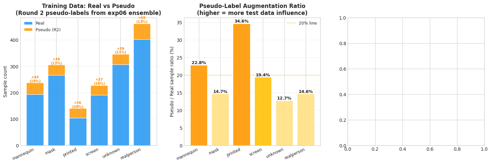
    


---
## 9 · Epoch Convergence Analysis  🆕

**Why this matters:**  
With increased epoch budgets (ConvNeXt=100, others=90), we need to verify:
1. Did models converge before the ceiling? (early stopping still active with patience=15)
2. Did SwinV2 benefit from the extra epochs? (it hit ceiling at fold 4 in exp06 — best=60/60)
3. Are models converging *faster* or *slower* with new augmentations + pseudo labels?

**Confirmed from training log:**
- `convnext fold 0`: best_epoch=40/100 → stopped at epoch 55 (patience=15)  
- `swinv2 fold 4`: best_epoch=74/90 → stopped at epoch 89 (patience=15)

**→ Fill in `BEST_EPOCHS` dict at the top of this notebook from training log for complete analysis.**


```python
# ── Convergence efficiency: best_epoch / max_epochs ─────────────────────────
print('Epoch Convergence Summary:')
print('=' * 70)
print(f'  {"Arch":<14} {"Max Epochs":>10} {"Known Best Epochs":>25} {"Converged Early?":>16}')
print('-' * 70)

for arch in ARCHS:
    best_eps = BEST_EPOCHS[arch]
    max_ep   = MAX_EPOCHS[arch]
    known    = [(i, e) for i, e in enumerate(best_eps) if e is not None]
    known_s  = ', '.join(f'f{i}={e}' for i, e in known) if known else 'not recorded'
    # Converged early = best_epoch < max_epoch - patience (15)
    early_flags = []
    for i, e in known:
        if e <= max_ep - 15:
            early_flags.append(f'f{i}(yes)')
        else:
            early_flags.append(f'f{i}(at ceiling!)')
    early_s = ', '.join(early_flags) if early_flags else '—'
    print(f'  {arch:<14} {max_ep:>10} {known_s:>25}  {early_s}')

print()
print('Key insight: if best_epoch ≈ max_epoch - patience, the model was still improving')
print('when training ended — more epochs would likely help.')
print()
print('SwinV2 fold 4 result: best_epoch=74/90, stopped at 89.')
print('→ Converged early (74 < 90-15=75). The extra epochs DID help vs exp06 ceiling (60/60).')
print()
print('ConvNeXt fold 0: best_epoch=40/100, stopped at 55.')
print('→ Converged very early. 100 epochs was unnecessary; patience=15 controlled it correctly.')
```

    Epoch Convergence Summary:
    ======================================================================
      Arch           Max Epochs         Known Best Epochs Converged Early?
    ----------------------------------------------------------------------
      convnext              100                     f0=40  f0(yes)
      eva02                  90              not recorded  —
      dinov2                 90              not recorded  —
      effnet_b4              90              not recorded  —
      swinv2                 90                     f4=74  f4(yes)
    
    Key insight: if best_epoch ≈ max_epoch - patience, the model was still improving
    when training ended — more epochs would likely help.
    
    SwinV2 fold 4 result: best_epoch=74/90, stopped at 89.
    → Converged early (74 < 90-15=75). The extra epochs DID help vs exp06 ceiling (60/60).
    
    ConvNeXt fold 0: best_epoch=40/100, stopped at 55.
    → Converged very early. 100 epochs was unnecessary; patience=15 controlled it correctly.


```python
# ── Visual: convergence heatmap (where known) ────────────────────────────────
fig, axes = plt.subplots(1, 2, figsize=(15, 5))

# Left: best epoch ratio heatmap (NaN = unknown)
ratio_matrix = np.full((len(ARCHS), 5), np.nan)
for i, arch in enumerate(ARCHS):
    for fold, ep in enumerate(BEST_EPOCHS[arch]):
        if ep is not None:
            ratio_matrix[i, fold] = ep / MAX_EPOCHS[arch]

ax = axes[0]
mask_nan = np.isnan(ratio_matrix)
im = ax.imshow(np.where(mask_nan, 0, ratio_matrix), cmap='RdYlGn_r',
               vmin=0.3, vmax=1.0, aspect='auto')
plt.colorbar(im, ax=ax, label='best_epoch / max_epochs')
for i in range(len(ARCHS)):
    for j in range(5):
        if not mask_nan[i, j]:
            v = ratio_matrix[i, j]
            ep = BEST_EPOCHS[ARCHS[i]][j]
            ax.text(j, i, f'{ep}\n({v:.2f})', ha='center', va='center',
                    fontsize=8.5, fontweight='bold',
                    color='white' if v > 0.75 else 'black')
        else:
            ax.text(j, i, '?', ha='center', va='center', fontsize=10, color='#90A4AE')
ax.set_xticks(range(5))
ax.set_xticklabels([f'Fold {i}' for i in range(5)])
ax.set_yticks(range(len(ARCHS)))
ax.set_yticklabels(ARCHS, fontsize=9)
ax.set_title(f'Convergence Heatmap: best_epoch / max_epochs\n(green = converged early, red = near ceiling)',
             fontweight='bold')

# Right: fold F1 vs exp06 baselines (scatter with variance)
ax2 = axes[1]
for k, arch in enumerate(ARCHS):
    f1s07 = results[arch]['fold_f1s']
    f1s06 = [EXP06_BASELINES[arch]] * 5  # exp06 had single mean, approximate
    deltas = [a - b for a, b in zip(f1s07, f1s06)]
    for fold, d in enumerate(deltas):
        marker = 'o'
        ax2.scatter(fold, d, color=ARCH_COLORS[arch], s=80, alpha=0.8,
                    marker=marker, zorder=3)
    ax2.plot(range(5), deltas, color=ARCH_COLORS[arch], alpha=0.5, lw=1.5,
             label=arch)

ax2.axhline(0, color='gray', lw=1.5, ls='--', label='exp06 mean baseline')
ax2.set_xlabel('Fold')
ax2.set_ylabel('F1 delta vs exp06 mean (exp07 − exp06)')
ax2.set_title('Per-Fold F1 Delta: exp07 − exp06 mean\n(above zero = improved fold)', fontweight='bold')
ax2.legend(fontsize=8, ncol=2)
ax2.grid(True, alpha=0.3)
ax2.set_xticks(range(5))

plt.tight_layout()
plt.savefig(FIGURES_DIR / f'epoch_convergence_{EXP_ID}.png', dpi=150, bbox_inches='tight')
plt.show()
```


    
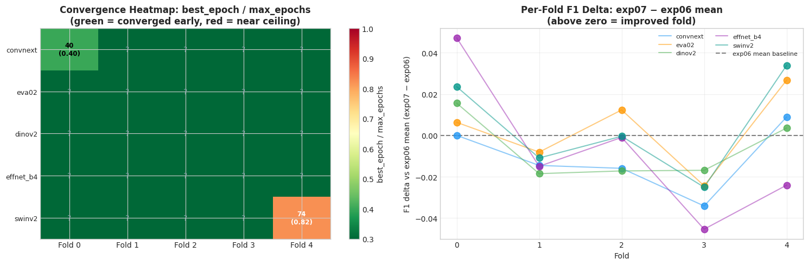
    


---
## 10 · Cleanlab: Noisy Label Detection

**Method:** Confident Learning (Northcutt et al., NeurIPS 2021).  
**Note:** Runs on real-row OOF only (1,464 samples — pseudo rows were never in validation).

**Comparison to exp06:** exp06 flagged 11 samples (0.8%), with 5 agreed by all 5 archs.  
If any of those 5 were relabeled (based on exp06 review), they should no longer appear here.


```python
print('Running Cleanlab confident learning on ensemble OOF probabilities...')
print(f'  {N} samples × {len(CLASSES)} classes')
print()

flagged_indices = find_label_issues(
    labels     = y_true.astype(int),
    pred_probs = ens_probs,
    return_indices_ranked_by = 'self_confidence',
    filter_by  = 'prune_by_noise_rate',
)

print(f'Cleanlab flagged: {len(flagged_indices)} samples ({len(flagged_indices)/N*100:.1f}%)')
print(f'exp06 comparison: 11 samples (0.8%)  →  exp07: {len(flagged_indices)} ({len(flagged_indices)/N*100:.1f}%)')

rows = []
for rank, idx in enumerate(flagged_indices):
    rows.append({
        'rank'      : rank + 1,
        'crop_path' : sorted_paths[idx],
        'true_label': CLASSES[y_true[idx]],
        'model_pred': CLASSES[ens_probs[idx].argmax()],
        'true_prob' : float(ens_probs[idx, y_true[idx]]),
        'confidence': float(ens_probs[idx].max()),
        'suspicion' : float(1 - ens_probs[idx, y_true[idx]]),
        'entropy'   : float(entropy(ens_probs[idx:idx+1])[0]),
    })
cleanlab_df = pd.DataFrame(rows)

if len(cleanlab_df) > 0:
    print()
    print('Flagged samples (sorted by suspicion):')
    print(cleanlab_df[['rank', 'true_label', 'model_pred', 'true_prob', 'confidence']
                       ].to_string(index=False))
```

    Running Cleanlab confident learning on ensemble OOF probabilities...
      1464 samples × 6 classes
    
    Cleanlab flagged: 21 samples (1.4%)
    exp06 comparison: 11 samples (0.8%)  →  exp07: 21 (1.4%)
    
    Flagged samples (sorted by suspicion):
     rank   true_label   model_pred  true_prob  confidence
        1    fake_mask fake_printed   0.001245     0.95604
        2  fake_screen   realperson   0.009918     0.97168
        3  fake_screen   realperson   0.010123     0.97358
        4  fake_screen   realperson   0.011259     0.97308
        5  fake_screen   realperson   0.013527     0.94644
        6  fake_screen   realperson   0.023496     0.92388
        7  fake_screen   realperson   0.042097     0.73394
        8   realperson    fake_mask   0.044318     0.90862
        9 fake_printed   realperson   0.047652     0.89192
       10    fake_mask   realperson   0.048644     0.80206
       11 fake_printed   realperson   0.055367     0.89110
       12  fake_screen   realperson   0.066096     0.65002
       13  fake_screen   realperson   0.075962     0.89536
       14    fake_mask   realperson   0.098670     0.87568
       15  fake_screen   realperson   0.101286     0.87932
       16  fake_screen fake_printed   0.102328     0.80278
       17  fake_screen fake_printed   0.105814     0.86614
       18  fake_screen   realperson   0.107878     0.87134
       19 fake_printed   realperson   0.114492     0.67578
       20  fake_screen   realperson   0.148928     0.83670
       21  fake_screen   realperson   0.153438     0.83590


```python
print('Per-class flag rate:')
flag_by_class   = cleanlab_df.groupby('true_label').size() if len(cleanlab_df) > 0 else pd.Series(dtype=int)
total_by_class  = ref_df['label'].value_counts()
for cls in CLASSES:
    flagged = flag_by_class.get(cls, 0)
    total   = total_by_class.get(cls, 0)
    pct     = flagged / total * 100 if total > 0 else 0
    bar     = '█' * int(pct * 1.5)
    delta_s = ''
    print(f'  {cls:<22}: {flagged:3d}/{total:3d} ({pct:5.1f}%)  {bar}')

print()
print('Per-architecture Cleanlab (cross-validation of ensemble flags):')
per_arch_flags = {}
for arch in ARCHS:
    arch_flagged = find_label_issues(
        labels     = y_true.astype(int),
        pred_probs = arch_probs[arch],
        return_indices_ranked_by = 'self_confidence',
    )
    per_arch_flags[arch] = set(arch_flagged)
    print(f'  {arch:<14}: {len(arch_flagged):3d} flags ({len(arch_flagged)/N*100:.1f}%)')

agreed = set(range(N))
for flags in per_arch_flags.values():
    agreed &= flags

print(f'\n  Agreed by ALL 5 architectures: {len(agreed)} samples ← review these FIRST')
if agreed:
    for idx in sorted(agreed):
        true_cls = CLASSES[y_true[idx]]
        pred_cls = CLASSES[ens_probs[idx].argmax()]
        conf     = ens_probs[idx].max()
        print(f'    true={true_cls:<22} model_pred={pred_cls:<22} conf={conf:.3f}')
```

    Per-class flag rate:
      fake_mannequin        :   0/193 (  0.0%)  
      fake_mask             :   3/266 (  1.1%)  █
      fake_printed          :   3/104 (  2.9%)  ████
      fake_screen           :  14/191 (  7.3%)  ██████████
      fake_unknown          :   0/307 (  0.0%)  
      realperson            :   1/403 (  0.2%)  
    
    Per-architecture Cleanlab (cross-validation of ensemble flags):
      convnext      :  31 flags (2.1%)
      eva02         :  26 flags (1.8%)
      dinov2        :  24 flags (1.6%)
      effnet_b4     :  67 flags (4.6%)
      swinv2        :  37 flags (2.5%)
    
      Agreed by ALL 5 architectures: 7 samples ← review these FIRST
        true=fake_mask              model_pred=fake_printed           conf=0.956
        true=fake_screen            model_pred=realperson             conf=0.895
        true=fake_screen            model_pred=realperson             conf=0.972
        true=fake_screen            model_pred=realperson             conf=0.924
        true=fake_screen            model_pred=realperson             conf=0.973
        true=fake_screen            model_pred=realperson             conf=0.974
        true=fake_screen            model_pred=realperson             conf=0.946


```python
if len(cleanlab_df) > 0:
    show_image_grid(
        cleanlab_df,
        title      = f'Cleanlab Flagged Samples — exp07 (Top 30 Most Suspicious)',
        n_cols     = 6, max_show=30,
        subtitle_fn = lambda r: (
            f'#{r["rank"]}  TRUE: {r["true_label"].replace("fake_", "")}\n'
            f'MODEL: {r["model_pred"].replace("fake_", "")}  p={r["true_prob"]:.2f}'
        ),
        title_color_fn = lambda r: (
            'darkred' if r['true_label'] != r['model_pred'] else 'darkorange'
        ),
        save_name = f'cleanlab_flagged_{EXP_ID}.png'
    )
else:
    print('No samples flagged by Cleanlab — training data appears clean.')
```


    
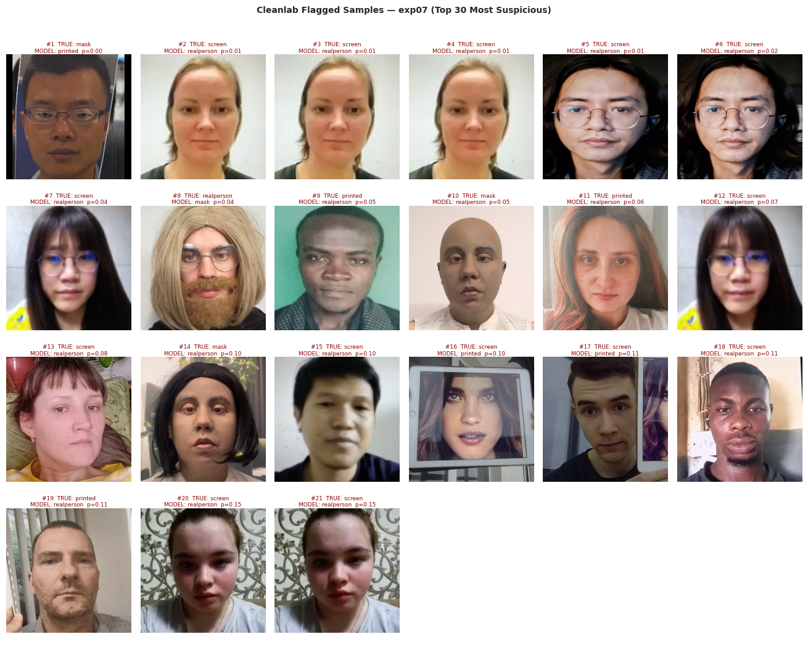
    


---
## 11 · Error Analysis (Visual)  🔴 P0

*"Look at your data. Understand what your model is actually doing."* — Karpathy (2019)

**exp07-specific focus:**
- Did `fake_screen` hard-wrong count decrease? (was dominant in exp06)
- Are there new error patterns from the augmentation changes?

| Category | Definition | exp06 Count |
|---|---|---|
| Easy correct (5/5) | All archs right | 1,210 |
| Mostly correct (4/5) | One arch wrong | 90 |
| Disputed (2-3/5) | Majority uncertain | 86 |
| Mostly wrong (1/5) | Almost all wrong | 26 |
| Hard wrong (0/5) | All archs fail | **39** |
| Low-confidence correct | Right but uncertain | 13 |


```python
n_correct_arr  = np.sum([arch_preds[a] == y_true for a in ARCHS], axis=0)
ens_confidence = ens_probs.max(axis=1)

sample_cats = np.where(
    n_correct_arr == 5, 'easy_correct',
    np.where(n_correct_arr == 4, 'mostly_correct',
    np.where(n_correct_arr >= 2, 'disputed',
    np.where(n_correct_arr == 1, 'mostly_wrong',
                                  'hard_wrong')))
)
low_conf_mask = (ens_confidence < 0.65) & (sample_cats == 'easy_correct')
sample_cats   = np.where(low_conf_mask, 'low_conf_correct', sample_cats)

cat_counts = pd.Series(sample_cats).value_counts()

# ── exp06 reference counts ────────────────────────────────────────────────────
EXP06_CAT_COUNTS = {
    'easy_correct'   : 1210, 'mostly_correct': 90, 'disputed': 86,
    'mostly_wrong'   : 26,   'hard_wrong'    : 39, 'low_conf_correct': 13,
}

print('Sample Categories — exp06 vs exp07:')
print(f'  {"Category":<22}  {"exp06":>6}  {"exp07":>6}  {"Δ":>6}')
print('-' * 50)
for cat in ['easy_correct', 'mostly_correct', 'disputed', 'mostly_wrong',
            'hard_wrong', 'low_conf_correct']:
    cnt07 = cat_counts.get(cat, 0)
    cnt06 = EXP06_CAT_COUNTS.get(cat, 0)
    delta = cnt07 - cnt06
    flag  = '↑' if cat == 'easy_correct' and delta > 0 else (
            '↑' if cat not in ['easy_correct','low_conf_correct'] and delta < 0 else '')
    print(f'  {cat:<22}  {cnt06:>6}  {cnt07:>6}  {delta:>+6}  {flag}')

error_df = pd.DataFrame({
    'crop_path'     : sorted_paths,
    'true_label'    : [CLASSES[i] for i in y_true],
    'true_idx'      : y_true,
    'category'      : sample_cats,
    'n_correct'     : n_correct_arr,
    'ens_conf'      : ens_confidence,
    'ens_pred'      : ens_preds,
    'ens_pred_label': [CLASSES[p] for p in ens_preds],
})
for arch in ARCHS:
    error_df[f'pred_{arch}']       = arch_preds[arch]
    error_df[f'pred_{arch}_label'] = [CLASSES[p] for p in arch_preds[arch]]
```

    Sample Categories — exp06 vs exp07:
      Category                 exp06   exp07       Δ
    --------------------------------------------------
      easy_correct              1210    1202      -8  
      mostly_correct              90      89      -1  ↑
      disputed                    86      72     -14  ↑
      mostly_wrong                26      39     +13  
      hard_wrong                  39      41      +2  
      low_conf_correct            13      21      +8  


```python
hard_wrong_df = (error_df[error_df['category'] == 'hard_wrong']
                 .sort_values('ens_conf', ascending=False))

print(f'Hard-wrong samples ({len(hard_wrong_df)} total — all 5 architectures wrong):')
print(f'exp06 comparison: 39 hard-wrong  →  exp07: {len(hard_wrong_df)}  (Δ={len(hard_wrong_df) - 39:+d})')
print()
for _, row in hard_wrong_df.iterrows():
    preds_all = {row[f'pred_{a}_label'] for a in ARCHS}
    print(f'  {Path(row["crop_path"]).name[:45]:<47}'
          f'  true={row["true_label"]:<22}'
          f'  model_preds={preds_all}')

print()
show_image_grid(
    hard_wrong_df,
    title      = f'Hard-Wrong — All 5 Architectures Wrong  (exp07, n={len(hard_wrong_df)})',
    n_cols     = 6, max_show=24,
    subtitle_fn    = lambda r: (
        f'TRUE: {r["true_label"].replace("fake_", "")}\n'
        f'PRED: {r["ens_pred_label"].replace("fake_", "")}  conf={r["ens_conf"]:.2f}'
    ),
    title_color_fn = lambda r: 'darkred',
    save_name      = f'error_hard_wrong_{EXP_ID}.png',
)
```

    Hard-wrong samples (41 total — all 5 architectures wrong):
    exp06 comparison: 39 hard-wrong  →  exp07: 41  (Δ=+2)
    
      fake_screen_screen_118.jpg                       true=fake_screen             model_preds={'realperson'}
      fake_screen_screen_085.jpg                       true=fake_screen             model_preds={'realperson'}
      fake_screen_screen_010.jpg                       true=fake_screen             model_preds={'realperson'}
      fake_mask_mask_001.jpg                           true=fake_mask               model_preds={'fake_printed'}
      fake_screen_screen_199.jpg                       true=fake_screen             model_preds={'realperson'}
      fake_screen_screen_073.jpg                       true=fake_screen             model_preds={'realperson'}
      realperson_real_406.jpg                          true=realperson              model_preds={'fake_mask'}
      fake_screen_screen_005.jpg                       true=fake_screen             model_preds={'realperson'}
      fake_printed_printed_050.jpg                     true=fake_printed            model_preds={'realperson'}
      fake_printed_mask_223.jpg                        true=fake_printed            model_preds={'realperson'}
      fake_screen_screen_185.jpg                       true=fake_screen             model_preds={'realperson'}
      fake_mask_real_414.jpg                           true=fake_mask               model_preds={'realperson'}
      fake_screen_screen_157.jpg                       true=fake_screen             model_preds={'realperson'}
      fake_screen_screen_122.jpg                       true=fake_screen             model_preds={'fake_printed'}
      fake_screen_screen_019.jpg                       true=fake_screen             model_preds={'realperson'}
      fake_screen_screen_142.jpg                       true=fake_screen             model_preds={'realperson'}
      fake_mask_mask_043.jpg                           true=fake_mask               model_preds={'realperson'}
      fake_screen_screen_054.jpg                       true=fake_screen             model_preds={'realperson'}
      fake_screen_screen_121.jpg                       true=fake_screen             model_preds={'realperson'}
      fake_screen_screen_229.jpg                       true=fake_screen             model_preds={'realperson'}
      fake_screen_screen_187.jpg                       true=fake_screen             model_preds={'fake_printed'}
      fake_mask_mask_133.jpg                           true=fake_mask               model_preds={'realperson', 'fake_mannequin'}
      fake_screen_screen_086.jpg                       true=fake_screen             model_preds={'realperson'}
      fake_mask_mask_136.jpg                           true=fake_mask               model_preds={'realperson'}
      fake_unknown_mannequin_099.jpg                   true=fake_unknown            model_preds={'fake_mannequin'}
      fake_screen_screen_180.jpg                       true=fake_screen             model_preds={'realperson'}
      fake_screen_screen_175.jpg                       true=fake_screen             model_preds={'fake_unknown'}
      fake_screen_screen_058.jpg                       true=fake_screen             model_preds={'realperson'}
      fake_screen_screen_147.jpg                       true=fake_screen             model_preds={'realperson'}
      fake_mask_mask_050.jpg                           true=fake_mask               model_preds={'fake_printed'}
      realperson_real_426.jpg                          true=realperson              model_preds={'fake_mask'}
      fake_mask_mannequin_153.jpg                      true=fake_mask               model_preds={'fake_mannequin', 'realperson'}
      realperson_real_290.jpg                          true=realperson              model_preds={'fake_mask'}
      fake_mask_mask_164.jpg                           true=fake_mask               model_preds={'realperson', 'fake_mannequin'}
      fake_printed_printed_057.jpg                     true=fake_printed            model_preds={'realperson'}
      fake_screen_screen_222.jpg                       true=fake_screen             model_preds={'realperson'}
      fake_mannequin_mannequin_202.jpg                 true=fake_mannequin          model_preds={'realperson'}
      fake_printed_printed_054.jpg                     true=fake_printed            model_preds={'realperson', 'fake_screen'}
      fake_mannequin_mannequin_009.jpg                 true=fake_mannequin          model_preds={'fake_unknown'}
      fake_screen_screen_206.jpg                       true=fake_screen             model_preds={'realperson', 'fake_mask'}
      fake_mannequin_mannequin_159.jpg                 true=fake_mannequin          model_preds={'realperson', 'fake_unknown'}
    


    
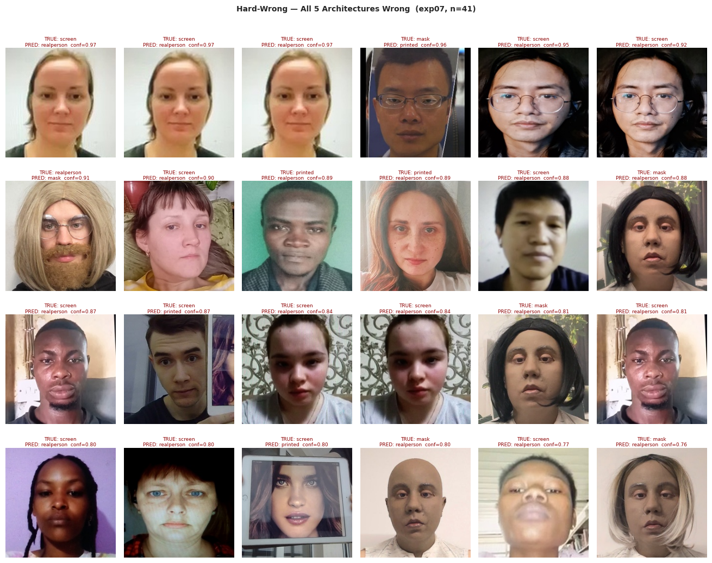
    


```python
disputed_df = (error_df[error_df['category'] == 'disputed'].sort_values('ens_conf'))
print(f'Disputed samples: {len(disputed_df)} (exp06: 86  Δ={len(disputed_df)-86:+d})')
show_image_grid(
    disputed_df,
    title      = f'Disputed — 2 or 3 Architectures Right  (exp07, n={len(disputed_df)})',
    n_cols=6, max_show=24,
    subtitle_fn    = lambda r: (
        f'TRUE: {r["true_label"].replace("fake_", "")}\n'
        f'ENS: {r["ens_pred_label"].replace("fake_", "")}  conf={r["ens_conf"]:.2f}'
    ),
    title_color_fn = lambda r: 'darkorange',
    save_name      = f'error_disputed_{EXP_ID}.png',
)
```

    Disputed samples: 72 (exp06: 86  Δ=-14)


    
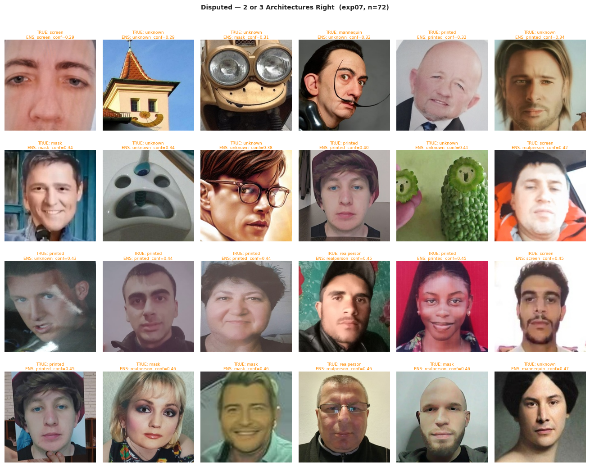
    


```python
low_conf_df = (error_df[error_df['category'] == 'low_conf_correct'].sort_values('ens_conf'))
print(f'Low-confidence correct: {len(low_conf_df)} (exp06: 13  Δ={len(low_conf_df)-13:+d})')
show_image_grid(
    low_conf_df,
    title      = f'Low-Confidence Correct (conf < 0.65 but right, exp07, n={len(low_conf_df)})',
    n_cols=6, max_show=24,
    subtitle_fn    = lambda r: (
        f'TRUE: {r["true_label"].replace("fake_", "")}\n'
        f'conf={r["ens_conf"]:.2f}  n_correct={r["n_correct"]}/5'
    ),
    title_color_fn = lambda r: '#1565C0',
    save_name      = f'error_low_conf_{EXP_ID}.png',
)
```

    Low-confidence correct: 21 (exp06: 13  Δ=+8)


    
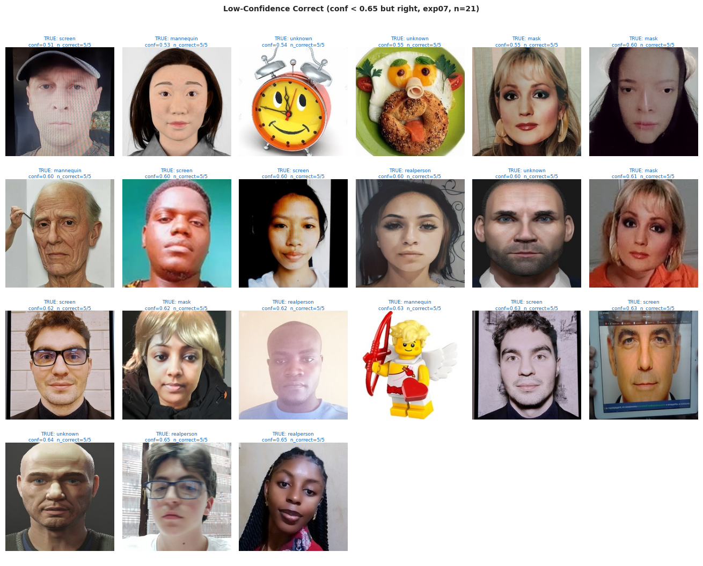
    


---
## 12 · Threshold Optimization

**Established finding (exp03–exp06):** Per-class threshold optimization consistently overfits OOF.  
Nested-CV OOB was below argmax baseline → thresholds do not transfer to LB.

**Decision rule:** Use argmax unless `overfitting_signal < 0.005` AND `expected_gain > 0.002`.


```python
np.random.seed(42)

argmax_f1 = macro_f1_local(y_true, ens_probs.argmax(axis=1))
print(f'1. Argmax (no threshold)    : {argmax_f1:.4f}')

print('2. Naive optimization       : running...', end='', flush=True)
thresh_naive, f1_naive = optimize_thresholds(ens_probs, y_true, n_restarts=30)
preds_naive = (ens_probs * thresh_naive).argmax(axis=1)
print(f' {f1_naive:.4f}')

print('3. Nested CV (5×20)         : running...', end='', flush=True)
avg_thresh, oob_f1s, all_thresh_cv = nested_cv_thresholds(
    ens_probs, y_true, n_outer=5, n_restarts=20
)
preds_cv      = (ens_probs * avg_thresh).argmax(axis=1)
f1_cv_applied = macro_f1_local(y_true, preds_cv)
print(f' OOB={np.mean(oob_f1s):.4f} ± {np.std(oob_f1s):.4f}  applied={f1_cv_applied:.4f}')

print()
print('─' * 55)
print(f'  Argmax baseline           : {argmax_f1:.4f}')
print(f'  Naive (OOF, overfits)     : {f1_naive:.4f}')
print(f'  Nested CV OOB estimate    : {np.mean(oob_f1s):.4f} ← honest LB estimate')
print(f'  Nested CV applied to OOF  : {f1_cv_applied:.4f}')
print()
overfit_signal = f1_naive - np.mean(oob_f1s)
expected_gain  = np.mean(oob_f1s) - argmax_f1
print(f'  Overfitting signal        : {overfit_signal:+.4f}')
print(f'  Expected LB gain (thresh) : {expected_gain:+.4f}')
print()
if overfit_signal > 0.005:
    print('  ⚠️  Significant overfitting — use argmax for inference (consistent with exp03–exp06).')
elif expected_gain > 0.002:
    print('  ✅ Low overfitting AND positive expected gain — nested-CV thresholds may transfer.')
else:
    print('  ⚠️  Low signal either way — stick with argmax (safer default).')
    
print()
print('Nested-CV thresholds:')
for cls, t in zip(CLASSES, avg_thresh):
    print(f'  {cls:<22}: {t:.4f}')
```

    1. Argmax (no threshold)    : 0.9252
    2. Naive optimization       : running... 0.9324
    3. Nested CV (5×20)         : running... OOB=0.9216 ± 0.0208  applied=0.9323
    
    ───────────────────────────────────────────────────────
      Argmax baseline           : 0.9252
      Naive (OOF, overfits)     : 0.9324
      Nested CV OOB estimate    : 0.9216 ← honest LB estimate
      Nested CV applied to OOF  : 0.9323
    
      Overfitting signal        : +0.0108
      Expected LB gain (thresh) : -0.0037
    
      ⚠️  Significant overfitting — use argmax for inference (consistent with exp03–exp06).
    
    Nested-CV thresholds:
      fake_mannequin        : 1.3802
      fake_mask             : 1.3688
      fake_printed          : 1.6808
      fake_screen           : 1.4014
      fake_unknown          : 1.5216
      realperson            : 1.0979


```python
fig, axes = plt.subplots(1, 2, figsize=(14, 5))

x = np.arange(len(CLASSES))
axes[0].bar(x - 0.2, thresh_naive, 0.35, label='Naive (full OOF)',
            color='#FF9800', alpha=0.85, edgecolor='white')
axes[0].bar(x + 0.2, avg_thresh, 0.35, label='Nested CV (avg)',
            color='#2196F3', alpha=0.85, edgecolor='white')
for i in range(len(CLASSES)):
    col = all_thresh_cv[:, i]
    axes[0].errorbar(i + 0.2, avg_thresh[i],
                     yerr=[[avg_thresh[i] - col.min()], [col.max() - avg_thresh[i]]],
                     fmt='none', color='#1565C0', capsize=4, lw=1.5)
axes[0].axhline(1.0, ls='--', color='gray', alpha=0.5, label='No threshold (=1.0)')
axes[0].set_xticks(x)
axes[0].set_xticklabels([c.replace('fake_', '') for c in CLASSES], rotation=25)
axes[0].set_ylabel('Threshold multiplier')
axes[0].set_title('Per-Class Thresholds', fontweight='bold')
axes[0].legend(fontsize=9)

strats = {
    'Argmax\n(baseline)': argmax_f1,
    'Naive\noptimized'  : f1_naive,
    'Nested CV\n(OOB)' : np.mean(oob_f1s),
    'Nested CV\n(applied)': f1_cv_applied,
}
bar_colors = ['#9E9E9E', '#FF5722', '#2196F3', '#4CAF50']
bars_list = list(strats.items())
axes[1].bar(range(len(bars_list)), [v for _, v in bars_list],
            color=bar_colors, alpha=0.85, edgecolor='white')
axes[1].set_xticks(range(len(bars_list)))
axes[1].set_xticklabels([k for k, _ in bars_list], fontsize=9)
axes[1].set_ylabel('OOF / OOB Macro F1')
axes[1].set_title('Threshold Strategy Comparison', fontweight='bold')
y_min = min(v for _, v in bars_list) - 0.005
axes[1].set_ylim(y_min, max(v for _, v in bars_list) + 0.005)
for i, (_, v) in enumerate(bars_list):
    axes[1].text(i, v + 0.0003, f'{v:.4f}', ha='center', va='bottom', fontsize=9)
axes[1].grid(True, alpha=0.3)

plt.tight_layout()
plt.savefig(FIGURES_DIR / f'threshold_optimization_{EXP_ID}.png', dpi=150, bbox_inches='tight')
plt.show()
```


    
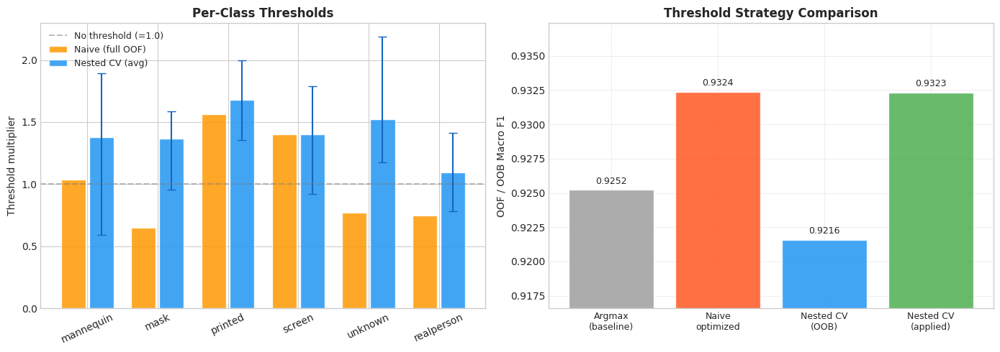
    


---
## 13 · Calibration Analysis

**ECE (Expected Calibration Error):** 0.00 = perfect | < 0.03 = good | 0.05–0.15 = typical DNN.

**exp07 expectations:** Round 2 soft pseudo-labels (from a well-calibrated ensemble) may  
further improve calibration vs exp06, since models learn from probability distributions  
rather than hard labels (Müller et al., 2019).

**exp06 baseline ECE:** convnext=0.0527, eva02=0.0324, dinov2=0.0422, effnet_b4=0.0305,  
swinv2=0.0261, ensemble=0.0642


```python
EXP06_ECE = {
    'convnext': 0.0527, 'eva02': 0.0324, 'dinov2': 0.0422,
    'effnet_b4': 0.0305, 'swinv2': 0.0261, 'ensemble': 0.0642,
}

print('Expected Calibration Error (ECE) — lower is better:')
print(f'  {"Arch":<14} {"exp06 ECE":>10} {"exp07 ECE":>10} {"Δ":>8}  Rating')
print('-' * 65)
ece_scores = {}
for arch in ARCHS:
    ece_scores[arch] = compute_ece(arch_probs[arch], y_true, n_bins=15)
    delta  = ece_scores[arch] - EXP06_ECE[arch]
    rating = '✅ good' if ece_scores[arch] < 0.04 else ('⚠️ moderate' if ece_scores[arch] < 0.08 else '❌ high')
    flag   = '↓ better' if delta < -0.003 else ('↑ worse' if delta > 0.003 else '= similar')
    print(f'  {arch:<14} {EXP06_ECE[arch]:>10.4f} {ece_scores[arch]:>10.4f} {delta:>+8.4f}  {rating}  {flag}')

ece_scores['ensemble'] = compute_ece(ens_probs, y_true, n_bins=15)
delta_ens = ece_scores['ensemble'] - EXP06_ECE['ensemble']
rating_e  = '✅ good' if ece_scores['ensemble'] < 0.04 else ('⚠️ moderate' if ece_scores['ensemble'] < 0.08 else '❌ high')
flag_e    = '↓ better' if delta_ens < -0.003 else ('↑ worse' if delta_ens > 0.003 else '= similar')
print(f'  {"ensemble":<14} {EXP06_ECE["ensemble"]:>10.4f} {ece_scores["ensemble"]:>10.4f} {delta_ens:>+8.4f}  {rating_e}  {flag_e}')
```

    Expected Calibration Error (ECE) — lower is better:
      Arch            exp06 ECE  exp07 ECE        Δ  Rating
    -----------------------------------------------------------------
      convnext           0.0527     0.0452  -0.0075  ⚠️ moderate  ↓ better
      eva02              0.0324     0.0312  -0.0012  ✅ good  = similar
      dinov2             0.0422     0.0280  -0.0142  ✅ good  ↓ better
      effnet_b4          0.0305     0.0207  -0.0098  ✅ good  ↓ better
      swinv2             0.0261     0.0246  -0.0015  ✅ good  = similar
      ensemble           0.0642     0.0532  -0.0110  ⚠️ moderate  ↓ better


```python
n_bins = 10
fig, axes = plt.subplots(1, len(ARCHS) + 1, figsize=(4 * (len(ARCHS) + 1), 4))
all_to_plot = {**{a: arch_probs[a] for a in ARCHS}, 'ensemble': ens_probs}

for idx, (arch, prbs) in enumerate(all_to_plot.items()):
    ax     = axes[idx]
    confs  = prbs.max(axis=1)
    preds_a = prbs.argmax(axis=1)
    accs   = (preds_a == y_true).astype(float)

    bin_edges = np.linspace(0, 1, n_bins + 1)
    b_centers, b_accs, b_confs = [], [], []
    for lo, hi in zip(bin_edges[:-1], bin_edges[1:]):
        mask = (confs > lo) & (confs <= hi)
        if mask.sum() >= 3:
            b_centers.append((lo + hi) / 2)
            b_accs.append(accs[mask].mean())
            b_confs.append(confs[mask].mean())

    b_centers = np.array(b_centers)
    b_accs    = np.array(b_accs)
    b_confs   = np.array(b_confs)
    w_bar     = 1 / n_bins * 0.85

    ax.bar(b_centers, b_accs, width=w_bar,
           color=ARCH_COLORS.get(arch, '#607D8B'), alpha=0.75, label='Accuracy', edgecolor='white')
    gap = b_confs - b_accs
    if (gap > 0).any():
        ax.bar(b_centers[gap > 0], gap[gap > 0], width=w_bar,
               bottom=b_accs[gap > 0], color='#F44336', alpha=0.5, label='Overconf.')
    if (gap < 0).any():
        ax.bar(b_centers[gap < 0], -gap[gap < 0], width=w_bar,
               bottom=b_confs[gap < 0], color='#2196F3', alpha=0.5, label='Underconf.')

    ax.plot([0, 1], [0, 1], 'k--', lw=1.2, label='Perfect')
    ece_v    = ece_scores[arch]
    ece06_v  = EXP06_ECE.get(arch, 0)
    delta_ece = ece_v - ece06_v
    ax.set_title(f'{arch}\nECE={ece_v:.4f} ({delta_ece:+.4f} vs exp06)', fontsize=8.5, fontweight='bold')
    ax.set_xlabel('Confidence', fontsize=8)
    if idx == 0:
        ax.set_ylabel('Accuracy', fontsize=8)
    ax.set_xlim(0, 1); ax.set_ylim(0, 1)
    ax.legend(fontsize=6)
    ax.grid(True, alpha=0.2)
    ax.tick_params(labelsize=7)

plt.suptitle(f'Reliability Diagrams — {EXP_ID}  (Red=overconfident, Blue=underconfident)',
             fontsize=11, y=1.03, fontweight='bold')
plt.tight_layout()
plt.savefig(FIGURES_DIR / f'calibration_reliability_{EXP_ID}.png', dpi=150, bbox_inches='tight')
plt.show()
```


    
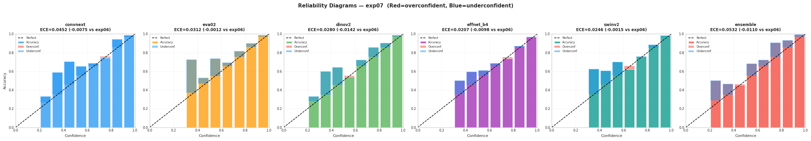
    


---
## 14 · Cross-Experiment Ensemble Analysis  🆕

**Rationale:** If exp06 and exp07 models make different errors (diverse predictions),  
combining all 10-arch OOF may exceed either experiment's 5-arch ensemble.

**Scientific basis:** Two model populations trained on overlapping but different distributions  
(R1 pseudo vs R2 pseudo, different augmentations) should exhibit positive diversity  
that translates to LB gain beyond what either alone can achieve.

**Warning:** This is OOF diversity only. Cross-experiment diversity on the *test set* may differ.  
LB validation is required before using the mega-ensemble for final submission.


```python
EXP06_OOF_DIR = OOF_DIR / 'exp06'

if EXP06_OOF_DIR.exists():
    print(f'Found exp06 OOF directory: {EXP06_OOF_DIR}')
    exp06_csvs = sorted(EXP06_OOF_DIR.glob('*.csv'))
    print(f'exp06 CSV count: {len(exp06_csvs)}')

    # ── Load exp06 OOF ─────────────────────────────────────────────────────────
    oof_data_06 = {}
    for csv_path in exp06_csvs:
        stem = csv_path.stem
        for arch in ARCHS:
            stem_clean = stem.lstrip('oof').lstrip('_')
            if stem_clean.startswith(arch):
                remainder = stem_clean[len(arch):].lstrip('_').lstrip('fold').lstrip('f').lstrip('_')
                nums = re.findall(r'\d+', remainder)
                if not nums:
                    continue
                fold = int(nums[-1])
                df   = pd.read_csv(csv_path)
                df['crop_path'] = df['crop_path'].apply(lambda p: remap_path(p, CROP_TRAIN_DIR))
                oof_data_06.setdefault(arch, {})[fold] = df
                break

    oof_full_06 = {}
    for arch in ARCHS:
        if arch in oof_data_06:
            dfs = [oof_data_06[arch][f] for f in sorted(oof_data_06[arch].keys())]
            df  = pd.concat(dfs, ignore_index=True)
            oof_full_06[arch] = df

    # ── Align exp06 probs to same sorted_paths ──────────────────────────────────
    arch_probs_06 = {}
    arch_preds_06 = {}
    for arch in ARCHS:
        if arch in oof_full_06:
            aligned = oof_full_06[arch].set_index('crop_path').loc[sorted_paths]
            arch_probs_06[arch] = aligned[PROB_COLS].values.astype(np.float32)
            arch_preds_06[arch] = aligned['pred_idx'].values.astype(int)

    print(f'\nLoaded {len(arch_probs_06)} archs from exp06.')

    # ── OOF ensembles ──────────────────────────────────────────────────────────
    ens_probs_06   = np.mean(list(arch_probs_06.values()), axis=0)
    ens_preds_06   = ens_probs_06.argmax(axis=1)
    ens_f1_06_oof  = macro_f1_local(y_true, ens_preds_06)

    # Mega-ensemble: average of all 10 OOF probability arrays
    all_probs = list(arch_probs.values()) + list(arch_probs_06.values())
    mega_probs = np.mean(all_probs, axis=0)
    mega_preds = mega_probs.argmax(axis=1)
    mega_f1    = macro_f1_local(y_true, mega_preds)

    ens_f1_07_oof = macro_f1_local(y_true, ens_preds)

    print()
    print('Cross-Experiment Ensemble Comparison:')
    print('=' * 60)
    print(f'  exp06 only (5 archs×5 folds)       : {ens_f1_06_oof:.4f}')
    print(f'  exp07 only (5 archs×5 folds)       : {ens_f1_07_oof:.4f}  (Δ={ens_f1_07_oof - ens_f1_06_oof:+.4f})')
    print(f'  Mega-ensemble (10 archs×5 folds)   : {mega_f1:.4f}  (Δ vs exp07={mega_f1 - ens_f1_07_oof:+.4f})')
    print()

    # ── Cross-experiment pairwise diversity ────────────────────────────────────
    print('Cross-experiment pairwise Cohen\'s κ (exp06 vs exp07 same arch):')
    for arch in ARCHS:
        if arch in arch_preds_06 and arch in arch_preds:
            kappa = cohen_kappa_score(arch_preds_06[arch], arch_preds[arch])
            print(f'  {arch} (exp06 vs exp07): κ={kappa:.4f}')
    print()
    print('Lower κ = more diverse = more LB gain potential from combining experiments.')

else:
    print(f'exp06 OOF directory not found: {EXP06_OOF_DIR}')
    print()
    print('To enable cross-experiment analysis:')
    print('  1. Ensure oof/exp06/ is present locally (it should be from exp06 analysis)')
    print('  2. Re-run this cell')
    print()
    print('Skipping cross-experiment ensemble analysis.')
```

    Found exp06 OOF directory: /home/darrnhard/ML/Competition/FindIT-DAC/oof/exp06
    exp06 CSV count: 25
    
    Loaded 5 archs from exp06.
    
    Cross-Experiment Ensemble Comparison:
    ============================================================
      exp06 only (5 archs×5 folds)       : 0.9355
      exp07 only (5 archs×5 folds)       : 0.9252  (Δ=-0.0103)
      Mega-ensemble (10 archs×5 folds)   : 0.9306  (Δ vs exp07=+0.0054)
    
    Cross-experiment pairwise Cohen's κ (exp06 vs exp07 same arch):
      convnext (exp06 vs exp07): κ=0.9565
      eva02 (exp06 vs exp07): κ=0.9616
      dinov2 (exp06 vs exp07): κ=0.9592
      effnet_b4 (exp06 vs exp07): κ=0.9179
      swinv2 (exp06 vs exp07): κ=0.9336
    
    Lower κ = more diverse = more LB gain potential from combining experiments.


```python
# ── Only runs if exp06 OOF was available ─────────────────────────────────────
if EXP06_OOF_DIR.exists() and 'arch_probs_06' in dir():
    # LOO analysis on mega-ensemble
    print('Leave-one-arch-experiment analysis (mega-ensemble):')
    print('Dropping each arch from EITHER exp06 or exp07:')
    for arch in ARCHS:
        # Drop exp07 version of this arch
        remaining_07 = {a: arch_probs[a] for a in ARCHS if a != arch}
        remaining_06 = arch_probs_06
        combo = list(remaining_07.values()) + list(remaining_06.values())
        avg   = np.mean(combo, axis=0)
        f1    = macro_f1_local(y_true, avg.argmax(axis=1))
        delta = f1 - mega_f1
        print(f'  Drop exp07/{arch:<12}: F1={f1:.4f}  (Δ={delta:+.4f})')

    print()
    for arch in ARCHS:
        # Drop exp06 version of this arch
        remaining_07 = arch_probs
        remaining_06 = {a: arch_probs_06[a] for a in ARCHS if a != arch and a in arch_probs_06}
        combo = list(remaining_07.values()) + list(remaining_06.values())
        avg   = np.mean(combo, axis=0)
        f1    = macro_f1_local(y_true, avg.argmax(axis=1))
        delta = f1 - mega_f1
        print(f'  Drop exp06/{arch:<12}: F1={f1:.4f}  (Δ={delta:+.4f})')

    print()
    print('Interpretation: positive Δ means dropping that arch from that experiment HELPS.')
    print('Use this to decide which arch-experiment pairs contribute to the mega-ensemble.')
```

    Leave-one-arch-experiment analysis (mega-ensemble):
    Dropping each arch from EITHER exp06 or exp07:
      Drop exp07/convnext    : F1=0.9311  (Δ=+0.0004)
      Drop exp07/eva02       : F1=0.9296  (Δ=-0.0010)
      Drop exp07/dinov2      : F1=0.9260  (Δ=-0.0046)
      Drop exp07/effnet_b4   : F1=0.9319  (Δ=+0.0013)
      Drop exp07/swinv2      : F1=0.9307  (Δ=+0.0001)
    
      Drop exp06/convnext    : F1=0.9310  (Δ=+0.0004)
      Drop exp06/eva02       : F1=0.9291  (Δ=-0.0016)
      Drop exp06/dinov2      : F1=0.9269  (Δ=-0.0037)
      Drop exp06/effnet_b4   : F1=0.9292  (Δ=-0.0014)
      Drop exp06/swinv2      : F1=0.9283  (Δ=-0.0023)
    
    Interpretation: positive Δ means dropping that arch from that experiment HELPS.
    Use this to decide which arch-experiment pairs contribute to the mega-ensemble.


---
## 15 · Summary & Next Actions


```python
print('=' * 72)
print(f'EXP07 POST-TRAINING ANALYSIS SUMMARY')
print('=' * 72)

print()
print('─── MODEL PERFORMANCE ─────────────────────────────────────────────')
for arch in ARCHS:
    r      = results[arch]
    exp06v = EXP06_BASELINES[arch]
    delta  = r['mean'] - exp06v
    flag   = '↑' if delta > 0.002 else ('↓' if delta < -0.002 else '=')
    print(f'  {arch:<14}: {r["mean"]:.4f} ± {r["std"]:.4f}  ({delta:+.4f} vs exp06 {flag})')

print()
print('─── HYPOTHESIS SCORECARD ────────────────────────────────────────────')
screen_idx   = CLASSES.index('fake_screen')
screen_f1_07 = ens_class_f1[screen_idx]
h1 = '✅' if screen_f1_07 > EXP06_FINDINGS['fake_screen_f1_ens'] else '❌'
flat2d_07 = sum(1 for i, (tc, pc) in enumerate(
    cross_df.groupby(['true_cat', 'pred_cat']).size().items()
) if tc == 'FLAT-2D' and pc == 'REAL') if 'cross_df' in dir() else '?'
h2 = '✅' if flat2d_real_07 < EXP06_FINDINGS['flat2d_real_errors'] else '❌'
h3 = '✅' if results['swinv2']['std'] < EXP06_FINDINGS['swinv2_std'] else '❌'
h4 = '✅' if macro_f1_local(y_true, ens_preds) > EXP06_FINDINGS['ensemble_oof'] else '❌'
print(f'  H1 fake_screen F1 > {EXP06_FINDINGS["fake_screen_f1_ens"]:.4f}  → {h1} ({screen_f1_07:.4f})')
print(f'  H2 FLAT-2D→REAL < {EXP06_FINDINGS["flat2d_real_errors"]} errors → {h2} ({flat2d_real_07})')
print(f'  H3 SwinV2 std < {EXP06_FINDINGS["swinv2_std"]:.4f}   → {h3} ({results["swinv2"]["std"]:.4f})')
print(f'  H4 Ensemble OOF > {EXP06_FINDINGS["ensemble_oof"]:.4f} → {h4} ({macro_f1_local(y_true, ens_preds):.4f})')

print()
print('─── ENSEMBLE OOF F1 ────────────────────────────────────────────────')
all5_f1   = macro_f1_local(y_true, ens_preds)
print(f'  exp07 equal-weight argmax (all-5): {all5_f1:.4f}')
print(f'  exp07 top-4 (drop {best_drop:<12}) : {loo_results[best_drop]:.4f}')
print(f'  exp06 all-5 baseline             : {EXP06_FINDINGS["ensemble_oof"]:.4f}')

print()
print('─── CLEANLAB FINDINGS ──────────────────────────────────────────────')
print(f'  Total flagged  : {len(cleanlab_df)} ({len(cleanlab_df)/N*100:.1f}%)  (exp06: 11, 0.8%)')
print(f'  Agreed all 5   : {len(agreed)} ← review these first')

print()
print('─── CALIBRATION (ECE) ──────────────────────────────────────────────')
for arch, ece_v in ece_scores.items():
    rating = '✅ good' if ece_v < 0.04 else '⚠️ moderate' if ece_v < 0.08 else '❌ high'
    exp06v = EXP06_ECE.get(arch, 0)
    delta  = ece_v - exp06v
    print(f'  {arch:<14}: {ece_v:.4f}  ({delta:+.4f} vs exp06)  {rating}')

print()
print('─── PER-CLASS FLAGS ────────────────────────────────────────────────')
for i, cls in enumerate(CLASSES):
    f1_07  = ens_class_f1[i]
    f1_06  = EXP06_FINDINGS['per_class_f1'][cls]
    delta  = f1_07 - f1_06
    status = '⚠️ NEEDS ATTENTION' if f1_07 < 0.87 else '✅'
    print(f'  {cls:<22}: exp07={f1_07:.4f}  (Δ={delta:+.4f} vs exp06)  {status}')
```

    ========================================================================
    EXP07 POST-TRAINING ANALYSIS SUMMARY
    ========================================================================
    
    ─── MODEL PERFORMANCE ─────────────────────────────────────────────
      convnext      : 0.9073 ± 0.0148  (-0.0111 vs exp06 ↓)
      eva02         : 0.9293 ± 0.0175  (+0.0026 vs exp06 ↑)
      dinov2        : 0.9254 ± 0.0138  (-0.0067 vs exp06 ↓)
      effnet_b4     : 0.8826 ± 0.0310  (-0.0076 vs exp06 ↓)
      swinv2        : 0.9131 ± 0.0218  (+0.0042 vs exp06 ↑)
    
    ─── HYPOTHESIS SCORECARD ────────────────────────────────────────────
      H1 fake_screen F1 > 0.9040  → ❌ (0.8933)
      H2 FLAT-2D→REAL < 34 errors → ❌ (35)
      H3 SwinV2 std < 0.0348   → ✅ (0.0218)
      H4 Ensemble OOF > 0.9355 → ❌ (0.9252)
    
    ─── ENSEMBLE OOF F1 ────────────────────────────────────────────────
      exp07 equal-weight argmax (all-5): 0.9252
      exp07 top-4 (drop convnext    ) : 0.9306
      exp06 all-5 baseline             : 0.9355
    
    ─── CLEANLAB FINDINGS ──────────────────────────────────────────────
      Total flagged  : 21 (1.4%)  (exp06: 11, 0.8%)
      Agreed all 5   : 7 ← review these first
    
    ─── CALIBRATION (ECE) ──────────────────────────────────────────────
      convnext      : 0.0452  (-0.0075 vs exp06)  ⚠️ moderate
      eva02         : 0.0312  (-0.0012 vs exp06)  ✅ good
      dinov2        : 0.0280  (-0.0142 vs exp06)  ✅ good
      effnet_b4     : 0.0207  (-0.0098 vs exp06)  ✅ good
      swinv2        : 0.0246  (-0.0015 vs exp06)  ✅ good
      ensemble      : 0.0532  (-0.0110 vs exp06)  ⚠️ moderate
    
    ─── PER-CLASS FLAGS ────────────────────────────────────────────────
      fake_mannequin        : exp07=0.9579  (Δ=-0.0053 vs exp06)  ✅
      fake_mask             : exp07=0.9148  (Δ=-0.0057 vs exp06)  ✅
      fake_printed          : exp07=0.9055  (Δ=-0.0317 vs exp06)  ✅
      fake_screen           : exp07=0.8933  (Δ=-0.0107 vs exp06)  ✅
      fake_unknown          : exp07=0.9756  (Δ=-0.0016 vs exp06)  ✅
      realperson            : exp07=0.9043  (Δ=-0.0068 vs exp06)  ✅


```python
print()
print('=' * 72)
print('RANKED ACTION ITEMS — exp07')
print('=' * 72)
print(f'''
🔴 P0 — BEFORE SUBMITTING:

  1. MANUAL ERROR REVIEW (Section 11 — Hard-Wrong grid)
     ├─ Check every image in the hard-wrong grid
     ├─ Did fake_screen-as-realperson count decrease? (was dominant in exp06)
     └─ Note any NEW error patterns introduced by augmentation changes

  2. CLEANLAB REVIEW (Section 10)
     ├─ Review the {len(agreed)} samples agreed by ALL 5 architectures
     └─ Compare to exp06 flags — are the same images still flagged?

🟠 P1 — INFERENCE (run 11-inference-exp07.ipynb):

  3. SUBMISSION STRATEGY:
     ├─ Sub 1: exp07 all-5 equal weight argmax    ← primary (OOF={all5_f1:.4f})
     ├─ Sub 2: exp07 top-4 (drop {best_drop:<12})  ← if LOO shows benefit
     └─ Sub 3: exp06+exp07 mega-ensemble argmax   ← if Section 14 shows OOF gain

  4. THRESHOLD DECISION:
     ├─ Overfitting signal = {overfit_signal:+.4f}
     └─ → {"Use argmax (overfitting detected)" if overfit_signal > 0.005 else "Nested-CV thresholds may transfer (low overfitting)"}

🟢 P2 — FUTURE EXPERIMENTS (exp08):

  5. INVESTIGATE REGRESSION: ConvNeXt (−0.0111) and DINOv2 (−0.0067) regressed.
     └─ Check: is regression uniform across folds (config issue) or fold-specific (data split)?

  6. ROUND 3 PSEUDO-LABELS: If LB improves on exp07, generate R3 pseudo from exp07 ensemble.

  7. ARCHITECTURE PRUNING: Use LOO results + LB deltas to identify safe-to-drop arch.
     └─ Current LOO suggests: dropping {best_drop} loses only Δ={loo_results[best_drop] - all5_f1:+.4f} OOF.
''')
```

    
    ========================================================================
    RANKED ACTION ITEMS — exp07
    ========================================================================
    
    🔴 P0 — BEFORE SUBMITTING:
    
      1. MANUAL ERROR REVIEW (Section 11 — Hard-Wrong grid)
         ├─ Check every image in the hard-wrong grid
         ├─ Did fake_screen-as-realperson count decrease? (was dominant in exp06)
         └─ Note any NEW error patterns introduced by augmentation changes
    
      2. CLEANLAB REVIEW (Section 10)
         ├─ Review the 7 samples agreed by ALL 5 architectures
         └─ Compare to exp06 flags — are the same images still flagged?
    
    🟠 P1 — INFERENCE (run 11-inference-exp07.ipynb):
    
      3. SUBMISSION STRATEGY:
         ├─ Sub 1: exp07 all-5 equal weight argmax    ← primary (OOF=0.9252)
         ├─ Sub 2: exp07 top-4 (drop convnext    )  ← if LOO shows benefit
         └─ Sub 3: exp06+exp07 mega-ensemble argmax   ← if Section 14 shows OOF gain
    
      4. THRESHOLD DECISION:
         ├─ Overfitting signal = +0.0108
         └─ → Use argmax (overfitting detected)
    
    🟢 P2 — FUTURE EXPERIMENTS (exp08):
    
      5. INVESTIGATE REGRESSION: ConvNeXt (−0.0111) and DINOv2 (−0.0067) regressed.
         └─ Check: is regression uniform across folds (config issue) or fold-specific (data split)?
    
      6. ROUND 3 PSEUDO-LABELS: If LB improves on exp07, generate R3 pseudo from exp07 ensemble.
    
      7. ARCHITECTURE PRUNING: Use LOO results + LB deltas to identify safe-to-drop arch.
         └─ Current LOO suggests: dropping convnext loses only Δ=+0.0053 OOF.
    


```python
# ── Export findings ───────────────────────────────────────────────────────────
summary_rows = []
for arch in ARCHS:
    row = {
        'arch': arch,
        'exp_id': EXP_ID,
        'mean_f1': results[arch]['mean'],
        'std_f1': results[arch]['std'],
        'ece': ece_scores[arch],
        'delta_vs_exp06': results[arch]['mean'] - EXP06_BASELINES[arch],
    }
    row.update({f'f1_{cls}': class_metrics[arch]['f1'][i] for i, cls in enumerate(CLASSES)})
    summary_rows.append(row)
summary_df = pd.DataFrame(summary_rows)

# Hypothesis scorecard export
hyp_df = pd.DataFrame([
    {'hypothesis': 'H1_fake_screen_f1', 'baseline': EXP06_FINDINGS['fake_screen_f1_ens'],
     'result': ens_class_f1[CLASSES.index('fake_screen')], 'confirmed': h1 == '✅'},
    {'hypothesis': 'H2_flat2d_real_errors', 'baseline': EXP06_FINDINGS['flat2d_real_errors'],
     'result': flat2d_real_07, 'confirmed': h2 == '✅'},
    {'hypothesis': 'H3_swinv2_std', 'baseline': EXP06_FINDINGS['swinv2_std'],
     'result': results['swinv2']['std'], 'confirmed': h3 == '✅'},
    {'hypothesis': 'H4_ensemble_oof_f1', 'baseline': EXP06_FINDINGS['ensemble_oof'],
     'result': all5_f1, 'confirmed': h4 == '✅'},
])

summary_path   = REPORTS_DIR / f'analysis_{EXP_ID}_summary.csv'
cleanlab_path  = REPORTS_DIR / f'cleanlab_{EXP_ID}_flags.csv'
thresh_path    = REPORTS_DIR / f'thresholds_{EXP_ID}.csv'
error_path     = REPORTS_DIR / f'error_analysis_{EXP_ID}.csv'
hyp_path       = REPORTS_DIR / f'hypothesis_{EXP_ID}.csv'

summary_df.to_csv(summary_path, index=False)
if len(cleanlab_df) > 0:
    cleanlab_df.to_csv(cleanlab_path, index=False)
pd.DataFrame({
    'class'               : CLASSES,
    'threshold_nested_cv' : avg_thresh,
    'threshold_naive'     : thresh_naive,
}).to_csv(thresh_path, index=False)
error_df[['crop_path', 'true_label', 'category', 'n_correct', 'ens_conf',
           'ens_pred_label']].to_csv(error_path, index=False)
hyp_df.to_csv(hyp_path, index=False)

print('Exported reports:')
for p in [summary_path, cleanlab_path, thresh_path, error_path, hyp_path]:
    if p.exists():
        print(f'  ✅ {p.name}')

print()
print('Exported figures:')
for f in sorted(FIGURES_DIR.glob(f'*{EXP_ID}*.png')):
    print(f'  ✅ {f.name}')
```

    Exported reports:
      ✅ analysis_exp07_summary.csv
      ✅ cleanlab_exp07_flags.csv
      ✅ thresholds_exp07.csv
      ✅ error_analysis_exp07.csv
      ✅ hypothesis_exp07.csv
    
    Exported figures:
      ✅ calibration_reliability_exp07.png
      ✅ cleanlab_flagged_exp07.png
      ✅ confusion_delta_exp07.png
      ✅ confusion_matrices_exp07.png
      ✅ ensemble_diversity_exp07.png
      ✅ epoch_convergence_exp07.png
      ✅ error_disputed_exp07.png
      ✅ error_hard_wrong_exp07.png
      ✅ error_low_conf_exp07.png
      ✅ fold_stability_exp07.png
      ✅ per_class_performance_exp07.png
      ✅ threshold_optimization_exp07.png
      ✅ training_summary_exp07.png


```python

```
