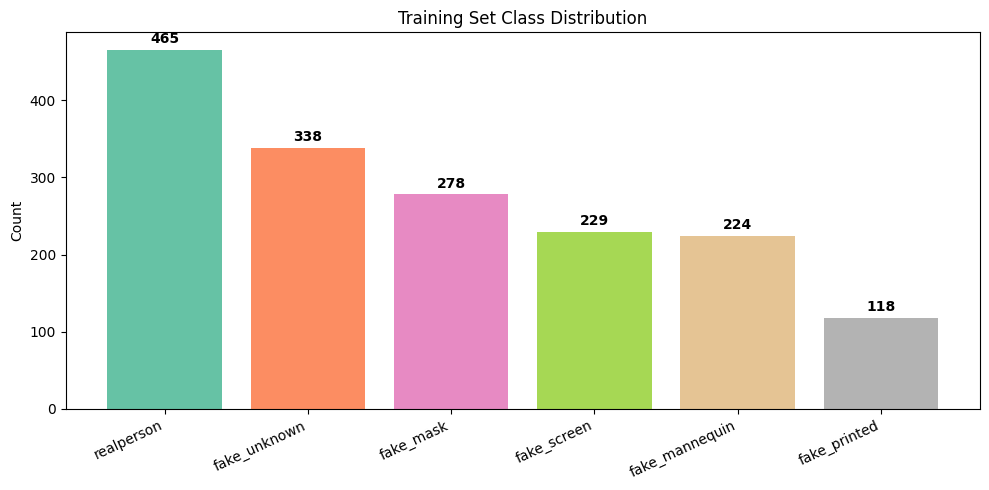
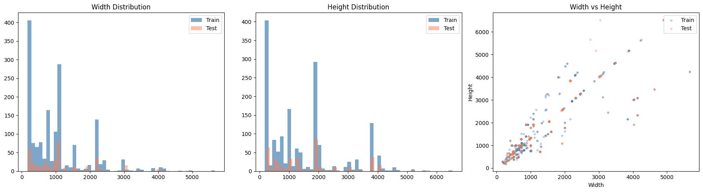
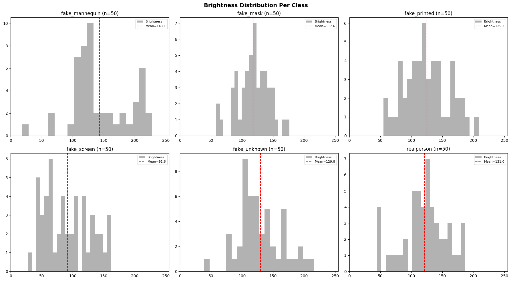
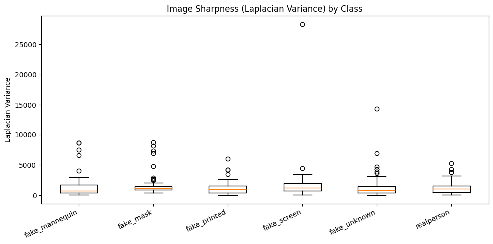
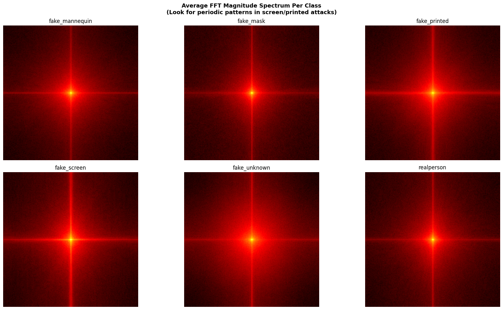

# Face Spoofing Competition — EDA
**Competition:** DAC Find IT 2026  
**Objective:** 6-class face spoofing detection  
**Metric:** Macro F1-Score

Run all cells on a **CPU kernel** (no GPU needed for EDA).


```python
import os
import numpy as np
import pandas as pd
import matplotlib.pyplot as plt
import matplotlib.gridspec as gridspec
from pathlib import Path
from PIL import Image
from collections import Counter, defaultdict
import hashlib
import random
import cv2
import warnings
warnings.filterwarnings('ignore')

random.seed(42)

DATA_PATH = Path("/home/darrnhard/ML/Competition/FindIT-DAC/dataset")
TRAIN_PATH = DATA_PATH / "train"
TEST_PATH = DATA_PATH / "test"

CLASSES = sorted([d.name for d in TRAIN_PATH.iterdir() if d.is_dir()])
print(f"Classes ({len(CLASSES)}): {CLASSES}")

```

    Classes (6): ['fake_mannequin', 'fake_mask', 'fake_printed', 'fake_screen', 'fake_unknown', 'realperson']


## 1. Class Distribution


```python
class_counts = {}
all_train_files = []
for cls in CLASSES:
    files = list((TRAIN_PATH / cls).glob("*"))
    class_counts[cls] = len(files)
    for f in files:
        all_train_files.append((f, cls))

test_files = sorted(list(TEST_PATH.glob("*")))

total = sum(class_counts.values())
print("=" * 55)
print("CLASS DISTRIBUTION (Train)")
print("=" * 55)
for cls, count in sorted(class_counts.items(), key=lambda x: -x[1]):
    pct = count / total * 100
    bar = "█" * int(pct)
    print(f"  {cls:<20s} {count:>4d}  ({pct:5.1f}%)  {bar}")
print(f"  {'TOTAL':<20s} {total:>4d}")
print(f"\nTest set: {len(test_files)} images")
print(f"Imbalance ratio (max/min): {max(class_counts.values()) / min(class_counts.values()):.2f}x")

```

    =======================================================
    CLASS DISTRIBUTION (Train)
    =======================================================
      realperson            465  ( 28.1%)  ████████████████████████████
      fake_unknown          338  ( 20.5%)  ████████████████████
      fake_mask             278  ( 16.8%)  ████████████████
      fake_screen           229  ( 13.9%)  █████████████
      fake_mannequin        224  ( 13.6%)  █████████████
      fake_printed          118  (  7.1%)  ███████
      TOTAL                1652
    
    Test set: 404 images
    Imbalance ratio (max/min): 3.94x


```python
fig, ax = plt.subplots(figsize=(10, 5))
colors = plt.cm.Set2(np.linspace(0, 1, len(CLASSES)))
sorted_classes = sorted(class_counts.items(), key=lambda x: -x[1])
bars = ax.bar([c[0] for c in sorted_classes], [c[1] for c in sorted_classes], color=colors)
ax.set_ylabel("Count")
ax.set_title("Training Set Class Distribution")
for bar, (cls, cnt) in zip(bars, sorted_classes):
    ax.text(bar.get_x() + bar.get_width()/2, bar.get_height() + 5, str(cnt), 
            ha='center', va='bottom', fontweight='bold')
plt.xticks(rotation=25, ha='right')
plt.tight_layout()
plt.show()

```


    

    


## 2. Image Properties (Sizes, Formats, Filesizes)


```python
def analyze_images(file_list, label=""):
    widths, heights, aspects, formats, modes, filesizes = [], [], [], [], [], []
    for fp in file_list:
        if isinstance(fp, tuple):
            fp = fp[0]
        try:
            filesizes.append(os.path.getsize(fp))
            with Image.open(fp) as img:
                w, h = img.size
                widths.append(w)
                heights.append(h)
                aspects.append(w / h)
                formats.append(img.format)
                modes.append(img.mode)
        except Exception as e:
            print(f"  Error reading {fp}: {e}")
    
    print(f"--- {label} ({len(widths)} images) ---")
    print(f"  Width:    min={min(widths)}, max={max(widths)}, median={int(np.median(widths))}, mean={np.mean(widths):.0f}")
    print(f"  Height:   min={min(heights)}, max={max(heights)}, median={int(np.median(heights))}, mean={np.mean(heights):.0f}")
    print(f"  Aspect:   min={min(aspects):.2f}, max={max(aspects):.2f}, median={np.median(aspects):.2f}")
    print(f"  Formats:  {Counter(formats)}")
    print(f"  Modes:    {Counter(modes)}")
    print(f"  Filesize: min={min(filesizes)//1024}KB, max={max(filesizes)//1024}KB, median={int(np.median(filesizes))//1024}KB")
    print()
    return widths, heights, aspects, filesizes

train_w, train_h, train_a, train_fs = analyze_images(all_train_files, "TRAIN")
test_w, test_h, test_a, test_fs = analyze_images(test_files, "TEST")

```

    --- TRAIN (1652 images) ---
      Width:    min=168, max=5664, median=863, mean=1039
      Height:   min=183, max=6528, median=1000, mean=1493
      Aspect:   min=0.33, max=2.11, median=0.75
      Formats:  Counter({'JPEG': 1640, 'WEBP': 9, 'PNG': 3})
      Modes:    Counter({'RGB': 1650, 'RGBA': 2})
      Filesize: min=3KB, max=9242KB, median=150KB
    
    --- TEST (404 images) ---
      Width:    min=174, max=4896, median=1080, mean=1214
      Height:   min=225, max=6528, median=1333, mean=1705
      Aspect:   min=0.45, max=2.11, median=0.75
      Formats:  Counter({'JPEG': 402, 'PNG': 1, 'WEBP': 1})
      Modes:    Counter({'RGB': 403, 'P': 1})
      Filesize: min=4KB, max=9644KB, median=237KB
    


```python
print("Per-Class Image Size Stats")
print("-" * 80)
for cls in CLASSES:
    cls_files = [(f, c) for f, c in all_train_files if c == cls]
    ws, hs = [], []
    for fp, _ in cls_files:
        with Image.open(fp) as img:
            w, h = img.size
            ws.append(w)
            hs.append(h)
    print(f"  {cls:<20s}  W: {np.mean(ws):6.0f}±{np.std(ws):5.0f}  H: {np.mean(hs):6.0f}±{np.std(hs):5.0f}  "
          f"Range: ({min(ws)}x{min(hs)}) - ({max(ws)}x{max(hs)})")

```

    Per-Class Image Size Stats
    --------------------------------------------------------------------------------
      fake_mannequin        W:    817±  586  H:    995±  708  Range: (168x194) - (4128x4096)
      fake_mask             W:   1458±  755  H:   2311± 1151  Range: (256x256) - (4624x4096)
      fake_printed          W:   1574± 1408  H:   1910± 1564  Range: (256x256) - (5664x4248)
      fake_screen           W:   1023±  593  H:   1618±  988  Range: (275x183) - (3880x5184)
      fake_unknown          W:    385±  438  H:    460±  655  Range: (256x256) - (3024x4032)
      realperson            W:   1245±  844  H:   1827± 1237  Range: (256x256) - (4896x6528)


```python
fig, axes = plt.subplots(1, 3, figsize=(18, 5))

axes[0].hist(train_w, bins=50, alpha=0.7, label='Train', color='steelblue')
axes[0].hist(test_w, bins=50, alpha=0.5, label='Test', color='coral')
axes[0].set_title("Width Distribution")
axes[0].legend()

axes[1].hist(train_h, bins=50, alpha=0.7, label='Train', color='steelblue')
axes[1].hist(test_h, bins=50, alpha=0.5, label='Test', color='coral')
axes[1].set_title("Height Distribution")
axes[1].legend()

axes[2].scatter(train_w, train_h, alpha=0.3, s=10, label='Train', c='steelblue')
axes[2].scatter(test_w, test_h, alpha=0.3, s=10, label='Test', c='coral')
axes[2].set_xlabel("Width")
axes[2].set_ylabel("Height")
axes[2].set_title("Width vs Height")
axes[2].legend()

plt.tight_layout()
plt.show()

```


    

    


## 3. Sample Images Per Class


```python
fig, axes = plt.subplots(len(CLASSES), 6, figsize=(18, len(CLASSES) * 3))
fig.suptitle("Sample Images Per Class (6 random each)", fontsize=16, fontweight='bold', y=1.01)

for i, cls in enumerate(CLASSES):
    cls_files = [f for f, c in all_train_files if c == cls]
    samples = random.sample(cls_files, min(6, len(cls_files)))
    for j in range(6):
        ax = axes[i][j]
        if j < len(samples):
            img = Image.open(samples[j])
            ax.imshow(np.array(img))
            if j == 0:
                ax.set_ylabel(cls, fontsize=10, fontweight='bold', rotation=0, labelpad=100, va='center')
        ax.axis('off')

plt.tight_layout()
plt.show()

```


    

    


## 4. Color & Brightness Analysis


```python
fig, axes = plt.subplots(2, 3, figsize=(18, 10))
axes = axes.flatten()

print("Per-Class Color Stats (sampled 50 imgs each)")
print("-" * 70)

for i, cls in enumerate(CLASSES):
    cls_files = [f for f, c in all_train_files if c == cls]
    samples = random.sample(cls_files, min(50, len(cls_files)))
    
    means_r, means_g, means_b, brightness = [], [], [], []
    for fp in samples:
        img = np.array(Image.open(fp).convert('RGB').resize((128, 128)))
        means_r.append(img[:,:,0].mean())
        means_g.append(img[:,:,1].mean())
        means_b.append(img[:,:,2].mean())
        brightness.append(img.mean())
    
    ax = axes[i]
    ax.hist(brightness, bins=20, alpha=0.6, color='gray', label='Brightness')
    ax.axvline(np.mean(brightness), color='red', linestyle='--', label=f'Mean={np.mean(brightness):.1f}')
    ax.set_title(f"{cls} (n={len(samples)})")
    ax.set_xlim(0, 255)
    ax.legend(fontsize=8)
    
    print(f"  {cls:<20s}  R:{np.mean(means_r):5.1f}  G:{np.mean(means_g):5.1f}  "
          f"B:{np.mean(means_b):5.1f}  Brightness:{np.mean(brightness):5.1f}")

plt.suptitle("Brightness Distribution Per Class", fontsize=14, fontweight='bold')
plt.tight_layout()
plt.show()

```

    Per-Class Color Stats (sampled 50 imgs each)
    ----------------------------------------------------------------------
      fake_mannequin        R:157.6  G:140.8  B:130.8  Brightness:143.1
      fake_mask             R:127.3  G:115.9  B:109.8  Brightness:117.6
      fake_printed          R:134.4  G:124.2  B:117.3  Brightness:125.3
      fake_screen           R: 98.5  G: 89.7  B: 86.6  Brightness: 91.6
      fake_unknown          R:143.8  G:126.7  B:118.7  Brightness:129.8
      realperson            R:134.1  G:117.1  B:111.7  Brightness:121.0


    

    


## 5. Duplicate & Leakage Check


```python
def file_hash(fp):
    with open(fp, 'rb') as f:
        return hashlib.md5(f.read()).hexdigest()

# Train duplicates
train_hashes = defaultdict(list)
for fp, cls in all_train_files:
    h = file_hash(fp)
    train_hashes[h].append((fp.name, cls))

duplicates = {h: files for h, files in train_hashes.items() if len(files) > 1}
print(f"Unique images in train: {len(train_hashes)}")
print(f"Duplicate groups: {len(duplicates)}")
if duplicates:
    print("\nExamples of duplicates:")
    for h, files in list(duplicates.items())[:5]:
        print(f"  {files}")

# Train-test overlap
test_hashes = {}
for fp in test_files:
    h = file_hash(fp)
    test_hashes[h] = fp.name

overlap = set(train_hashes.keys()) & set(test_hashes.keys())
print(f"\nTrain-Test overlap (exact hash match): {len(overlap)}")
if overlap:
    print("FREE LABELS (test images that exist in train):")
    for h in list(overlap)[:10]:
        print(f"  Train: {train_hashes[h]}  <-->  Test: {test_hashes[h]}")

```

    Unique images in train: 1474
    Duplicate groups: 161
    
    Examples of duplicates:
      [('mannequin_005.jpg', 'fake_mannequin'), ('screen_048.jpg', 'fake_screen')]
      [('mannequin_006.jpeg', 'fake_mannequin'), ('mannequin_016.jpeg', 'fake_mannequin')]
      [('mannequin_008.jpg', 'fake_mannequin'), ('screen_176.jpg', 'fake_screen')]
      [('mannequin_011.jpg', 'fake_mannequin'), ('mannequin_207.jpg', 'fake_mannequin')]
      [('mannequin_012.jpeg', 'fake_mannequin'), ('mannequin_157.jpeg', 'fake_mannequin')]
    
    Train-Test overlap (exact hash match): 87
    FREE LABELS (test images that exist in train):
      Train: [('printed_095.jpeg', 'fake_printed')]  <-->  Test: test_156.jpeg
      Train: [('mannequin_174.jpg', 'fake_mannequin')]  <-->  Test: test_082.jpg
      Train: [('mannequin_042.jpg', 'fake_mannequin'), ('screen_088.jpg', 'fake_screen')]  <-->  Test: test_220.jpg
      Train: [('mannequin_159.jpg', 'fake_mannequin')]  <-->  Test: test_150.jpg
      Train: [('mannequin_217.jpg', 'fake_mannequin')]  <-->  Test: test_061.jpg
      Train: [('mannequin_019.jpg', 'fake_mannequin')]  <-->  Test: test_163.jpg
      Train: [('mask_223.jpg', 'fake_mask')]  <-->  Test: test_124.jpg
      Train: [('real_457.jpg', 'realperson')]  <-->  Test: test_274.jpg
      Train: [('real_272.jpg', 'realperson')]  <-->  Test: test_213.jpg
      Train: [('real_286.jpg', 'realperson')]  <-->  Test: test_249.jpg


## 6. File Naming Patterns


```python
print("Train filenames (per class):")
for cls in CLASSES:
    cls_files = sorted([f.name for f, c in all_train_files if c == cls])
    exts = Counter([Path(f).suffix for f in cls_files])
    print(f"  {cls}: {cls_files[:3]} ... {cls_files[-1]}")
    print(f"    Extensions: {exts}")

print(f"\nTest filenames:")
print(f"  {[f.name for f in test_files[:5]]} ... {test_files[-1].name}")
print(f"  Extensions: {Counter([f.suffix for f in test_files])}")

```

    Train filenames (per class):
      fake_mannequin: ['mannequin_001.jpg', 'mannequin_002.jpg', 'mannequin_003.jpg'] ... mannequin_224.jpg
        Extensions: Counter({'.jpg': 208, '.jpeg': 12, '.png': 2, '.JPG': 2})
      fake_mask: ['mask_001.jpg', 'mask_002.jpg', 'mask_003.jpg'] ... mask_278.jpg
        Extensions: Counter({'.jpg': 273, '.jpeg': 5})
      fake_printed: ['printed_001.jpg', 'printed_002.jpeg', 'printed_003.jpg'] ... printed_118.jpg
        Extensions: Counter({'.jpg': 96, '.jpeg': 22})
      fake_screen: ['screen_001.jpg', 'screen_002.jpg', 'screen_003.jpg'] ... screen_229.jpg
        Extensions: Counter({'.jpg': 228, '.JPG': 1})
      fake_unknown: ['unknown_001.jpeg', 'unknown_002.jpg', 'unknown_003.jpeg'] ... unknown_338.jpeg
        Extensions: Counter({'.jpeg': 296, '.jpg': 41, '.png': 1})
      realperson: ['real_001.jpg', 'real_002.jpg', 'real_003.jpg'] ... real_465.jpg
        Extensions: Counter({'.jpg': 424, '.jpeg': 41})
    
    Test filenames:
      ['test_001.jpg', 'test_002.jpg', 'test_003.jpg', 'test_004.jpg', 'test_005.jpg'] ... test_404.jpg
      Extensions: Counter({'.jpg': 355, '.jpeg': 48, '.png': 1})


## 7. Sharpness Analysis (Laplacian Variance)
Higher value = sharper image. Printed/screen fakes are often blurrier than real faces.


```python
sharpness_per_class = {}
print("Sharpness Stats (Laplacian Variance, sampled 50 per class)")
print("-" * 70)

for cls in CLASSES:
    cls_files = [f for f, c in all_train_files if c == cls]
    samples = random.sample(cls_files, min(50, len(cls_files)))
    sharps = []
    for fp in samples:
        img = cv2.imread(str(fp), cv2.IMREAD_GRAYSCALE)
        img = cv2.resize(img, (256, 256))
        lap_var = cv2.Laplacian(img, cv2.CV_64F).var()
        sharps.append(lap_var)
    sharpness_per_class[cls] = sharps
    print(f"  {cls:<20s}  Mean: {np.mean(sharps):8.1f} ± {np.std(sharps):7.1f}  "
          f"(min={np.min(sharps):.0f}, max={np.max(sharps):.0f})")

fig, ax = plt.subplots(figsize=(10, 5))
ax.boxplot(sharpness_per_class.values(), labels=sharpness_per_class.keys())
ax.set_title("Image Sharpness (Laplacian Variance) by Class")
ax.set_ylabel("Laplacian Variance")
plt.xticks(rotation=25, ha='right')
plt.tight_layout()
plt.show()

```

    Sharpness Stats (Laplacian Variance, sampled 50 per class)
    ----------------------------------------------------------------------
      fake_mannequin        Mean:   1570.4 ±  2043.3  (min=110, max=8652)
      fake_mask             Mean:   1799.9 ±  1930.4  (min=435, max=8741)
      fake_printed          Mean:   1243.1 ±  1167.1  (min=30, max=6011)
      fake_screen           Mean:   2059.6 ±  3880.7  (min=55, max=28281)
      fake_unknown          Mean:   1575.7 ±  2311.1  (min=40, max=14346)
      realperson            Mean:   1352.5 ±  1152.3  (min=77, max=5293)


    

    


## 8. Frequency Domain Analysis (FFT)
Screen attacks often show periodic moire patterns visible in the frequency domain.


```python
fig, axes = plt.subplots(2, 3, figsize=(18, 10))
axes = axes.flatten()

for i, cls in enumerate(CLASSES):
    cls_files = [f for f, c in all_train_files if c == cls]
    samples = random.sample(cls_files, min(30, len(cls_files)))
    
    avg_spectrum = np.zeros((256, 256))
    for fp in samples:
        img = cv2.imread(str(fp), cv2.IMREAD_GRAYSCALE)
        img = cv2.resize(img, (256, 256))
        f_transform = np.fft.fft2(img)
        f_shift = np.fft.fftshift(f_transform)
        magnitude = np.log1p(np.abs(f_shift))
        avg_spectrum += magnitude
    avg_spectrum /= len(samples)
    
    axes[i].imshow(avg_spectrum, cmap='hot')
    axes[i].set_title(f"{cls}")
    axes[i].axis('off')

plt.suptitle("Average FFT Magnitude Spectrum Per Class\n(Look for periodic patterns in screen/printed attacks)", 
             fontsize=13, fontweight='bold')
plt.tight_layout()
plt.show()

```


    

    


## Summary & Next Steps

**After reviewing the outputs above, paste the key findings back and we'll design the model pipeline based on:**

1. **Input resolution** — based on image size distribution  
2. **Augmentation strategy** — based on visual patterns & what distinguishes classes  
3. **Class imbalance handling** — weights vs oversampling  
4. **Architecture choice** — based on texture/frequency importance  
5. **Ensemble strategy** — K-fold + multi-architecture  


