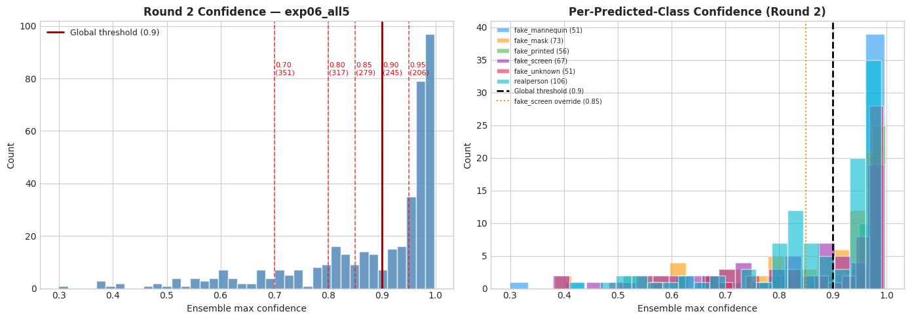
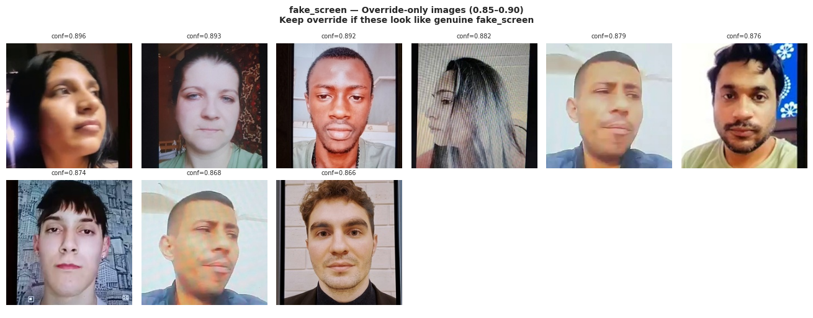
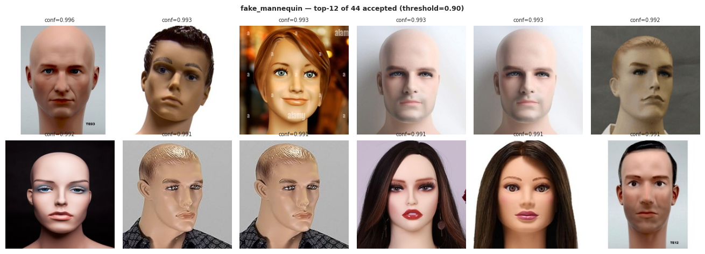
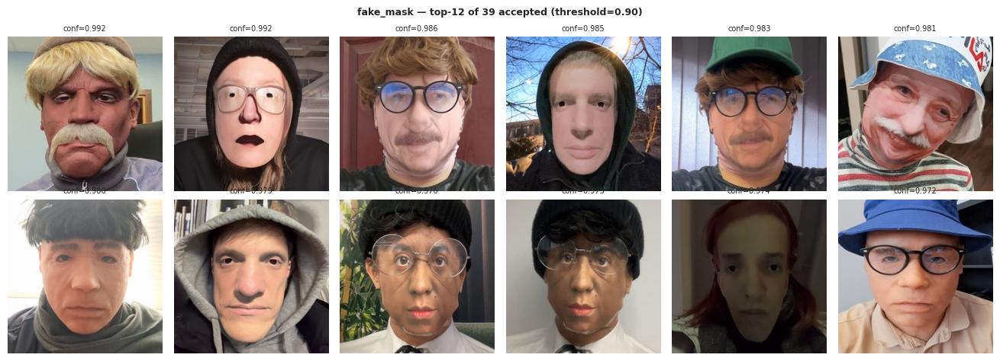
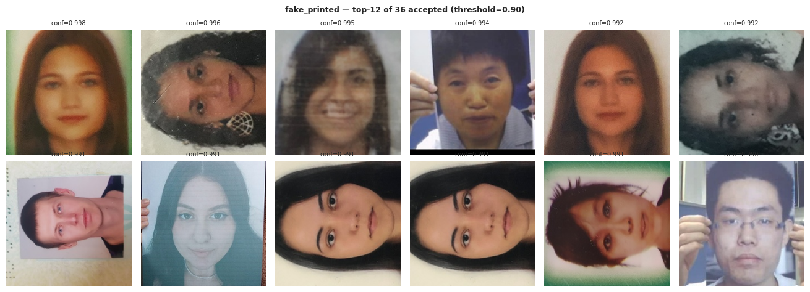
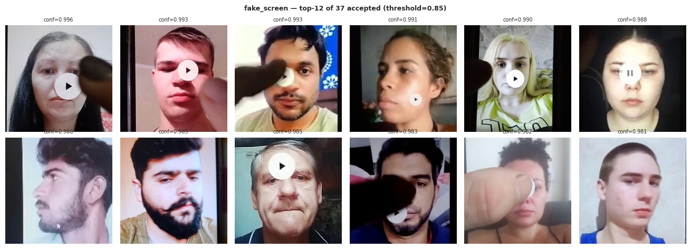
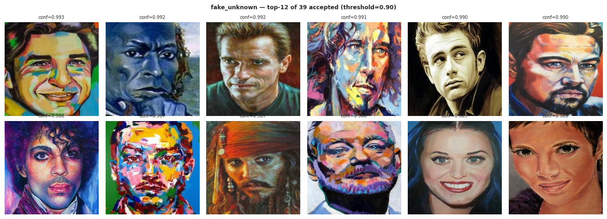
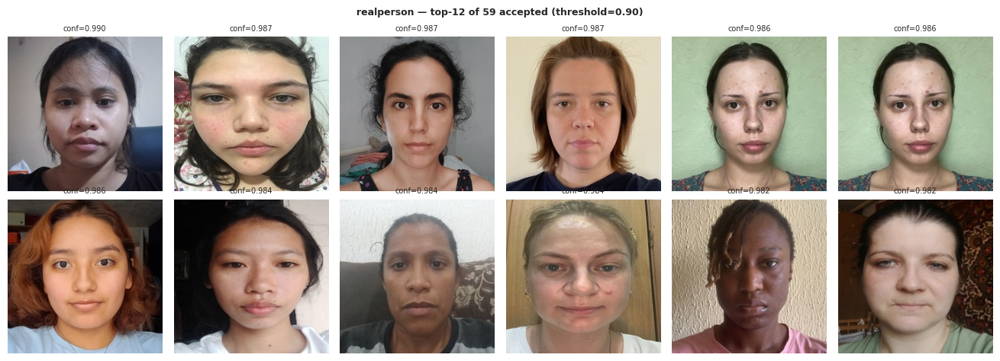

# 10 — Soft Pseudo-Label Generation — Round 2 (exp07)

**Purpose:** Generate Round 2 pseudo-labels using the stronger exp06 ensemble,
then merge with `train_clean.csv` to produce `train_pseudo_exp07.csv` for exp07 retraining.

**Run locally** — CPU-only, no GPU needed.

### What changed vs Round 1 (08-pseudo-label.ipynb)

| Item | Round 1 | Round 2 |
|---|---|---|
| Source ensemble | exp04_all4_swinv2 (LB=0.78555) | exp06_all5 (OOF=0.9355, LB=0.78555) |
| Source file | submissions/test_probs_exp04_all4_swinv2.npy | oof/exp06/test_probs_all5.npy |
| Ensemble composition | 4→5 arch, equal weight | 5 arch (convnext+eva02+dinov2+effnet_b4+swinv2), equal weight |
| fake_screen override | None | 0.85 (inspect visually in Section 5 before committing) |
| Output CSV | train_pseudo.csv | train_pseudo_exp07.csv |

### Why equal-weight ensemble (not optimized weights)
The optimized weights (DINOv2=44.7%, EVA02=36.3%) concentrate mass on 2 of 5 models,
reducing diversity. For pseudo-label generation, a diverse ensemble produces more
trustworthy confidence estimates — high confidence from 5 architectures agreeing is a
stronger signal than high confidence driven primarily by 2 correlated models.

### Why fake_screen override at 0.85
Round 1 accepted only 29 fake_screen images (lowest of any class). fake_screen was
the weakest class in exp06 (ensemble F1=0.9040). The exp06 ensemble is better calibrated
than Round 1's source, so 0.85-confidence fake_screen predictions are more trustworthy.
**Confirm with visual inspection in Section 5 before committing this override.**

## 0 · Config — Change Only This Cell


```python
# ── Source ensemble ────────────────────────────────────────────────────────────
PROBS_FILENAME = 'test_probs_all5.npy'   # in oof/exp06/
SOURCE_EXP_ID  = 'exp06'                 # which experiment produced the probs
ENSEMBLE_NAME  = 'exp06_all5'            # for traceability
LB_SCORE       = 0.78555                 # confirmed LB score of source ensemble

# ── Threshold strategy ─────────────────────────────────────────────────────────
# GLOBAL_THRESHOLD: default 0.9 (same as Round 1)
# Change after viewing histogram in Section 3 if distribution looks different.
GLOBAL_THRESHOLD = 0.90

# Per-class lower threshold override.
# fake_screen: lower to 0.85 to get more pseudo-labels for the weakest class.
# CONFIRM THIS after visual inspection in Section 5.
# If the 0.85–0.90 fake_screen images look noisy → revert to {} or raise to 0.88.
CLASS_OVERRIDES = {'fake_screen': 0.85}

# ── Round 1 reference (for comparison in Section 6) ───────────────────────────
ROUND1_CSV = 'train_pseudo.csv'   # in data/processed/ — used by exp06

# ── Output ────────────────────────────────────────────────────────────────────
OUTPUT_CSV = 'train_pseudo_exp07.csv'   # written to data/processed/

print(f'Source probs : oof/{SOURCE_EXP_ID}/{PROBS_FILENAME}  (LB={LB_SCORE})')
print(f'Threshold    : {GLOBAL_THRESHOLD}  (change after histogram review)')
print(f'Overrides    : {CLASS_OVERRIDES}')
print(f'Output CSV   : data/processed/{OUTPUT_CSV}')
```

    Source probs : oof/exp06/test_probs_all5.npy  (LB=0.78555)
    Threshold    : 0.9  (change after histogram review)
    Overrides    : {'fake_screen': 0.85}
    Output CSV   : data/processed/train_pseudo_exp07.csv


## 1 · Setup


```python
import sys
import warnings
warnings.filterwarnings('ignore')
from pathlib import Path

import numpy as np
import pandas as pd
import matplotlib.pyplot as plt
import matplotlib.patches as mpatches
from PIL import Image

try:
    plt.style.use('seaborn-v0_8-whitegrid')
except OSError:
    try:
        plt.style.use('seaborn-whitegrid')
    except OSError:
        pass

PROJECT_ROOT = Path().resolve()
sys.path.insert(0, str(PROJECT_ROOT))

from src.utils.config import (
    CROP_TEST_DIR, CROP_TRAIN_DIR, PROCESSED_DIR,
    OOF_DIR, CLASSES, CLASS_TO_IDX, IDX_TO_CLASS, NUM_CLASSES,
    TRAIN_CSV, TEST_CSV,
    print_env,
)

PROB_COLS = [f'prob_{c}' for c in CLASSES]

print_env()
```

    Environment  : local
    Project dir  : /home/darrnhard/ML/Competition/FindIT-DAC
      interim    : /home/darrnhard/ML/Competition/FindIT-DAC/data/interim
        train    : /home/darrnhard/ML/Competition/FindIT-DAC/data/interim/train
        test     : /home/darrnhard/ML/Competition/FindIT-DAC/data/interim/test
      processed  : /home/darrnhard/ML/Competition/FindIT-DAC/data/processed
        crops    : /home/darrnhard/ML/Competition/FindIT-DAC/data/processed/crops
        train csv: /home/darrnhard/ML/Competition/FindIT-DAC/data/processed/train_clean.csv
        test csv : /home/darrnhard/ML/Competition/FindIT-DAC/data/processed/test.csv
    Model dir    : /home/darrnhard/ML/Competition/FindIT-DAC/models
    OOF dir      : /home/darrnhard/ML/Competition/FindIT-DAC/oof
    Submissions  : /home/darrnhard/ML/Competition/FindIT-DAC/submissions
    Device       : cuda
    GPU          : NVIDIA GeForce GTX 1050 Ti
    VRAM         : 4.2 GB


## 2 · Load Test Probabilities + Test DataFrame


```python
# ── Load probabilities from exp06 OOF directory ───────────────────────────────
probs_path = OOF_DIR / SOURCE_EXP_ID / PROBS_FILENAME
assert probs_path.exists(), (
    f'Probs file not found: {probs_path}\n'
    f'Run 09-inference-exp06.ipynb first and confirm test_probs_all5.npy was saved.'
)

probs = np.load(probs_path)   # shape (404, 6)
assert probs.shape == (404, 6), f'Unexpected shape: {probs.shape}'
print(f'Loaded: {probs_path}  shape={probs.shape}  dtype={probs.dtype}')

# ── Load test CSV ──────────────────────────────────────────────────────────────
test_df = pd.read_csv(TEST_CSV)
test_df['crop_path'] = test_df['crop_path'].apply(
    lambda p: str(CROP_TEST_DIR / Path(p).name)
)

assert len(test_df) == len(probs), \
    f'Mismatch: {len(test_df)} rows in CSV but {len(probs)} probs'

# ── Attach probabilities to test_df ───────────────────────────────────────────
for i, cls in enumerate(CLASSES):
    test_df[f'prob_{cls}'] = probs[:, i]

test_df['confidence'] = probs.max(axis=1)
test_df['pred_idx']   = probs.argmax(axis=1)
test_df['pred_label'] = test_df['pred_idx'].map(IDX_TO_CLASS)

print(f'\nTest images    : {len(test_df):,}')
print(f'Mean confidence: {test_df["confidence"].mean():.4f}')
print(f'Min  confidence: {test_df["confidence"].min():.4f}')
print(f'Max  confidence: {test_df["confidence"].max():.4f}')
print()
print('Predicted class distribution (before thresholding):')
print(test_df['pred_label'].value_counts().sort_index().to_string())
```

    Loaded: /home/darrnhard/ML/Competition/FindIT-DAC/oof/exp06/test_probs_all5.npy  shape=(404, 6)  dtype=float64
    
    Test images    : 404
    Mean confidence: 0.8779
    Min  confidence: 0.2989
    Max  confidence: 0.9980
    
    Predicted class distribution (before thresholding):
    pred_label
    fake_mannequin     51
    fake_mask          73
    fake_printed       56
    fake_screen        67
    fake_unknown       51
    realperson        106


## 3 · Confidence Histogram — Confirm or Adjust Global Threshold

Compare Round 2 confidence distribution against Round 1.
If the exp06 ensemble is better calibrated, expect higher overall confidence.


```python
fig, axes = plt.subplots(1, 2, figsize=(14, 5))

# ── Full confidence histogram ──────────────────────────────────────────────────
ax = axes[0]
ax.hist(test_df['confidence'], bins=40, color='steelblue', alpha=0.8, edgecolor='white')
for thresh in [0.70, 0.80, 0.85, 0.90, 0.95]:
    n_above = (test_df['confidence'] >= thresh).sum()
    ax.axvline(thresh, color='red', alpha=0.7, linestyle='--', linewidth=1.2)
    ax.text(thresh + 0.002, ax.get_ylim()[1] * 0.8,
            f'{thresh:.2f}\n({n_above})', fontsize=8, color='red')
ax.axvline(GLOBAL_THRESHOLD, color='darkred', linewidth=2,
           label=f'Global threshold ({GLOBAL_THRESHOLD})')
ax.set_xlabel('Ensemble max confidence')
ax.set_ylabel('Count')
ax.set_title(f'Round 2 Confidence — {ENSEMBLE_NAME}', fontweight='bold')
ax.legend(fontsize=9)

# ── Per-class confidence ───────────────────────────────────────────────────────
ax2 = axes[1]
colors = ['#2196F3', '#FF9800', '#4CAF50', '#9C27B0', '#E91E63', '#00BCD4']
for cls, color in zip(CLASSES, colors):
    mask = test_df['pred_label'] == cls
    if mask.sum() > 0:
        ax2.hist(test_df.loc[mask, 'confidence'], bins=20, alpha=0.6,
                 label=f'{cls} ({mask.sum()})', color=color, edgecolor='white')
ax2.axvline(GLOBAL_THRESHOLD, color='black', linewidth=2, linestyle='--',
            label=f'Global threshold ({GLOBAL_THRESHOLD})')
if CLASS_OVERRIDES:
    for cls_ov, thresh_ov in CLASS_OVERRIDES.items():
        ax2.axvline(thresh_ov, color='darkorange', linewidth=1.5, linestyle=':',
                    label=f'{cls_ov} override ({thresh_ov})')
ax2.set_xlabel('Ensemble max confidence')
ax2.set_ylabel('Count')
ax2.set_title('Per-Predicted-Class Confidence (Round 2)', fontweight='bold')
ax2.legend(fontsize=7, loc='upper left')

plt.tight_layout()
plt.show()

print('Acceptance count at each threshold (ALL classes):')
print(f'  {"Threshold":>12}  {"Accepted":>10}  {"Rejected":>10}  {"Accept%":>8}')
for t in [0.70, 0.75, 0.80, 0.85, 0.90, 0.92, 0.95]:
    n_acc = (test_df['confidence'] >= t).sum()
    n_rej = len(test_df) - n_acc
    print(f'  {t:>12.2f}  {n_acc:>10}  {n_rej:>10}  {n_acc/len(test_df)*100:>7.1f}%')
```


    

    


    Acceptance count at each threshold (ALL classes):
         Threshold    Accepted    Rejected   Accept%
              0.70         351          53     86.9%
              0.75         334          70     82.7%
              0.80         317          87     78.5%
              0.85         279         125     69.1%
              0.90         245         159     60.6%
              0.92         234         170     57.9%
              0.95         206         198     51.0%


## 4 · Per-Class Acceptance Table — Check fake_screen Override

Pay special attention to fake_screen at the 0.85–0.90 confidence range.
These are the images that the override will accept. If they look suspicious in Section 5,
raise the override to 0.88 or remove it entirely.


```python
# Effective threshold per class (global unless overridden)
effective_thresh = {cls: CLASS_OVERRIDES.get(cls, GLOBAL_THRESHOLD) for cls in CLASSES}

print('Per-class acceptance at effective thresholds:')
print(f'  {"Class":<22}  {"Threshold":>10}  {"Accepted":>10}  {"Rejected":>10}  {"Accept%":>8}')
print('  ' + '-' * 68)
for cls in CLASSES:
    mask  = test_df['pred_label'] == cls
    t     = effective_thresh[cls]
    n_acc = (test_df.loc[mask, 'confidence'] >= t).sum()
    n_tot = mask.sum()
    n_rej = n_tot - n_acc
    flag  = '  ← override' if cls in CLASS_OVERRIDES else ''
    print(f'  {cls:<22}  {t:>10.2f}  {n_acc:>10}  {n_rej:>10}  '
          f'{n_acc/n_tot*100 if n_tot>0 else 0:>7.1f}%{flag}')

# Total accepted with effective thresholds
total_accepted = sum(
    ((test_df['pred_label'] == cls) & (test_df['confidence'] >= effective_thresh[cls])).sum()
    for cls in CLASSES
)
print(f'\n  Total accepted: {total_accepted} / {len(test_df)} ({total_accepted/len(test_df)*100:.1f}%)')

print()
print('Round 1 reference (for comparison):')
ROUND1_COUNTS = {
    'fake_mannequin': 42, 'fake_mask': 38, 'fake_printed': 36,
    'fake_screen': 29, 'fake_unknown': 38, 'realperson': 56
}
print(f'  {"Class":<22}  {"Round1":>8}  {"Round2":>8}  {"Delta":>8}')
print('  ' + '-' * 52)
for cls in CLASSES:
    mask  = test_df['pred_label'] == cls
    t     = effective_thresh[cls]
    r2    = (test_df.loc[mask, 'confidence'] >= t).sum()
    r1    = ROUND1_COUNTS.get(cls, 0)
    delta = r2 - r1
    print(f'  {cls:<22}  {r1:>8}  {r2:>8}  {delta:>+8}')
print(f'  {"TOTAL":<22}  {sum(ROUND1_COUNTS.values()):>8}  {total_accepted:>8}  '
      f'{total_accepted - sum(ROUND1_COUNTS.values()):>+8}')
```

    Per-class acceptance at effective thresholds:
      Class                    Threshold    Accepted    Rejected   Accept%
      --------------------------------------------------------------------
      fake_mannequin                0.90          44           7     86.3%
      fake_mask                     0.90          39          34     53.4%
      fake_printed                  0.90          36          20     64.3%
      fake_screen                   0.85          37          30     55.2%  ← override
      fake_unknown                  0.90          39          12     76.5%
      realperson                    0.90          59          47     55.7%
    
      Total accepted: 254 / 404 (62.9%)
    
    Round 1 reference (for comparison):
      Class                     Round1    Round2     Delta
      ----------------------------------------------------
      fake_mannequin                42        44        +2
      fake_mask                     38        39        +1
      fake_printed                  36        36        +0
      fake_screen                   29        37        +8
      fake_unknown                  38        39        +1
      realperson                    56        59        +3
      TOTAL                        239       254       +15


## 5 · Visual Inspection — fake_screen Override Region

**This is the go/no-go gate for the fake_screen override.**

These are the fake_screen images accepted ONLY because of the 0.85 override (confidence 0.85–0.90).
If they look like genuine screen attacks → keep `CLASS_OVERRIDES = {'fake_screen': 0.85}`.
If they look ambiguous or like real faces → change to `CLASS_OVERRIDES = {}` in Section 0.


```python
# ── Images accepted ONLY due to override (between override_thresh and global_thresh) ──
for cls, override_t in CLASS_OVERRIDES.items():
    global_t = GLOBAL_THRESHOLD
    mask_override_only = (
        (test_df['pred_label'] == cls) &
        (test_df['confidence'] >= override_t) &
        (test_df['confidence'] <  global_t)
    )
    subset = test_df[mask_override_only].sort_values('confidence', ascending=False)
    n_show = len(subset)

    print(f'{cls}: {n_show} images accepted ONLY via override ({override_t:.2f}–{global_t:.2f})')
    if n_show == 0:
        print('  → No images in this range. Override has no effect — check thresholds.')
        continue

    n_cols = min(6, n_show)
    n_rows = (n_show + n_cols - 1) // n_cols
    fig, axes = plt.subplots(n_rows, n_cols, figsize=(n_cols * 2.2, n_rows * 2.6))
    axes_flat = np.array(axes).flatten() if n_show > 1 else [axes]

    for i, (_, row) in enumerate(subset.iterrows()):
        ax = axes_flat[i]
        img_path = Path(row['crop_path'])
        if img_path.exists():
            ax.imshow(Image.open(img_path).convert('RGB'))
        else:
            ax.text(0.5, 0.5, 'missing', ha='center', va='center',
                    transform=ax.transAxes, color='red')
        ax.set_title(f'conf={row["confidence"]:.3f}', fontsize=7)
        ax.axis('off')

    for j in range(n_show, len(axes_flat)):
        axes_flat[j].axis('off')

    plt.suptitle(f'{cls} — Override-only images ({override_t:.2f}–{global_t:.2f})\n'
                 f'Keep override if these look like genuine {cls}',
                 fontsize=10, fontweight='bold')
    plt.tight_layout()
    plt.show()

print('─' * 60)
print('DECISION POINT:')
print('  ✅ Images look like genuine screen attacks → proceed with CLASS_OVERRIDES as set')
print('  ❌ Images look ambiguous → go to Section 0 and set CLASS_OVERRIDES = {}')
print('  ⚠️  Some ok, some not → try raising override to 0.88 in Section 0, re-run')
```

    fake_screen: 9 images accepted ONLY via override (0.85–0.90)


    

    


    ────────────────────────────────────────────────────────────
    DECISION POINT:
      ✅ Images look like genuine screen attacks → proceed with CLASS_OVERRIDES as set
      ❌ Images look ambiguous → go to Section 0 and set CLASS_OVERRIDES = {}
      ⚠️  Some ok, some not → try raising override to 0.88 in Section 0, re-run


## 6 · Visual Inspection — All Classes Above Threshold

Quick sanity check on the full accepted set. Look for obvious errors.


```python
for cls in CLASSES:
    t    = effective_thresh[cls]
    mask = (test_df['pred_label'] == cls) & (test_df['confidence'] >= t)
    subset = test_df[mask].sort_values('confidence', ascending=False)
    n_show = min(12, len(subset))   # cap at 12 per class

    if n_show == 0:
        print(f'{cls}: 0 accepted — skipping')
        continue

    n_cols = min(6, n_show)
    n_rows = (n_show + n_cols - 1) // n_cols
    fig, axes = plt.subplots(n_rows, n_cols, figsize=(n_cols * 2.2, n_rows * 2.4))
    axes_flat = np.array(axes).flatten() if n_show > 1 else [axes]

    for i, (_, row) in enumerate(subset.head(n_show).iterrows()):
        ax = axes_flat[i]
        img_path = Path(row['crop_path'])
        if img_path.exists():
            ax.imshow(Image.open(img_path).convert('RGB'))
        else:
            ax.text(0.5, 0.5, 'missing', ha='center', va='center',
                    transform=ax.transAxes, color='red')
        ax.set_title(f'conf={row["confidence"]:.3f}', fontsize=7)
        ax.axis('off')

    for j in range(n_show, len(axes_flat)):
        axes_flat[j].axis('off')

    total_cls = mask.sum()
    plt.suptitle(f'{cls} — top-{n_show} of {total_cls} accepted (threshold={t:.2f})',
                 fontsize=9, fontweight='bold')
    plt.tight_layout()
    plt.show()
```


    

    


    

    


    

    


    

    


    

    


    

    


## 7 · Build Pseudo DataFrame


```python
# Apply effective thresholds per class
accepted_masks = [
    (test_df['pred_label'] == cls) & (test_df['confidence'] >= effective_thresh[cls])
    for cls in CLASSES
]
accepted_mask = accepted_masks[0].copy()
for m in accepted_masks[1:]:
    accepted_mask |= m

pseudo_df = test_df[accepted_mask].copy().reset_index(drop=True)

# ── Rename pred_label → label, add required training columns ──────────────────
pseudo_df['label']     = pseudo_df['pred_label']
pseudo_df['label_idx'] = pseudo_df['pred_idx']
pseudo_df['fold']      = -1       # never enters validation
pseudo_df['is_pseudo'] = True
pseudo_df['source']    = 'pseudo_r2'

# Keep soft probability columns (prob_* already attached in Section 2)
# Trainer routes is_pseudo=True rows to SoftCrossEntropyLoss using these.

# Drop columns not needed in training CSV
drop_cols = [c for c in ['pred_label', 'pred_idx'] if c in pseudo_df.columns]
pseudo_df = pseudo_df.drop(columns=drop_cols)

print(f'Pseudo-label DataFrame: {len(pseudo_df)} rows')
print()
print('Class distribution of accepted pseudo-labels:')
print(pseudo_df['label'].value_counts().sort_index().to_string())
print()
print('Confidence stats:')
print(f'  Mean : {pseudo_df["confidence"].mean():.4f}')
print(f'  Min  : {pseudo_df["confidence"].min():.4f}')
print(f'  P25  : {pseudo_df["confidence"].quantile(0.25):.4f}')
print(f'  P50  : {pseudo_df["confidence"].quantile(0.50):.4f}')
print()
print('First 3 rows:')
print(pseudo_df[['crop_path', 'label', 'label_idx', 'fold', 'is_pseudo', 'confidence']].head(3).to_string())
```

    Pseudo-label DataFrame: 254 rows
    
    Class distribution of accepted pseudo-labels:
    label
    fake_mannequin    44
    fake_mask         39
    fake_printed      36
    fake_screen       37
    fake_unknown      39
    realperson        59
    
    Confidence stats:
      Mean : 0.9667
      Min  : 0.8661
      P25  : 0.9574
      P50  : 0.9735
    
    First 3 rows:
                                                                              crop_path           label  label_idx  fold  is_pseudo  confidence
    0  /home/darrnhard/ML/Competition/FindIT-DAC/data/processed/crops/test/test_002.jpg  fake_mannequin          0    -1       True    0.982432
    1  /home/darrnhard/ML/Competition/FindIT-DAC/data/processed/crops/test/test_004.jpg      realperson          5    -1       True    0.985928
    2  /home/darrnhard/ML/Competition/FindIT-DAC/data/processed/crops/test/test_006.jpg  fake_mannequin          0    -1       True    0.972480


## 8 · Merge with Real Labels → Save `train_pseudo_exp07.csv`


```python
# ── Load real training data ────────────────────────────────────────────────────
train_df_real = pd.read_csv(TRAIN_CSV)
train_df_real['crop_path'] = train_df_real['crop_path'].apply(
    lambda p: str(CROP_TRAIN_DIR / Path(p).name)
)

# ── Add tracking columns to real rows ─────────────────────────────────────────
# is_pseudo=False, confidence=1.0, prob_* = NaN
# Trainer reconstructs one-hot from label_idx for real rows.
train_df_real['is_pseudo']  = False
train_df_real['confidence'] = 1.0
train_df_real['source']     = 'real'
for prob_col in PROB_COLS:
    train_df_real[prob_col] = np.nan

# ── Align columns before concat ───────────────────────────────────────────────
shared_cols = [c for c in train_df_real.columns if c in pseudo_df.columns]
merged_df   = pd.concat(
    [train_df_real, pseudo_df[shared_cols]],
    ignore_index=True
)

# ── Sanity checks ─────────────────────────────────────────────────────────────
n_real   = (~merged_df['is_pseudo']).sum()
n_pseudo = merged_df['is_pseudo'].sum()

assert n_real   == len(train_df_real), f'Real row count mismatch: {n_real} vs {len(train_df_real)}'
assert n_pseudo == len(pseudo_df),     f'Pseudo row count mismatch'
assert merged_df['fold'].isin([-1, 0, 1, 2, 3, 4]).all(), 'Unexpected fold values'
assert (merged_df[merged_df['is_pseudo']]['fold'] == -1).all(), \
    'BUG: pseudo rows have fold != -1 — they would leak into validation!'
assert Path(merged_df.iloc[0]['crop_path']).exists(), \
    f'First real crop not found: {merged_df.iloc[0]["crop_path"]}'
assert Path(merged_df[merged_df['is_pseudo']].iloc[0]['crop_path']).exists(), \
    'First pseudo crop not found'

print('Merged DataFrame:')
print(f'  Total rows   : {len(merged_df):,}')
print(f'  Real rows    : {n_real:,}  (folds 0-4)')
print(f'  Pseudo rows  : {n_pseudo:,}  (fold=-1, never in val)')
print(f'  Columns      : {list(merged_df.columns)}')
print()
print('Fold distribution:')
print(merged_df['fold'].value_counts().sort_index().to_string())
print()
print('Combined class distribution:')
print(merged_df['label'].value_counts().sort_index().to_string())
print()
print('✅ All sanity checks passed.')
```

    Merged DataFrame:
      Total rows   : 1,718
      Real rows    : 1,464  (folds 0-4)
      Pseudo rows  : 254  (fold=-1, never in val)
      Columns      : ['path', 'filename', 'label', 'label_idx', 'hash', 'group', 'fold', 'crop_path', 'is_pseudo', 'confidence', 'source', 'prob_fake_mannequin', 'prob_fake_mask', 'prob_fake_printed', 'prob_fake_screen', 'prob_fake_unknown', 'prob_realperson']
    
    Fold distribution:
    fold
    -1    254
     0    293
     1    293
     2    293
     3    293
     4    292
    
    Combined class distribution:
    label
    fake_mannequin    237
    fake_mask         305
    fake_printed      140
    fake_screen       228
    fake_unknown      346
    realperson        462
    
    ✅ All sanity checks passed.


```python
# ── Save ──────────────────────────────────────────────────────────────────────
output_path = PROCESSED_DIR / OUTPUT_CSV
merged_df.to_csv(output_path, index=False)

print(f'Saved: {output_path}')
print(f'  {len(merged_df):,} rows  |  {len(merged_df.columns)} columns')
print()
print('Next step: sync to remote and run 10-exp07-training.ipynb on Vast.ai')
print('  bash scripts/sync_to_remote.sh')
```

    Saved: /home/darrnhard/ML/Competition/FindIT-DAC/data/processed/train_pseudo_exp07.csv
      1,718 rows  |  17 columns
    
    Next step: sync to remote and run 10-exp07-training.ipynb on Vast.ai
      bash scripts/sync_to_remote.sh


## 9 · Summary


```python
print('=' * 62)
print('PSEUDO-LABEL GENERATION COMPLETE — Round 2 (exp07)')
print('=' * 62)
print()
print(f'Source ensemble : {ENSEMBLE_NAME}  (LB={LB_SCORE})')
print(f'Global threshold: {GLOBAL_THRESHOLD}')
print(f'Class overrides : {CLASS_OVERRIDES if CLASS_OVERRIDES else "none"}')
print()
print('Accepted pseudo-labels (Round 2 vs Round 1):')
print(f'  {"Class":<22}  {"Round1":>8}  {"Round2":>8}  {"Delta":>6}  {"MeanConf":>10}')
print('  ' + '-' * 62)
for cls in CLASSES:
    n_r2  = (pseudo_df['label'] == cls).sum()
    n_r1  = ROUND1_COUNTS[cls]
    avg   = pseudo_df[pseudo_df['label'] == cls]['confidence'].mean() if n_r2 > 0 else float('nan')
    delta = n_r2 - n_r1
    print(f'  {cls:<22}  {n_r1:>8}  {n_r2:>8}  {delta:>+6}  {avg:>10.3f}')
print(f'  {"TOTAL":<22}  {sum(ROUND1_COUNTS.values()):>8}  {len(pseudo_df):>8}  '
      f'{len(pseudo_df)-sum(ROUND1_COUNTS.values()):>+6}')
print()
print(f'Output CSV: {output_path}')
print(f'  {n_real:,} real rows (folds 0-4) + {n_pseudo:,} pseudo rows (fold=-1)')
print()
print('WHAT HAPPENS IN TRAINING (exp07):')
print('  • Real rows   → FocalLoss on hard integer label_idx')
print('  • Pseudo rows → SoftCrossEntropyLoss on prob_* vector,')
print('                  weighted by confidence score')
print('  • Pseudo rows NEVER appear in any validation fold (fold=-1)')
print('  • Class weights computed from real rows only')
print('  • New augmentation.py (GaussianNoise, RandomRotation, improved MoirePattern)')
print('=' * 62)
```

    ==============================================================
    PSEUDO-LABEL GENERATION COMPLETE — Round 2 (exp07)
    ==============================================================
    
    Source ensemble : exp06_all5  (LB=0.78555)
    Global threshold: 0.9
    Class overrides : {'fake_screen': 0.85}
    
    Accepted pseudo-labels (Round 2 vs Round 1):
      Class                     Round1    Round2   Delta    MeanConf
      --------------------------------------------------------------
      fake_mannequin                42        44      +2       0.979
      fake_mask                     38        39      +1       0.958
      fake_printed                  36        36      +0       0.980
      fake_screen                   29        37      +8       0.946
      fake_unknown                  38        39      +1       0.974
      realperson                    56        59      +3       0.964
      TOTAL                        239       254     +15
    
    Output CSV: /home/darrnhard/ML/Competition/FindIT-DAC/data/processed/train_pseudo_exp07.csv
      1,464 real rows (folds 0-4) + 254 pseudo rows (fold=-1)
    
    WHAT HAPPENS IN TRAINING (exp07):
      • Real rows   → FocalLoss on hard integer label_idx
      • Pseudo rows → SoftCrossEntropyLoss on prob_* vector,
                      weighted by confidence score
      • Pseudo rows NEVER appear in any validation fold (fold=-1)
      • Class weights computed from real rows only
      • New augmentation.py (GaussianNoise, RandomRotation, improved MoirePattern)
    ==============================================================


```python

```


```python

```
