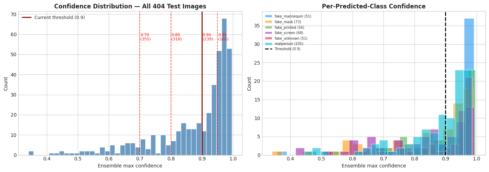
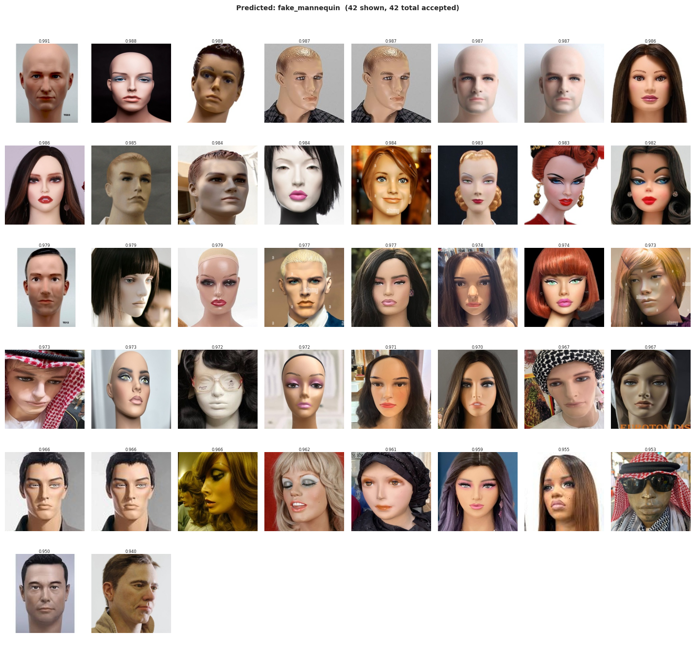
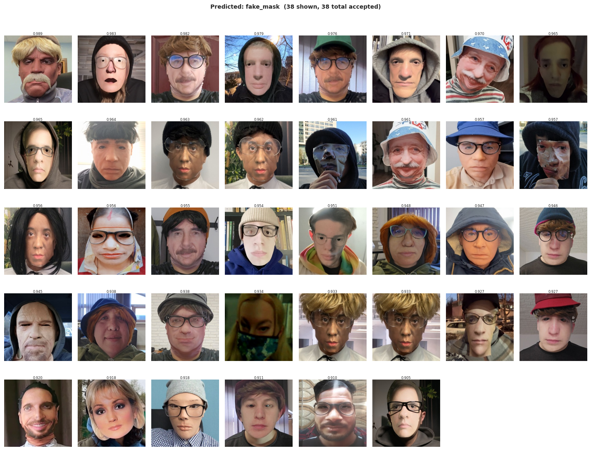
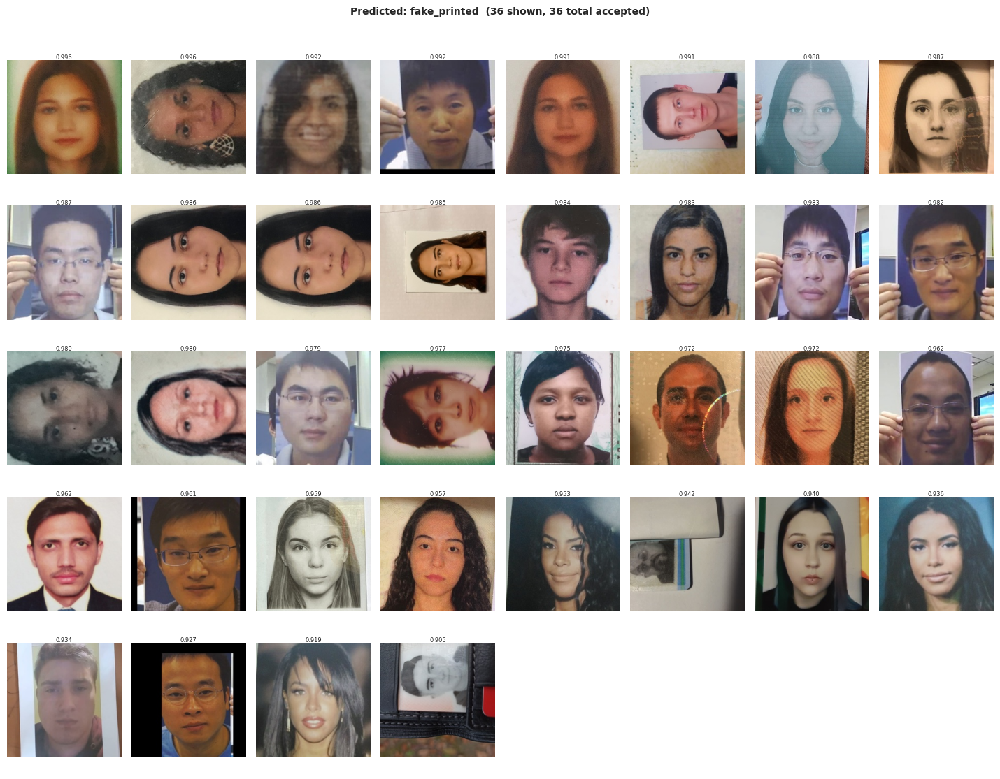
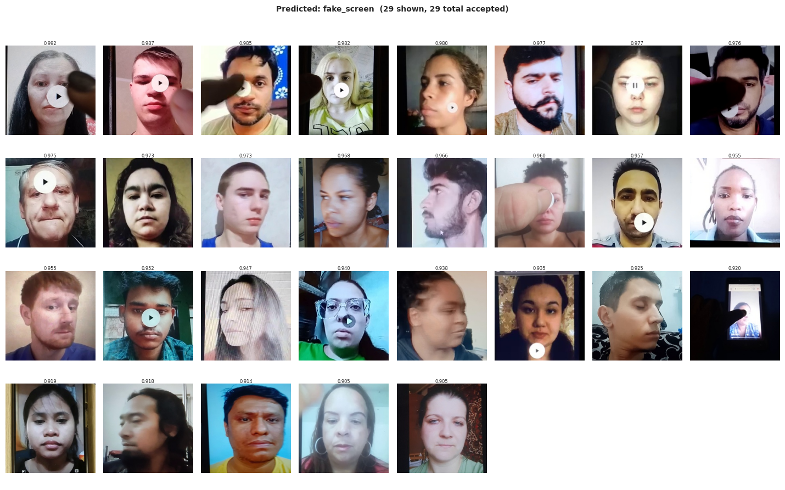
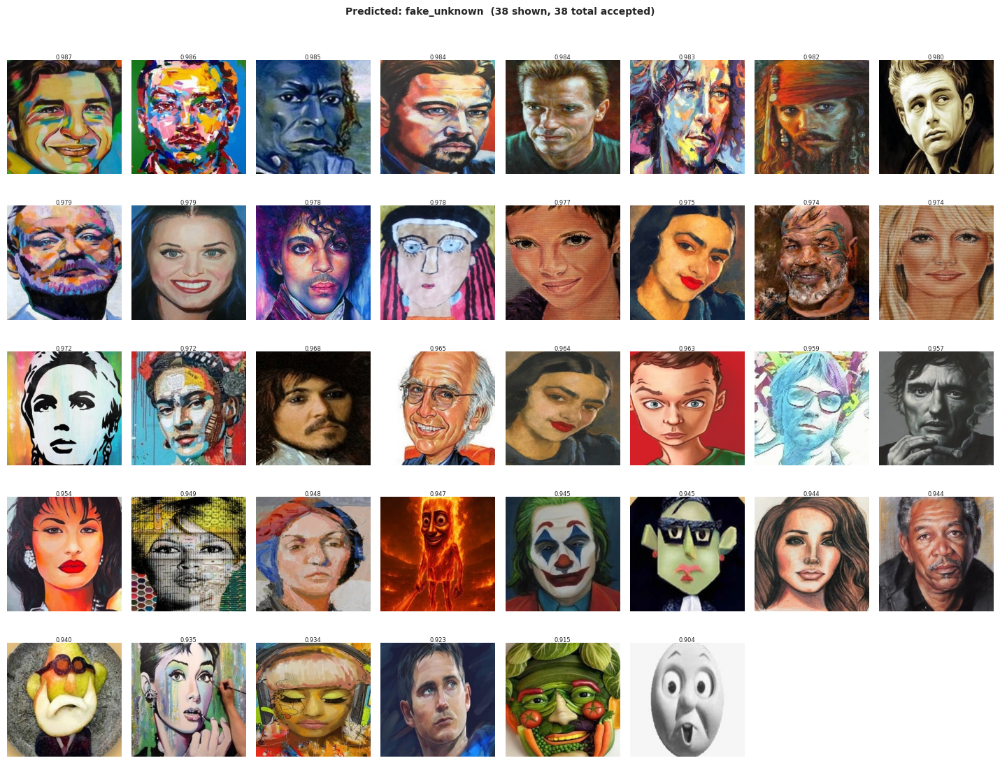
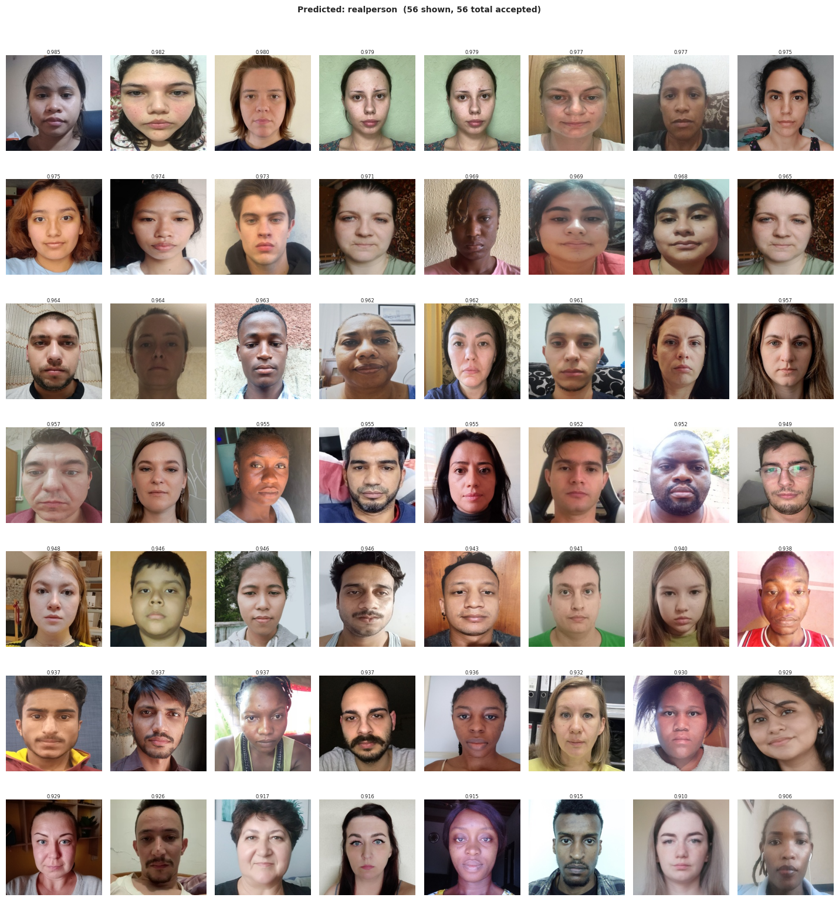

# 08 — Soft Pseudo-Label Generation

**Purpose:** Use the best ensemble's test probabilities to generate soft pseudo-labels
for confident test images, then merge with `train_clean.csv` to produce `train_pseudo.csv`
for exp06 retraining.

**Run locally** — CPU-only, no GPU needed.

### What this notebook does
1. Load `test_probs_exp04_all4_swinv2.npy` (5-arch ensemble, LB=0.78555)
2. Show confidence histogram → pick global threshold interactively
3. Show per-class count table at each threshold level
4. Show image grids (visual inspection per predicted class)
5. Commit threshold → generate `pseudo_df` with soft probability vectors
6. Merge with `train_clean.csv` → save `data/processed/train_pseudo.csv`

### Why soft labels (not hard argmax)
The ensemble probability vector contains calibrated uncertainty.
Training with `[0.02, 0.04, 0.72, 0.08, 0.10, 0.04]` instead of `[0, 0, 1, 0, 0, 0]`
prevents confirmation bias — the model knows the ensemble wasn't 100% certain.

### Source ensemble
- `exp04_all4_swinv2` — ConvNeXt + EVA-02 + DINOv2 + EfficientNet-B4 + SwinV2, LB=0.78555
- Saved by inference notebook: `submissions/test_probs_exp04_all4_swinv2.npy`


## 0 · Config — Change Only This Cell


```python
# ── Source ensemble ────────────────────────────────────────────────────────────
PROBS_FILE    = 'test_probs_exp04_all4_swinv2.npy'   # in submissions/
ENSEMBLE_NAME = 'exp04_all4_swinv2'                  # for traceability
LB_SCORE      = 0.78555                              # confirmed LB score

# ── Threshold strategy ─────────────────────────────────────────────────────────
# GLOBAL_THRESHOLD is set AFTER viewing the histogram (Section 3).
# Default: 0.90 — change after visual inspection.
GLOBAL_THRESHOLD = 0.9

# Per-class lower threshold override (set to None to skip).
# Use this if fake_printed (rare class) gets too few pseudo-labels.
# e.g. CLASS_OVERRIDES = {'fake_printed': 0.80, 'fake_screen': 0.85}
CLASS_OVERRIDES = {}   # fill after viewing Section 4

# ── Output ────────────────────────────────────────────────────────────────────
OUTPUT_CSV = 'train_pseudo.csv'   # written to data/processed/

print(f'Source probs : {PROBS_FILE}  (LB={LB_SCORE})')
print(f'Threshold    : {GLOBAL_THRESHOLD}  (change after histogram review)')
print(f'Output CSV   : data/processed/{OUTPUT_CSV}')

```

    Source probs : test_probs_exp04_all4_swinv2.npy  (LB=0.78555)
    Threshold    : 0.9  (change after histogram review)
    Output CSV   : data/processed/train_pseudo.csv


## 1 · Setup


```python
import sys
import warnings
warnings.filterwarnings('ignore')
from pathlib import Path

import numpy as np
import pandas as pd
import matplotlib.pyplot as plt
import matplotlib.patches as mpatches
from PIL import Image

try:
    plt.style.use('seaborn-v0_8-whitegrid')
except OSError:
    try:
        plt.style.use('seaborn-whitegrid')
    except OSError:
        pass

PROJECT_ROOT = Path().resolve()
sys.path.insert(0, str(PROJECT_ROOT))

from src.utils.config import (
    CROP_TEST_DIR, CROP_TRAIN_DIR, PROCESSED_DIR,
    SUBMISSION_DIR, CLASSES, CLASS_TO_IDX, IDX_TO_CLASS, NUM_CLASSES,
    TRAIN_CSV, TEST_CSV,
    print_env,
)

PROB_COLS = [f'prob_{c}' for c in CLASSES]

print_env()

```

    Environment  : local
    Project dir  : /home/darrnhard/ML/Competition/FindIT-DAC
      interim    : /home/darrnhard/ML/Competition/FindIT-DAC/data/interim
        train    : /home/darrnhard/ML/Competition/FindIT-DAC/data/interim/train
        test     : /home/darrnhard/ML/Competition/FindIT-DAC/data/interim/test
      processed  : /home/darrnhard/ML/Competition/FindIT-DAC/data/processed
        crops    : /home/darrnhard/ML/Competition/FindIT-DAC/data/processed/crops
        train csv: /home/darrnhard/ML/Competition/FindIT-DAC/data/processed/train_clean.csv
        test csv : /home/darrnhard/ML/Competition/FindIT-DAC/data/processed/test.csv
    Model dir    : /home/darrnhard/ML/Competition/FindIT-DAC/models
    OOF dir      : /home/darrnhard/ML/Competition/FindIT-DAC/oof
    Submissions  : /home/darrnhard/ML/Competition/FindIT-DAC/submissions
    Device       : cuda
    GPU          : NVIDIA GeForce GTX 1050 Ti
    VRAM         : 4.2 GB


## 2 · Load Test Probabilities + Test DataFrame


```python
# ── Load probabilities ─────────────────────────────────────────────────────────
probs_path = SUBMISSION_DIR / PROBS_FILE
assert probs_path.exists(), f'Probs file not found: {probs_path}\nRun the inference notebook first.'

probs = np.load(probs_path)   # shape (404, 6)
assert probs.shape == (404, 6), f'Unexpected shape: {probs.shape}'
print(f'Loaded: {probs_path.name}  shape={probs.shape}  dtype={probs.dtype}')

# ── Load test CSV ──────────────────────────────────────────────────────────────
test_df = pd.read_csv(TEST_CSV)
test_df['crop_path'] = test_df['crop_path'].apply(
    lambda p: str(CROP_TEST_DIR / Path(p).name)
)

assert len(test_df) == len(probs), \
    f'Mismatch: {len(test_df)} rows in CSV but {len(probs)} probs'

# ── Attach probabilities to test_df ───────────────────────────────────────────
for i, cls in enumerate(CLASSES):
    test_df[f'prob_{cls}'] = probs[:, i]

test_df['confidence'] = probs.max(axis=1)
test_df['pred_idx']   = probs.argmax(axis=1)
test_df['pred_label'] = test_df['pred_idx'].map(IDX_TO_CLASS)

print(f'Test images   : {len(test_df):,}')
print(f'Mean confidence: {test_df["confidence"].mean():.4f}')
print(f'Min  confidence: {test_df["confidence"].min():.4f}')
print(f'Max  confidence: {test_df["confidence"].max():.4f}')
print()
print('Predicted class distribution (before thresholding):')
print(test_df['pred_label'].value_counts().sort_index().to_string())

```

    Loaded: test_probs_exp04_all4_swinv2.npy  shape=(404, 6)  dtype=float32
    Test images   : 404
    Mean confidence: 0.8746
    Min  confidence: 0.3415
    Max  confidence: 0.9959
    
    Predicted class distribution (before thresholding):
    pred_label
    fake_mannequin     51
    fake_mask          73
    fake_printed       56
    fake_screen        68
    fake_unknown       51
    realperson        105


## 3 · Confidence Histogram — Pick Your Threshold Here

Look at where the mass is. The threshold should sit where you see a clear
separation between high-confidence "easy" predictions and low-confidence
"uncertain" ones. If the distribution is unimodal (no clear gap), use 0.90.


```python
fig, axes = plt.subplots(1, 2, figsize=(14, 5))

# ── Full confidence histogram ──────────────────────────────────────────────────
ax = axes[0]
ax.hist(test_df['confidence'], bins=40, color='steelblue', alpha=0.8, edgecolor='white')
for thresh in [0.70, 0.80, 0.90, 0.95]:
    n_above = (test_df['confidence'] >= thresh).sum()
    ax.axvline(thresh, color='red', alpha=0.7, linestyle='--', linewidth=1.2)
    ax.text(thresh + 0.002, ax.get_ylim()[1] * 0.8,
            f'{thresh:.2f}\n({n_above})', fontsize=8, color='red')
ax.axvline(GLOBAL_THRESHOLD, color='darkred', linewidth=2,
           label=f'Current threshold ({GLOBAL_THRESHOLD})')
ax.set_xlabel('Ensemble max confidence')
ax.set_ylabel('Count')
ax.set_title('Confidence Distribution — All 404 Test Images', fontweight='bold')
ax.legend(fontsize=9)

# ── Per-class confidence distribution ─────────────────────────────────────────
ax2 = axes[1]
colors = ['#2196F3', '#FF9800', '#4CAF50', '#9C27B0', '#E91E63', '#00BCD4']
for cls, color in zip(CLASSES, colors):
    mask = test_df['pred_label'] == cls
    if mask.sum() > 0:
        ax2.hist(test_df.loc[mask, 'confidence'], bins=20, alpha=0.6,
                 label=f'{cls} ({mask.sum()})', color=color, edgecolor='white')
ax2.axvline(GLOBAL_THRESHOLD, color='black', linewidth=2, linestyle='--',
            label=f'Threshold ({GLOBAL_THRESHOLD})')
ax2.set_xlabel('Ensemble max confidence')
ax2.set_ylabel('Count')
ax2.set_title('Per-Predicted-Class Confidence', fontweight='bold')
ax2.legend(fontsize=7, loc='upper left')

plt.tight_layout()
plt.show()

print('Acceptance count at each threshold:')
print(f'  {"Threshold":>12}  {"Accepted":>10}  {"Rejected":>10}  {"Accept%":>8}')
for t in [0.70, 0.75, 0.80, 0.85, 0.90, 0.95, 0.99]:
    n = (test_df['confidence'] >= t).sum()
    print(f'  {t:>12.2f}  {n:>10}  {404-n:>10}  {n/404*100:>8.1f}%')

print()
print(f'▶ Current GLOBAL_THRESHOLD = {GLOBAL_THRESHOLD}')
print('  If you want a different threshold, update Section 0 and re-run from there.')

```


    

    


    Acceptance count at each threshold:
         Threshold    Accepted    Rejected   Accept%
              0.70         355          49      87.9%
              0.75         335          69      82.9%
              0.80         318          86      78.7%
              0.85         282         122      69.8%
              0.90         239         165      59.2%
              0.95         165         239      40.8%
              0.99           8         396       2.0%
    
    ▶ Current GLOBAL_THRESHOLD = 0.9
      If you want a different threshold, update Section 0 and re-run from there.


## 4 · Per-Class Analysis — Check Class Balance

Key concern: pseudo-labeling favors majority classes. `fake_printed` (104 real samples)
may get very few pseudo-labels because the ensemble is rarely confident on it.
Use `CLASS_OVERRIDES` in Section 0 to lower the threshold for under-represented classes.


```python
# Real training class distribution (from train_clean.csv)
train_df_real = pd.read_csv(TRAIN_CSV)
train_df_real['crop_path'] = train_df_real['crop_path'].apply(
    lambda p: str(CROP_TRAIN_DIR / Path(p).name)
)

TRAIN_COUNTS = train_df_real['label'].value_counts().to_dict()
TRAIN_TOTAL  = sum(TRAIN_COUNTS.values())
TRAIN_FRAC   = {cls: TRAIN_COUNTS[cls] / TRAIN_TOTAL for cls in CLASSES}

print('Per-class analysis at key thresholds:')
print(f'  {"Class":<22}  {"Train N":>7}  {"Train%":>7}', end='')
for t in [0.80, 0.85, 0.90, 0.95]:
    print(f'  {f"≥{t:.2f}":>8}', end='')
print()
print('  ' + '-' * (22 + 8 + 8 + 4 * 11))

for cls in CLASSES:
    train_n   = TRAIN_COUNTS[cls]
    train_pct = TRAIN_FRAC[cls] * 100
    row = f'  {cls:<22}  {train_n:>7}  {train_pct:>6.1f}%'
    for t in [0.80, 0.85, 0.90, 0.95]:
        # use per-class override if set, else global
        effective_t = CLASS_OVERRIDES.get(cls, t)
        mask_cls = (test_df['pred_label'] == cls) & (test_df['confidence'] >= effective_t)
        n = mask_cls.sum()
        row += f'  {n:>8}'
    print(row)

print()
# Apply current config and show effective accepted set
def apply_thresholds(df, global_thresh, overrides):
    accepted = []
    for cls in CLASSES:
        thresh = overrides.get(cls, global_thresh)
        mask = (df['pred_label'] == cls) & (df['confidence'] >= thresh)
        accepted.append(df[mask])
    return pd.concat(accepted).drop_duplicates().reset_index(drop=True)

accepted_df = apply_thresholds(test_df, GLOBAL_THRESHOLD, CLASS_OVERRIDES)

print(f'=== Accepted pseudo-labels at current config ===')
print(f'  Global threshold  : {GLOBAL_THRESHOLD}')
print(f'  Class overrides   : {CLASS_OVERRIDES if CLASS_OVERRIDES else "none"}')
print(f'  Total accepted    : {len(accepted_df)} / 404')
print()
print(f'  {"Class":<22}  {"Real N":>7}  {"Real%":>7}  {"Pseudo N":>9}  {"Pseudo%":>9}  {"Status"}')
print('  ' + '-' * 75)
for cls in CLASSES:
    real_n   = TRAIN_COUNTS[cls]
    real_pct = TRAIN_FRAC[cls] * 100
    pseudo_n = (accepted_df['pred_label'] == cls).sum()
    pseudo_pct = pseudo_n / max(len(accepted_df), 1) * 100
    ratio = pseudo_pct / real_pct if real_pct > 0 else 0
    flag  = '⚠️  UNDER' if ratio < 0.5 else '⚠️  OVER' if ratio > 2.0 else '✅'
    print(f'  {cls:<22}  {real_n:>7}  {real_pct:>6.1f}%  {pseudo_n:>9}  {pseudo_pct:>8.1f}%  {flag}')

print()
print('▶ If any class shows ⚠️  UNDER, consider adding a CLASS_OVERRIDE in Section 0.')
print('▶ If a class shows ⚠️  OVER, the ensemble is over-predicting it — acceptable but note it.')

```

    Per-class analysis at key thresholds:
      Class                   Train N   Train%     ≥0.80     ≥0.85     ≥0.90     ≥0.95
      ----------------------------------------------------------------------------------
      fake_mannequin              193    13.2%        48        47        42        41
      fake_mask                   266    18.2%        51        43        38        21
      fake_printed                104     7.1%        45        41        36        29
      fake_screen                 191    13.0%        45        36        29        18
      fake_unknown                307    21.0%        44        42        38        25
      realperson                  403    27.5%        85        73        56        31
    
    === Accepted pseudo-labels at current config ===
      Global threshold  : 0.9
      Class overrides   : none
      Total accepted    : 239 / 404
    
      Class                    Real N    Real%   Pseudo N    Pseudo%  Status
      ---------------------------------------------------------------------------
      fake_mannequin              193    13.2%         42      17.6%  ✅
      fake_mask                   266    18.2%         38      15.9%  ✅
      fake_printed                104     7.1%         36      15.1%  ⚠️  OVER
      fake_screen                 191    13.0%         29      12.1%  ✅
      fake_unknown                307    21.0%         38      15.9%  ✅
      realperson                  403    27.5%         56      23.4%  ✅
    
    ▶ If any class shows ⚠️  UNDER, consider adding a CLASS_OVERRIDE in Section 0.
    ▶ If a class shows ⚠️  OVER, the ensemble is over-predicting it — acceptable but note it.


## 5 · Visual Inspection — Image Grids Per Predicted Class

Scan each grid. Look for obvious wrong predictions (e.g., a real face in the
`fake_printed` grid). These are the cases where the ensemble was confidently wrong.
If you see systematic errors, raise the threshold for that class via `CLASS_OVERRIDES`.


```python
def show_pseudo_grid(df_subset, cls_name, n_cols=8, max_show=100):
    """Display accepted pseudo-label crops for one predicted class."""
    df_subset = df_subset.head(max_show).reset_index(drop=True)
    n_show    = len(df_subset)
    if n_show == 0:
        print(f'  [{cls_name}] No accepted pseudo-labels at current threshold.')
        return

    n_rows = (n_show + n_cols - 1) // n_cols
    fig, axes = plt.subplots(n_rows, n_cols, figsize=(n_cols * 1.8, n_rows * 2.2))
    axes = np.array(axes).flatten()

    for i, (_, row) in enumerate(df_subset.iterrows()):
        ax = axes[i]
        p  = Path(row['crop_path'])
        if p.exists():
            try:
                ax.imshow(Image.open(p).convert('RGB'))
            except Exception:
                ax.text(0.5, 0.5, 'err', ha='center', va='center',
                        transform=ax.transAxes, fontsize=7)
        else:
            ax.text(0.5, 0.5, 'missing', ha='center', va='center',
                    transform=ax.transAxes, fontsize=6, color='red')
        ax.set_title(f'{row["confidence"]:.3f}', fontsize=6, pad=1)
        ax.axis('off')

    for j in range(n_show, len(axes)):
        axes[j].axis('off')

    plt.suptitle(
        f'Predicted: {cls_name}  ({n_show} shown, {len(df_subset)} total accepted)',
        fontsize=10, fontweight='bold', y=1.01
    )
    plt.tight_layout()
    plt.show()


print('Showing visual grids for accepted pseudo-labels...')
print('Each image title = ensemble confidence score.')
print('Look for obviously wrong predictions in each grid.\n')

for cls in CLASSES:
    cls_df = accepted_df[accepted_df['pred_label'] == cls].sort_values(
        'confidence', ascending=False
    )
    show_pseudo_grid(cls_df, cls)

```

    Showing visual grids for accepted pseudo-labels...
    Each image title = ensemble confidence score.
    Look for obviously wrong predictions in each grid.
    


    

    


    

    


    

    


    

    


    

    


    

    


## 6 · Commit Threshold → Generate Pseudo DataFrame

After visual inspection, update `GLOBAL_THRESHOLD` and `CLASS_OVERRIDES` in Section 0
and re-run from there if needed. When satisfied, run this cell to finalize.


```python
# Re-apply thresholds with final config
accepted_df = apply_thresholds(test_df, GLOBAL_THRESHOLD, CLASS_OVERRIDES)

# Build pseudo_df in the same schema as train_clean.csv
# train_clean.csv columns: path, filename, label, label_idx, hash, group, fold, crop_path
# Extra columns for pseudo: is_pseudo, confidence, prob_*

pseudo_rows = []
for _, row in accepted_df.iterrows():
    cls       = row['pred_label']
    cls_idx   = CLASS_TO_IDX[cls]
    crop_path = row['crop_path']
    filename  = Path(crop_path).name

    pseudo_row = {
        'path'      : crop_path,             # test crops live in crops/test/
        'filename'  : filename,
        'label'     : cls,
        'label_idx' : cls_idx,
        'hash'      : '',                    # no MD5 needed for pseudo
        'group'     : -1,                    # no identity group
        'fold'      : -1,                    # never in validation
        'crop_path' : crop_path,
        'is_pseudo' : True,
        'confidence': float(row['confidence']),
        'source'    : ENSEMBLE_NAME,
    }
    # Add soft probability vector
    for prob_col in PROB_COLS:
        pseudo_row[prob_col] = float(row[prob_col])

    pseudo_rows.append(pseudo_row)

pseudo_df = pd.DataFrame(pseudo_rows)

print(f'Pseudo-label DataFrame: {len(pseudo_df):,} rows')
print()
print('Class distribution of accepted pseudo-labels:')
print(pseudo_df['label'].value_counts().sort_index().to_string())
print()
print(f'Confidence stats:')
print(f'  Mean : {pseudo_df["confidence"].mean():.4f}')
print(f'  Min  : {pseudo_df["confidence"].min():.4f}')
print(f'  P25  : {pseudo_df["confidence"].quantile(0.25):.4f}')
print(f'  P50  : {pseudo_df["confidence"].quantile(0.50):.4f}')
print()
print('First 3 rows:')
print(pseudo_df[['crop_path', 'label', 'label_idx', 'fold', 'is_pseudo', 'confidence']].head(3).to_string())

```

    Pseudo-label DataFrame: 239 rows
    
    Class distribution of accepted pseudo-labels:
    label
    fake_mannequin    42
    fake_mask         38
    fake_printed      36
    fake_screen       29
    fake_unknown      38
    realperson        56
    
    Confidence stats:
      Mean : 0.9597
      Min  : 0.9036
      P25  : 0.9449
      P50  : 0.9638
    
    First 3 rows:
                                                                              crop_path           label  label_idx  fold  is_pseudo  confidence
    0  /home/darrnhard/ML/Competition/FindIT-DAC/data/processed/crops/test/test_002.jpg  fake_mannequin          0    -1       True    0.973486
    1  /home/darrnhard/ML/Competition/FindIT-DAC/data/processed/crops/test/test_006.jpg  fake_mannequin          0    -1       True    0.965566
    2  /home/darrnhard/ML/Competition/FindIT-DAC/data/processed/crops/test/test_012.jpg  fake_mannequin          0    -1       True    0.983594


## 7 · Merge with Real Labels → Save `train_pseudo.csv`


```python
# ── Load real training data ────────────────────────────────────────────────────
train_df_real = pd.read_csv(TRAIN_CSV)
train_df_real['crop_path'] = train_df_real['crop_path'].apply(
    lambda p: str(CROP_TRAIN_DIR / Path(p).name)
)

# ── Add tracking columns to real rows ─────────────────────────────────────────
# is_pseudo=False, confidence=1.0, source=real, prob_* = NaN for real rows
# (Dataset will reconstruct one-hot on-the-fly from label_idx)
train_df_real['is_pseudo']  = False
train_df_real['confidence'] = 1.0
train_df_real['source']     = 'real'
for prob_col in PROB_COLS:
    train_df_real[prob_col] = np.nan   # not needed for real rows

# ── Concatenate ────────────────────────────────────────────────────────────────
merged_df = pd.concat([train_df_real, pseudo_df], ignore_index=True)

# ── Sanity checks ─────────────────────────────────────────────────────────────
n_real   = (merged_df['is_pseudo'] == False).sum()
n_pseudo = (merged_df['is_pseudo'] == True).sum()

assert n_real   == len(train_df_real), 'Real row count mismatch'
assert n_pseudo == len(pseudo_df),     'Pseudo row count mismatch'
assert merged_df['fold'].isin([-1, 0, 1, 2, 3, 4]).all(), 'Unexpected fold values'

# Verify pseudo rows are never in any validation fold
pseudo_rows_check = merged_df[merged_df['is_pseudo']]
assert (pseudo_rows_check['fold'] == -1).all(), \
    'BUG: pseudo rows have fold != -1 — they would leak into validation!'

# Verify first real row still accessible
assert Path(merged_df.iloc[0]['crop_path']).exists(), \
    f'First real crop not found: {merged_df.iloc[0]["crop_path"]}'

# Verify first pseudo row still accessible
first_pseudo = merged_df[merged_df['is_pseudo']].iloc[0]
assert Path(first_pseudo['crop_path']).exists(), \
    f'First pseudo crop not found: {first_pseudo["crop_path"]}'

print('Merged DataFrame:')
print(f'  Total rows   : {len(merged_df):,}')
print(f'  Real rows    : {n_real:,}  (folds 0-4)')
print(f'  Pseudo rows  : {n_pseudo:,}  (fold=-1, never in val)')
print(f'  Columns      : {list(merged_df.columns)}')
print()
print('Fold distribution (pseudo rows all have fold=-1):')
print(merged_df['fold'].value_counts().sort_index().to_string())
print()
print('Combined class distribution:')
print(merged_df['label'].value_counts().sort_index().to_string())
print()
print('✅ All sanity checks passed.')

```

    Merged DataFrame:
      Total rows   : 1,703
      Real rows    : 1,464  (folds 0-4)
      Pseudo rows  : 239  (fold=-1, never in val)
      Columns      : ['path', 'filename', 'label', 'label_idx', 'hash', 'group', 'fold', 'crop_path', 'is_pseudo', 'confidence', 'source', 'prob_fake_mannequin', 'prob_fake_mask', 'prob_fake_printed', 'prob_fake_screen', 'prob_fake_unknown', 'prob_realperson']
    
    Fold distribution (pseudo rows all have fold=-1):
    fold
    -1    239
     0    293
     1    293
     2    293
     3    293
     4    292
    
    Combined class distribution:
    label
    fake_mannequin    235
    fake_mask         304
    fake_printed      140
    fake_screen       220
    fake_unknown      345
    realperson        459
    
    ✅ All sanity checks passed.


```python
# ── Save ──────────────────────────────────────────────────────────────────────
output_path = PROCESSED_DIR / OUTPUT_CSV
merged_df.to_csv(output_path, index=False)

print(f'Saved: {output_path}')
print(f'  {len(merged_df):,} rows  |  {len(merged_df.columns)} columns')
print()
print('Next step: run 06-exp06-training.ipynb on Vast.ai')
print('  Load CSV : data/processed/train_pseudo.csv')
print('  Compute class_weights from real rows only (is_pseudo == False)')
print('  Archs    : convnext, eva02, dinov2, effnet_b4, swinv2')
print('  use_sampler=False for ALL archs (fix from exp05 oversight)')

```

    Saved: /home/darrnhard/ML/Competition/FindIT-DAC/data/processed/train_pseudo.csv
      1,703 rows  |  17 columns
    
    Next step: run 06-exp06-training.ipynb on Vast.ai
      Load CSV : data/processed/train_pseudo.csv
      Compute class_weights from real rows only (is_pseudo == False)
      Archs    : convnext, eva02, dinov2, effnet_b4, swinv2
      use_sampler=False for ALL archs (fix from exp05 oversight)


## 8 · Summary


```python
print('=' * 62)
print('PSEUDO-LABEL GENERATION COMPLETE')
print('=' * 62)
print()
print(f'Source ensemble : {ENSEMBLE_NAME}  (LB={LB_SCORE})')
print(f'Global threshold: {GLOBAL_THRESHOLD}')
print(f'Class overrides : {CLASS_OVERRIDES if CLASS_OVERRIDES else "none"}')
print()
print('Accepted pseudo-labels:')
for cls in CLASSES:
    n   = (pseudo_df['label'] == cls).sum()
    avg = pseudo_df[pseudo_df['label'] == cls]['confidence'].mean() if n > 0 else float('nan')
    print(f'  {cls:<22}: {n:>4} images  (mean conf={avg:.3f})')
print()
print(f'Output CSV: {output_path}')
print(f'  {n_real:,} real rows (folds 0-4) + {n_pseudo:,} pseudo rows (fold=-1)')
print()
print('WHAT HAPPENS IN TRAINING (exp06):')
print('  • Real rows   → FocalLoss on hard integer label_idx')
print('  • Pseudo rows → SoftCrossEntropyLoss on prob_* vector,')
print('                  weighted by confidence score')
print('  • Pseudo rows NEVER appear in any validation fold (fold=-1)')
print('  • Class weights computed from real rows only')
print('=' * 62)

```

    ==============================================================
    PSEUDO-LABEL GENERATION COMPLETE
    ==============================================================
    
    Source ensemble : exp04_all4_swinv2  (LB=0.78555)
    Global threshold: 0.9
    Class overrides : none
    
    Accepted pseudo-labels:
      fake_mannequin        :   42 images  (mean conf=0.974)
      fake_mask             :   38 images  (mean conf=0.949)
      fake_printed          :   36 images  (mean conf=0.970)
      fake_screen           :   29 images  (mean conf=0.954)
      fake_unknown          :   38 images  (mean conf=0.961)
      realperson            :   56 images  (mean conf=0.951)
    
    Output CSV: /home/darrnhard/ML/Competition/FindIT-DAC/data/processed/train_pseudo.csv
      1,464 real rows (folds 0-4) + 239 pseudo rows (fold=-1)
    
    WHAT HAPPENS IN TRAINING (exp06):
      • Real rows   → FocalLoss on hard integer label_idx
      • Pseudo rows → SoftCrossEntropyLoss on prob_* vector,
                      weighted by confidence score
      • Pseudo rows NEVER appear in any validation fold (fold=-1)
      • Class weights computed from real rows only
    ==============================================================


```python

```


```python

```
